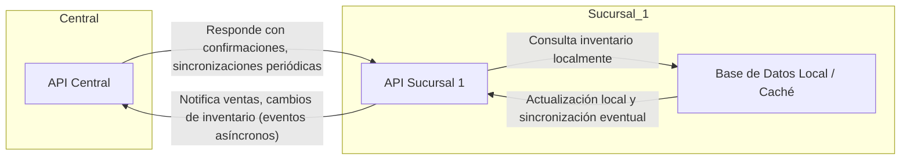

## Principios de Diseño para EcoMarket

### Basado en: Desafíos Técnicos | Arquitecturas Reales

*   **Principio Clave que Adoptaremos**: Cada sucursal operará de forma autónoma (offline-first) para garantizar la continuidad de ventas incluso ante caídas de la red.
*   **Justificación**: Casos exitosos en retail muestran que la autonomía local permite mantener operaciones críticas sin depender de la conectividad central.
*   **Riesgo que Mitigaremos**: Evitaremos las consultas de inventario síncronas entre sucursales y sistemas centrales.
*   **Justificación**: Las consultas síncronas pueden generar latencias de varios segundos o provocar bloqueos, lo que afecta negativamente la experiencia del cliente y la eficiencia en el punto de venta.

---

### Basado en: Éxitos/Fracasos | Arquitecturas Reales

*   **Principio Clave que Adoptaremos**: Sincronización asíncrona de inventarios y eventos comerciales.
*   **Justificación**: Aprendimos del caso de grandes cadenas que el uso de eventos y sincronización asíncrona reduce el impacto de fallas de red y permite mayor escalabilidad.
*   **Riesgo que Mitigaremos**: Pérdida de ventas por inconsistencia temporal en los datos de stock.
*   **Justificación**: El desacople permite seguir vendiendo sin esperar la confirmación del stock en tiempo real, y los mecanismos de reconciliación posteriores corrigen diferencias.

---

### Basado en: Desafíos Técnicos | Éxitos/Fracasos

*   **Principio Clave que Adoptaremos**: Uso intensivo de cachés locales y replicación eventual de datos relevantes para la operación.
*   **Justificación**: Empresas líderes en el sector implementan cachés locales para acelerar la consulta de datos y minimizar el impacto de la latencia en la red.
*   **Riesgo que Mitigaremos**: Experiencia de usuario degradada por esperas prolongadas o caídas en el servicio por saturación de la red.
*   **Justificación**: La consulta local permite respuestas inmediatas y el sistema se encarga de actualizar los datos en segundo plano, logrando un balance entre velocidad y consistencia.

-----
## Diagrama Arquitectura Expansión EcoMarket

**Explicación Flechas:**  
- La Sucursal 1 "notifica" a la API Central sus ventas y cambios de inventario mediante eventos asíncronos.  
- La API Central puede enviar confirmaciones o realizar sincronizaciones periódicas hacia la sucursal.  
- Las consultas de inventario en la sucursal son principalmente locales (offline-first), evitando dependencia inmediata de la central.

-----
Implementación del Prototipo (60 min):
Duplica el proyecto de tu API y renómbralo a `EcoMarket.Central` y `EcoMarket.Sucursal1`.
Haz que la sucursal sea autónoma, gestionando su propio inventario en memoria.
Implementa una **comunicación asíncrona**: cuando ocurra una venta en la sucursal, actualiza su inventario local al instante y luego envía una notificación a la API Central para actualizar el inventario global.
