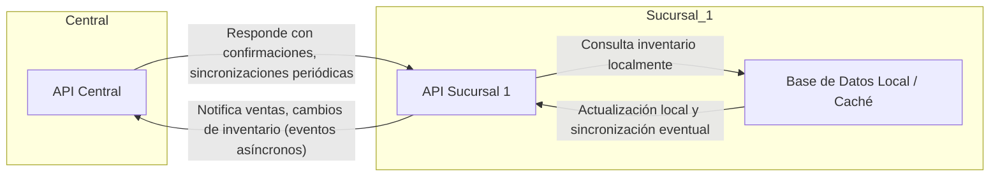

## Principios de Diseño para EcoMarket

### Basado en: Desafíos Técnicos | Arquitecturas Reales

*   **Principio Clave que Adoptaremos**: Cada sucursal operará de forma autónoma (offline-first) para garantizar la continuidad de ventas incluso ante caídas de la red.
*   **Justificación**: Casos exitosos en retail muestran que la autonomía local permite mantener operaciones críticas sin depender de la conectividad central.
*   **Riesgo que Mitigaremos**: Evitaremos las consultas de inventario síncronas entre sucursales y sistemas centrales.
*   **Justificación**: Las consultas síncronas pueden generar latencias de varios segundos o provocar bloqueos, lo que afecta negativamente la experiencia del cliente y la eficiencia en el punto de venta.

---

### Basado en: Éxitos/Fracasos | Arquitecturas Reales

*   **Principio Clave que Adoptaremos**: Sincronización asíncrona de inventarios y eventos comerciales.
*   **Justificación**: Aprendimos del caso de grandes cadenas que el uso de eventos y sincronización asíncrona reduce el impacto de fallas de red y permite mayor escalabilidad.
*   **Riesgo que Mitigaremos**: Pérdida de ventas por inconsistencia temporal en los datos de stock.
*   **Justificación**: El desacople permite seguir vendiendo sin esperar la confirmación del stock en tiempo real, y los mecanismos de reconciliación posteriores corrigen diferencias.

---

### Basado en: Desafíos Técnicos | Éxitos/Fracasos

*   **Principio Clave que Adoptaremos**: Uso intensivo de cachés locales y replicación eventual de datos relevantes para la operación.
*   **Justificación**: Empresas líderes en el sector implementan cachés locales para acelerar la consulta de datos y minimizar el impacto de la latencia en la red.
*   **Riesgo que Mitigaremos**: Experiencia de usuario degradada por esperas prolongadas o caídas en el servicio por saturación de la red.
*   **Justificación**: La consulta local permite respuestas inmediatas y el sistema se encarga de actualizar los datos en segundo plano, logrando un balance entre velocidad y consistencia.


-----

## Diagrama Arquitectura Expansión EcoMarket



**Explicación Flechas:**  
- La Sucursal 1 "notifica" a la API Central sus ventas y cambios de inventario mediante eventos asíncronos.  
- La API Central puede enviar confirmaciones o realizar sincronizaciones periódicas hacia la sucursal.  
- Las consultas de inventario en la sucursal son principalmente locales (offline-first), evitando dependencia inmediata de la central.

----

# Prototipo EcoMarket: Sucursal Autónoma y Comunicación Asíncrona

## Estructura recomendada

- `EcoMarket.Central/` — API Centralizada (Node.js + Express)
- `EcoMarket.Sucursal1/` — API sucursal autónoma (Node.js + Express, inventario en memoria)

---

## 1. EcoMarket.Sucursal1 — Inventario Local & Notificación asíncrona

```javascript name=EcoMarket.Sucursal1/app.js
const express = require('express');
const axios = require('axios');
const app = express();
app.use(express.json());

// Inventario en memoria
let inventario = {
  "manzana": 10,
  "banana": 20
};

// Venta local y notificación asíncrona
app.post('/venta', async (req, res) => {
  const { producto, cantidad } = req.body;
  if (!inventario[producto] || inventario[producto] < cantidad) {
    return res.status(400).json({ error: "Stock insuficiente" });
  }
  inventario[producto] -= cantidad;

  // Responde al cliente INMEDIATAMENTE
  res.json({ ok: true, inventario });

  // Notifica de forma asíncrona a la Central
  try {
    await axios.post('http://localhost:4000/sucursal-notificacion', {
      sucursal: "Sucursal1",
      producto,
      cantidad
    });
  } catch (err) {
    // Aquí podrías guardar en una cola local si la central no responde
    console.error('Error notificando a la central:', err.message);
  }
});

// Consulta inventario local
app.get('/inventario', (req, res) => {
  res.json(inventario);
});

app.listen(3000, () => console.log('Sucursal1 corriendo en puerto 3000'));
```

---

## 2. EcoMarket.Central — Recibiendo notificaciones

```javascript name=EcoMarket.Central/app.js
const express = require('express');
const app = express();
app.use(express.json());

// Inventario global (simulado)
let inventarioGlobal = {
  "manzana": 100,
  "banana": 200
};

app.post('/sucursal-notificacion', (req, res) => {
  const { sucursal, producto, cantidad } = req.body;
  if (!inventarioGlobal[producto] || inventarioGlobal[producto] < cantidad) {
    return res.status(400).json({ error: "Stock global insuficiente" });
  }
  inventarioGlobal[producto] -= cantidad;
  console.log(`Notificación recibida de ${sucursal}: -${cantidad} ${producto}`);
  res.json({ ok: true, inventarioGlobal });
});

app.get('/inventario-global', (req, res) => {
  res.json(inventarioGlobal);
});

app.listen(4000, () => console.log('Central corriendo en puerto 4000'));
```

---

## 3. Flujo de comunicación

- **Venta en Sucursal1:**  
  - Actualiza inventario local instantáneamente.
  - Notifica a Central mediante POST asíncrono.
- **Central:**  
  - Actualiza inventario global.
  - Puede implementar lógica de reconciliación y reportes.

---

## 4. Principios implementados

- **Autonomía local:** Sucursal opera su propio inventario.
- **Comunicación asíncrona:** La venta no espera confirmación de la Central.
- **Offline-first:** Sucursal puede seguir vendiendo aunque la Central esté caída (puedes mejorar con una cola o reintentos).

---

¿Necesitas estructura de carpetas, Docker, integración con base de datos, pruebas, o algo más avanzado? ¡Avísame!
