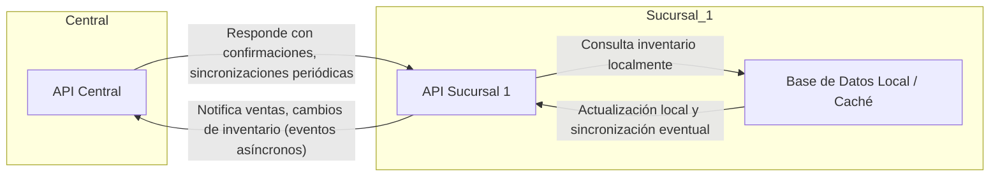

## Principios de Diseño para EcoMarket

### Basado en: Desafíos Técnicos | Arquitecturas Reales

*   **Principio Clave que Adoptaremos**: Cada sucursal operará de forma autónoma (offline-first) para garantizar la continuidad de ventas incluso ante caídas de la red.
*   **Justificación**: Casos exitosos en retail muestran que la autonomía local permite mantener operaciones críticas sin depender de la conectividad central.
*   **Riesgo que Mitigaremos**: Evitaremos las consultas de inventario síncronas entre sucursales y sistemas centrales.
*   **Justificación**: Las consultas síncronas pueden generar latencias de varios segundos o provocar bloqueos, lo que afecta negativamente la experiencia del cliente y la eficiencia en el punto de venta.

---

### Basado en: Éxitos/Fracasos | Arquitecturas Reales

*   **Principio Clave que Adoptaremos**: Sincronización asíncrona de inventarios y eventos comerciales.
*   **Justificación**: Aprendimos del caso de grandes cadenas que el uso de eventos y sincronización asíncrona reduce el impacto de fallas de red y permite mayor escalabilidad.
*   **Riesgo que Mitigaremos**: Pérdida de ventas por inconsistencia temporal en los datos de stock.
*   **Justificación**: El desacople permite seguir vendiendo sin esperar la confirmación del stock en tiempo real, y los mecanismos de reconciliación posteriores corrigen diferencias.

---

### Basado en: Desafíos Técnicos | Éxitos/Fracasos

*   **Principio Clave que Adoptaremos**: Uso intensivo de cachés locales y replicación eventual de datos relevantes para la operación.
*   **Justificación**: Empresas líderes en el sector implementan cachés locales para acelerar la consulta de datos y minimizar el impacto de la latencia en la red.
*   **Riesgo que Mitigaremos**: Experiencia de usuario degradada por esperas prolongadas o caídas en el servicio por saturación de la red.
*   **Justificación**: La consulta local permite respuestas inmediatas y el sistema se encarga de actualizar los datos en segundo plano, logrando un balance entre velocidad y consistencia.

-----

## Diagrama Arquitectura Expansión EcoMarket

**Explicación Flechas:**  
- La Sucursal 1 "notifica" a la API Central sus ventas y cambios de inventario mediante eventos asíncronos.  
- La API Central puede enviar confirmaciones o realizar sincronizaciones periódicas hacia la sucursal.  
- Las consultas de inventario en la sucursal son principalmente locales (offline-first), evitando dependencia inmediata de la central.

----

# Prototipo EcoMarket: Sucursal Autónoma y Comunicación Asíncrona

## Estructura recomendada

- `EcoMarket.Central/` — API Centralizada (Node.js + Express)
- `EcoMarket.Sucursal1/` — API sucursal autónoma (Node.js + Express, inventario en memoria)

---

## 1. EcoMarket.Sucursal1 — Inventario Local & Notificación asíncrona

from fastapi import FastAPI, HTTPException
from pydantic import BaseModel
import httpx

app = FastAPI()

# Inventario en memoria
inventario = {
    "manzana": 10,
    "banana": 20
}

class Venta(BaseModel):
    producto: str
    cantidad: int

@app.post("/venta")
async def registrar_venta(venta: Venta):
    producto = venta.producto
    cantidad = venta.cantidad

    if producto not in inventario or inventario[producto] < cantidad:
        raise HTTPException(status_code=400, detail="Stock insuficiente")

    inventario[producto] -= cantidad

    # Responde al cliente INMEDIATAMENTE
    response = {"ok": True, "inventario": inventario}

    # Notifica de forma asíncrona a la Central
    async with httpx.AsyncClient() as client:
        try:
            await client.post("http://localhost:4000/sucursal-notificacion", json={
                "sucursal": "Sucursal1",
                "producto": producto,
                "cantidad": cantidad
            })
        except Exception as e:
            # Aquí podrías guardar en una cola local si la central no responde
            print("Error notificando a la central:", str(e))

    return response

@app.get("/inventario")
async def obtener_inventario():
    return inventario
    
---

## 2. EcoMarket.Central — Recibiendo notificaciones

from fastapi import FastAPI, HTTPException
from pydantic import BaseModel

app = FastAPI()

# Inventario global (simulado)
inventario_global = {
    "manzana": 100,
    "banana": 200
}

class Notificacion(BaseModel):
    sucursal: str
    producto: str
    cantidad: int

@app.post("/sucursal-notificacion")
async def recibir_notificacion(n: Notificacion):
    producto = n.producto
    cantidad = n.cantidad

    if producto not in inventario_global or inventario_global[producto] < cantidad:
        raise HTTPException(status_code=400, detail="Stock global insuficiente")

    inventario_global[producto] -= cantidad
    print(f"Notificación recibida de {n.sucursal}: -{cantidad} {producto}")

    return {"ok": True, "inventarioGlobal": inventario_global}

@app.get("/inventario-global")
async def obtener_inventario_global():
    return inventario_global

---

## 3. Flujo de comunicación

- **Venta en Sucursal1:**  
  - Actualiza inventario local instantáneamente.
  - Notifica a Central mediante POST asíncrono.
- **Central:**  
  - Actualiza inventario global.
  - Puede implementar lógica de reconciliación y reportes.

---

## 4. Principios implementados

- **Autonomía local:** Sucursal opera su propio inventario.
- **Comunicación asíncrona:** La venta no espera confirmación de la Central.
- **Offline-first:** Sucursal puede seguir vendiendo aunque la Central esté caída (puedes mejorar con una cola o reintentos).

---

¿Necesitas estructura de carpetas, Docker, integración con base de datos, pruebas, o algo más avanzado? ¡Avísame!
