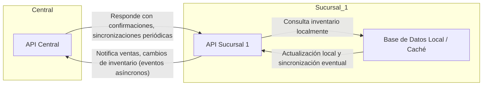

## Principios de Diseño para EcoMarket

### Basado en: Desafíos Técnicos | Arquitecturas Reales

*   **Principio Clave que Adoptaremos**: Cada sucursal operará de forma autónoma (offline-first) para garantizar la continuidad de ventas incluso ante caídas de la red.
*   **Justificación**: Casos exitosos en retail muestran que la autonomía local permite mantener operaciones críticas sin depender de la conectividad central.
*   **Riesgo que Mitigaremos**: Evitaremos las consultas de inventario síncronas entre sucursales y sistemas centrales.
*   **Justificación**: Las consultas síncronas pueden generar latencias de varios segundos o provocar bloqueos, lo que afecta negativamente la experiencia del cliente y la eficiencia en el punto de venta.

---

### Basado en: Éxitos/Fracasos | Arquitecturas Reales

*   **Principio Clave que Adoptaremos**: Sincronización asíncrona de inventarios y eventos comerciales.
*   **Justificación**: Aprendimos del caso de grandes cadenas que el uso de eventos y sincronización asíncrona reduce el impacto de fallas de red y permite mayor escalabilidad.
*   **Riesgo que Mitigaremos**: Pérdida de ventas por inconsistencia temporal en los datos de stock.
*   **Justificación**: El desacople permite seguir vendiendo sin esperar la confirmación del stock en tiempo real, y los mecanismos de reconciliación posteriores corrigen diferencias.

---

### Basado en: Desafíos Técnicos | Éxitos/Fracasos

*   **Principio Clave que Adoptaremos**: Uso intensivo de cachés locales y replicación eventual de datos relevantes para la operación.
*   **Justificación**: Empresas líderes en el sector implementan cachés locales para acelerar la consulta de datos y minimizar el impacto de la latencia en la red.
*   **Riesgo que Mitigaremos**: Experiencia de usuario degradada por esperas prolongadas o caídas en el servicio por saturación de la red.
*   **Justificación**: La consulta local permite respuestas inmediatas y el sistema se encarga de actualizar los datos en segundo plano, logrando un balance entre velocidad y consistencia.


-----

## Diagrama Arquitectura Expansión EcoMarket



**Explicación Flechas:**  
- La Sucursal 1 "notifica" a la API Central sus ventas y cambios de inventario mediante eventos asíncronos.  
- La API Central puede enviar confirmaciones o realizar sincronizaciones periódicas hacia la sucursal.  
- Las consultas de inventario en la sucursal son principalmente locales (offline-first), evitando dependencia inmediata de la central.

----

# Prototipo EcoMarket: Sucursal Autónoma y Comunicación Asíncrona

## Estructura recomendada

```
EcoMarket/
│
├── Central/
│   └── main.py
│
└── Sucursal1/
    └── main.py
```

---

## 1. EcoMarket.Sucursal1 — Inventario Local, Notificación asíncrona, CRUD de inventario, ventas autónomas & Circuit Breaker

```python
# filepath: EcoMarket/Sucursal1/SucursalAPI.py
from fastapi import FastAPI, HTTPException, BackgroundTasks
from fastapi.responses import HTMLResponse
from pydantic import BaseModel
from typing import Dict, List, Optional
from datetime import datetime, timedelta
import httpx
import logging
from enum import Enum

# ===== LOGGING =====
logging.basicConfig(level=logging.INFO)
logger = logging.getLogger(__name__)

app = FastAPI(
    title="🌿 EcoMarket Sucursal API",
    description="""
    **Gestión de inventario y ventas autónomas**  
    - CRUD de inventario  
    - Ventas locales  
    - Notificaciones al central con Circuit Breaker
    """,
    version="1.3.0",
    docs_url="/",
    redoc_url=None
)

# ===== CONFIGURACIÓN =====
BRANCH_ID = "sucursal-001"
CENTRAL_API_URL = "http://localhost:8000"

# ===== MODELOS =====
class Product(BaseModel):
    id: int
    name: str
    price: float
    stock: int

class SaleRequest(BaseModel):
    product_id: int
    quantity: int
    customer_info: Optional[str] = None

class SaleResponse(BaseModel):
    sale_id: str
    product_name: str
    quantity_sold: int
    total_amount: float
    timestamp: datetime
    status: str

# ===== CIRCUIT BREAKER =====
class CircuitState(Enum):
    CLOSED = "closed"
    OPEN = "open"
    HALF_OPEN = "half_open"

class CircuitBreaker:
    def __init__(self, failure_threshold=3, recovery_timeout=30):
        self.failure_threshold = failure_threshold
        self.recovery_timeout = recovery_timeout
        self.failure_count = 0
        self.last_failure_time: Optional[datetime] = None
        self.state = CircuitState.CLOSED
    
    async def call(self, func, *args, **kwargs):
        if self.state == CircuitState.OPEN:
            if self._should_attempt_reset():
                self.state = CircuitState.HALF_OPEN
                logger.info("🔄 Circuito HALF_OPEN: probando llamada")
            else:
                raise Exception("Circuit breaker abierto")
        try:
            result = await func(*args, **kwargs)
            self._on_success()
            return result
        except Exception as e:
            self._on_failure()
            raise e
    
    def _on_success(self):
        self.failure_count = 0
        self.state = CircuitState.CLOSED
    
    def _on_failure(self):
        self.failure_count += 1
        self.last_failure_time = datetime.now()
        if self.failure_count >= self.failure_threshold:
            self.state = CircuitState.OPEN
    
    def _should_attempt_reset(self):
        if not self.last_failure_time:
            return False
        return datetime.now() >= self.last_failure_time + timedelta(seconds=self.recovery_timeout)

circuit_breaker = CircuitBreaker(failure_threshold=3, recovery_timeout=60)

# ===== INVENTARIO LOCAL =====
local_inventory: Dict[int, Product] = {
    1: Product(id=1, name="Manzanas Orgánicas", price=2.50, stock=25),
    2: Product(id=2, name="Pan Integral", price=1.80, stock=15),
    3: Product(id=3, name="Leche Deslactosada", price=3.20, stock=8)
}
sales_history: List[SaleResponse] = []

# ===== FUNCIONES =====
async def notify_central_about_sale(product_id: int, quantity_sold: int, timestamp: datetime, sale_amount: float):
    notification = {
        "branch_id": BRANCH_ID,
        "product_id": product_id,
        "quantity_sold": quantity_sold,
        "timestamp": timestamp.isoformat(),
        "sale_price": sale_amount
    }
    async with httpx.AsyncClient(timeout=5.0) as client:
        response = await client.post(f"{CENTRAL_API_URL}/sale-notification", json=notification)
        if response.status_code != 200:
            raise Exception(f"Error al notificar central: {response.status_code}")

async def send_notification_with_circuit_breaker(product_id: int, quantity_sold: int, timestamp: datetime, sale_amount: float):
    try:
        await circuit_breaker.call(
            notify_central_about_sale,
            product_id,
            quantity_sold,
            timestamp,
            sale_amount
        )
    except Exception as e:
        logger.error(f"⚠️ Notificación no enviada (CircuitBreaker): {e}")

# ===== ENDPOINTS CRUD INVENTARIO =====
@app.get("/inventory", response_model=List[Product], tags=["Inventario"])
async def get_local_inventory():
    return list(local_inventory.values())

@app.get("/inventory/{product_id}", response_model=Product, tags=["Inventario"])
async def get_product(product_id: int):
    if product_id not in local_inventory:
        raise HTTPException(status_code=404, detail="Producto no encontrado")
    return local_inventory[product_id]

@app.post("/inventory", response_model=Product, tags=["Inventario"])
async def add_product(product: Product):
    if product.id in local_inventory:
        raise HTTPException(status_code=400, detail="El producto ya existe")
    local_inventory[product.id] = product
    return product

@app.put("/inventory/{product_id}", response_model=Product, tags=["Inventario"])
async def update_product(product_id: int, product: Product):
    if product_id not in local_inventory:
        raise HTTPException(status_code=404, detail="Producto no encontrado")
    local_inventory[product_id] = product
    return product

@app.delete("/inventory/{product_id}", tags=["Inventario"])
async def delete_product(product_id: int):
    if product_id not in local_inventory:
        raise HTTPException(status_code=404, detail="Producto no encontrado")
    removed = local_inventory.pop(product_id)
    return {"eliminado": removed.name, "id": removed.id}

# ===== ENDPOINTS VENTAS =====
@app.post("/sales", response_model=SaleResponse, tags=["Ventas"])
async def process_sale(sale_request: SaleRequest, background_tasks: BackgroundTasks):
    if sale_request.product_id not in local_inventory:
        raise HTTPException(status_code=404, detail="Producto no disponible")
    product = local_inventory[sale_request.product_id]
    if product.stock < sale_request.quantity:
        raise HTTPException(status_code=400, detail=f"Stock insuficiente. Disponible: {product.stock}")
    
    product.stock -= sale_request.quantity
    sale_timestamp = datetime.now()
    total_amount = product.price * sale_request.quantity

    sale_response = SaleResponse(
        sale_id=f"{BRANCH_ID}_{sale_timestamp.isoformat()}",
        product_name=product.name,
        quantity_sold=sale_request.quantity,
        total_amount=total_amount,
        timestamp=sale_timestamp,
        status="completed"
    )
    sales_history.append(sale_response)

    background_tasks.add_task(
        send_notification_with_circuit_breaker,
        sale_request.product_id,
        sale_request.quantity,
        sale_timestamp,
        total_amount
    )

    return sale_response

@app.get("/sales/stats", tags=["Ventas"])
async def sales_stats():
    if not sales_history:
        return {"total_sales": 0, "total_revenue": 0}
    total_revenue = sum(s.total_amount for s in sales_history)
    return {
        "total_sales": len(sales_history),
        "total_revenue": round(total_revenue, 2),
        "average_sale": round(total_revenue / len(sales_history), 2)
    }

# ===== INTERFAZ HTML SIMPLE =====
@app.get("/dashboard", response_class=HTMLResponse, tags=["Dashboard"])
async def dashboard():
    inventory_html = "".join([f"<li>{p.id} - {p.name}: ${p.price} x {p.stock} unidades</li>" for p in local_inventory.values()])
    sales_html = "".join([f"<li>{s.sale_id} - {s.product_name} x{s.quantity_sold} = ${s.total_amount}</li>" for s in sales_history])
    
    return f"""
    <html>
        <head>
            <title>🌿 EcoMarket Sucursal Dashboard</title>
        </head>
        <body style="font-family:Arial;">
            <h1>EcoMarket Sucursal - Dashboard</h1>
            <p><b>Branch:</b> {BRANCH_ID}</p>
            <p><b>Status:</b> Operational - Autonomous</p>
            <p><b>Circuit Breaker:</b> {circuit_breaker.state.value} (Failures: {circuit_breaker.failure_count})</p>
            
            <h2>Inventario Local</h2>
            <ul>{inventory_html}</ul>
            
            <h2>Ventas Realizadas</h2>
            <ul>{sales_html}</ul>
        </body>
    </html>
    """

# ===== ENDPOINT GENERAL =====
@app.get("/", tags=["General"])
async def root():
    return {
        "service": "🌿 EcoMarket Sucursal API",
        "branch_id": BRANCH_ID,
        "status": "operational - AUTONOMOUS",
        "total_products": len(local_inventory),
        "total_sales": len(sales_history),
        "circuit_breaker_state": circuit_breaker.state.value,
        "circuit_failures": circuit_breaker.failure_count
    }

# ===== MAIN =====
if __name__ == "__main__":
    import uvicorn
    uvicorn.run(app, host="0.0.0.0", port=8001)
```

---

## 2. EcoMarket.Central — Recibiendo notificaciones, completo con Dashboard y CRUD

```python
# filepath: EcoMarket/Central/CentralAPI.py
from fastapi import FastAPI, HTTPException, Form
from fastapi.responses import HTMLResponse
from pydantic import BaseModel
from typing import Dict, List
from datetime import datetime
import logging

logging.basicConfig(level=logging.INFO)
logger = logging.getLogger(__name__)

app = FastAPI(
    title="🌿 EcoMarket Central API",
    description="Servidor central que gestiona inventario maestro y recibe notificaciones de sucursales.",
    version="1.2.0",
    docs_url="/docs",
    redoc_url="/redoc"
)

# ===== MODELOS =====
class Product(BaseModel):
    id: int
    name: str
    price: float
    stock: int

class SaleNotification(BaseModel):
    branch_id: str
    product_id: int
    quantity_sold: int
    timestamp: datetime
    sale_price: float

# ===== INVENTARIO CENTRAL =====
central_inventory: Dict[int, Product] = {
    1: Product(id=1, name="Manzanas Orgánicas", price=2.50, stock=100),
    2: Product(id=2, name="Pan Integral", price=1.80, stock=50),
    3: Product(id=3, name="Leche Deslactosada", price=3.20, stock=30),
    4: Product(id=4, name="Café Premium", price=8.90, stock=25),
    5: Product(id=5, name="Quinoa", price=12.50, stock=15)
}

# ===== HISTORIAL DE VENTAS =====
sales_notifications: List[SaleNotification] = []

# ===== ENDPOINTS PRINCIPALES =====
@app.get("/", tags=["General"])
async def root():
    return {
        "service": "🌿 EcoMarket Central API",
        "status": "operational",
        "total_products": len(central_inventory),
        "total_notifications": len(sales_notifications)
    }

@app.get("/inventory", response_model=List[Product], tags=["Inventario"])
async def get_inventory():
    return list(central_inventory.values())

@app.post("/inventory", response_model=Product, tags=["Inventario"])
async def add_product(product: Product):
    if product.id in central_inventory:
        raise HTTPException(status_code=400, detail="El producto ya existe")
    central_inventory[product.id] = product
    return product

@app.put("/inventory/{product_id}", response_model=Product, tags=["Inventario"])
async def update_product(product_id: int, product: Product):
    if product_id not in central_inventory:
        raise HTTPException(status_code=404, detail="Producto no encontrado")
    central_inventory[product_id] = product
    return product

@app.delete("/inventory/{product_id}", tags=["Inventario"])
async def delete_product(product_id: int):
    if product_id not in central_inventory:
        raise HTTPException(status_code=404, detail="Producto no encontrado")
    removed = central_inventory.pop(product_id)
    return {"removed": removed.name, "id": removed.id}

# ===== NOTIFICACIONES DE VENTAS =====
@app.post("/sale-notification", tags=["Comunicación"])
async def receive_sale(notification: SaleNotification):
    if notification.product_id not in central_inventory:
        raise HTTPException(status_code=404, detail="Producto no encontrado")
    
    # Actualizar inventario
    product = central_inventory[notification.product_id]
    product.stock = max(0, product.stock - notification.quantity_sold)

    # Guardar notificación en historial
    sales_notifications.append(notification)
    logger.info(f"📦 Venta recibida: {notification.branch_id} - {notification.product_id} x{notification.quantity_sold}")
    
    return {
        "status": "received",
        "message": f"Venta registrada para {notification.quantity_sold} unidades",
        "updated_stock": product.stock
    }

# ===== DASHBOARD HTML =====
@app.get("/dashboard", response_class=HTMLResponse, tags=["Dashboard"])
async def dashboard():
    inventory_html = "".join([f"<tr><td>{p.id}</td><td>{p.name}</td><td>${p.price}</td><td>{p.stock}</td></tr>" for p in central_inventory.values()])
    
    notifications_html = "".join([
        f"<tr><td>{n.timestamp.strftime('%Y-%m-%d %H:%M:%S')}</td>"
        f"<td>{n.branch_id}</td>"
        f"<td>{central_inventory[n.product_id].name}</td>"
        f"<td>{n.quantity_sold}</td>"
        f"<td>${n.sale_price}</td>"
        f"<td>${central_inventory[n.product_id].price * n.quantity_sold}</td>"
        f"<td>${(n.sale_price - (central_inventory[n.product_id].price * n.quantity_sold))}</td></tr>"
        for n in sales_notifications
    ])
    
    return f"""
    <html>
        <head>
            <title>🌿 EcoMarket Central Dashboard</title>
            <style>
                body {{ font-family: Arial; }}
                table {{ border-collapse: collapse; width: 80%; margin-bottom: 30px; }}
                th, td {{ border: 1px solid #ddd; padding: 8px; text-align: left; }}
                th {{ background-color: #4CAF50; color: white; }}
            </style>
        </head>
        <body>
            <h1>EcoMarket Central Dashboard</h1>
            
            <h2>Inventario Central</h2>
            <table>
                <tr><th>ID</th><th>Producto</th><th>Precio</th><th>Stock</th></tr>
                {inventory_html}
            </table>
            
            <h2>Historial de Ventas</h2>
            <table>
                <tr><th>Fecha</th><th>Sucursal</th><th>Producto</th><th>Cantidad</th><th>Monto</th><th>Total</th><th>Cambio</th></tr>
                {notifications_html}
            </table>

            <a href="/new-sale">Registrar Nueva Venta</a>
        </body>
    </html>
    """

# ===== FORMULARIO DE NUEVA VENTA CON AUTOCOMPLETE =====
@app.get("/new-sale", response_class=HTMLResponse, tags=["Dashboard"])
async def new_sale_form():
    options_html = "".join([f"<option value='{p.name}' data-id='{p.id}'>" for p in central_inventory.values()])
    
    return f"""
    <html>
        <head>
            <title>🌿 Registrar Nueva Venta</title>
            <style>
                body {{ font-family: Arial; margin: 30px; }}
                input, select {{ padding: 5px; margin: 5px 0; width: 250px; }}
                button {{ padding: 8px 15px; background-color: #4CAF50; color: white; border: none; cursor: pointer; }}
                button:hover {{ background-color: #45a049; }}
            </style>
        </head>
        <body>
            <h1>Registrar Nueva Venta</h1>
            <form action="/submit-sale" method="post" id="saleForm">
                <label>Sucursal:</label><br>
                <input type="text" name="branch_id" value="Sucursal1" required><br>

                <label>Producto:</label><br>
                <input list="productos" id="productInput" name="product_name" placeholder="Escribe para buscar..." required>
                <datalist id="productos">
                    {options_html}
                </datalist>
                <input type="hidden" name="product_id" id="product_id_hidden"><br>

                <label>Cantidad:</label><br>
                <input type="number" name="quantity_sold" value="1" min="1" required><br>

                <label>Precio Total:</label><br>
                <input type="number" step="0.01" name="sale_price" value="0.0" required><br><br>

                <button type="submit">Enviar Venta</button>
            </form>

            <script>
                const productInput = document.getElementById('productInput');
                const productIdHidden = document.getElementById('product_id_hidden');
                const options = document.querySelectorAll('#productos option');

                productInput.addEventListener('input', function() {{
                    const val = this.value;
                    const match = Array.from(options).find(o => o.value === val);
                    if(match) {{
                        productIdHidden.value = match.dataset.id;
                    }} else {{
                        productIdHidden.value = '';
                    }}
                }});
            </script>
        </body>
    </html>
    """

@app.post("/submit-sale", response_class=HTMLResponse, tags=["Dashboard"])
async def submit_sale(
    branch_id: str = Form(...),
    product_id: int = Form(...),
    quantity_sold: int = Form(...),
    sale_price: float = Form(...)
):
    if product_id not in central_inventory:
        return HTMLResponse(content="<h3>❌ Producto no encontrado.</h3><a href='/new-sale'>Volver</a>")
    
    product = central_inventory[product_id]
    product.stock = max(0, product.stock - quantity_sold)

    notification = SaleNotification(
        branch_id=branch_id,
        product_id=product_id,
        quantity_sold=quantity_sold,
        sale_price=sale_price,
        timestamp=datetime.now()
    )
    sales_notifications.append(notification)

    return HTMLResponse(content=f"""
        <h3>✅ Venta registrada correctamente!</h3>
        <p>{branch_id} vendió {quantity_sold}x {product.name} por ${sale_price}</p>
        <a href="/new-sale">Registrar otra venta</a> | <a href="/dashboard">Ir al Dashboard</a>
    """)

# ===== CORRER SERVIDOR =====
if __name__ == "__main__":
    import uvicorn
    uvicorn.run(app, host="0.0.0.0", port=8000)
```

---

## 3. Flujo de comunicación

- **Venta en Sucursal1:**  
  - Actualiza inventario local instantáneamente.
  - Notifica a Central mediante POST asíncrono.
- **Central:**  
  - Actualiza inventario global.
  - Puede implementar lógica de reconciliación y reportes.

---

## 4. Principios implementados

- **Autonomía local:** Sucursal opera su propio inventario.
- **Comunicación asíncrona:** La venta no espera confirmación de la Central.
- **Offline-first:** Sucursal puede seguir vendiendo aunque la Central esté caída (puedes mejorar con una cola o reintentos).

---

## 5. Estrategia de Consistencia

**Modelo Adoptado: Consistencia Eventual**

- Cada sucursal mantiene su inventario de forma local e independiente.
- Los cambios se notifican a la central de forma asíncrona (no bloquean la venta).
- La central realiza sincronización periódica y conciliación de inventarios.

**Mecanismos de Soporte**
- Reintentos automáticos de notificación en caso de falla de red.
- Cola local para almacenar transacciones pendientes.
- Reconciliación periódica para detectar y resolver diferencias.

---

## 6 . Trade-off Aceptado

**✅ Ganamos**
- Velocidad en el punto de venta (respuestas inmediatas).
- Autonomía de cada sucursal (offline-first).
- Escalabilidad (más sucursales sin sobrecargar la central).

**⚠️ Aceptamos**
- Posibles discrepancias temporales en inventario.
- Casos de sobreventa que requieren gestión posterior con el cliente.
- Complejidad técnica mayor para reconciliación y monitoreo
