## Principios de Diseño para EcoMarket

### Basado en: Desafíos Técnicos | Arquitecturas Reales

*   **Principio Clave que Adoptaremos**: Cada sucursal operará de forma autónoma (offline-first) para garantizar la continuidad de ventas incluso ante caídas de la red.
*   **Justificación**: Casos exitosos en retail muestran que la autonomía local permite mantener operaciones críticas sin depender de la conectividad central.
*   **Riesgo que Mitigaremos**: Evitaremos las consultas de inventario síncronas entre sucursales y sistemas centrales.
*   **Justificación**: Las consultas síncronas pueden generar latencias de varios segundos o provocar bloqueos, lo que afecta negativamente la experiencia del cliente y la eficiencia en el punto de venta.

---

### Basado en: Éxitos/Fracasos | Arquitecturas Reales

*   **Principio Clave que Adoptaremos**: Sincronización asíncrona de inventarios y eventos comerciales.
*   **Justificación**: Aprendimos del caso de grandes cadenas que el uso de eventos y sincronización asíncrona reduce el impacto de fallas de red y permite mayor escalabilidad.
*   **Riesgo que Mitigaremos**: Pérdida de ventas por inconsistencia temporal en los datos de stock.
*   **Justificación**: El desacople permite seguir vendiendo sin esperar la confirmación del stock en tiempo real, y los mecanismos de reconciliación posteriores corrigen diferencias.

---

### Basado en: Desafíos Técnicos | Éxitos/Fracasos

*   **Principio Clave que Adoptaremos**: Uso intensivo de cachés locales y replicación eventual de datos relevantes para la operación.
*   **Justificación**: Empresas líderes en el sector implementan cachés locales para acelerar la consulta de datos y minimizar el impacto de la latencia en la red.
*   **Riesgo que Mitigaremos**: Experiencia de usuario degradada por esperas prolongadas o caídas en el servicio por saturación de la red.
*   **Justificación**: La consulta local permite respuestas inmediatas y el sistema se encarga de actualizar los datos en segundo plano, logrando un balance entre velocidad y consistencia.


-----

## Diagrama Arquitectura Expansión EcoMarket

```mermaid
flowchart LR
    subgraph Central
        A[API Central]
    end
    subgraph Sucursal_1
        B[API Sucursal 1]
        C[Base de Datos Local / Caché]
    end

    B -- Notifica ventas, cambios de inventario (eventos asíncronos) --> A
    A -- Responde con confirmaciones, sincronizaciones periódicas --> B
    B -- Consulta inventario localmente --> C
    C -- Actualización local y sincronización eventual --> B
```



**Explicación Flechas:**  
- La Sucursal 1 "notifica" a la API Central sus ventas y cambios de inventario mediante eventos asíncronos.  
- La API Central puede enviar confirmaciones o realizar sincronizaciones periódicas hacia la sucursal.  
- Las consultas de inventario en la sucursal son principalmente locales (offline-first), evitando dependencia inmediata de la central.

----

# Prototipo EcoMarket: Sucursal Autónoma y Comunicación Asíncrona

## Estructura recomendada

```
EcoMarket/
│
├── Central/
│   └── main.py
│
└── Sucursal1/
    └── main.py
```

---

## 1. EcoMarket.Sucursal1 — Inventario Local, Notificación asíncrona, CRUD de inventario, ventas autónomas & Circuit Breaker

```python# filepath: EcoMarket/Sucursal/SucursalAPI.py
from fastapi import FastAPI, HTTPException, BackgroundTasks, Form
from fastapi.responses import HTMLResponse
from pydantic import BaseModel
from typing import Dict, List, Optional
from datetime import datetime, timedelta
import httpx
import logging
from enum import Enum
import asyncio

# ===== LOGGING =====
logging.basicConfig(level=logging.INFO)
logger = logging.getLogger(__name__)

app = FastAPI(
    title="🌿 EcoMarket Sucursal API",
    description="Gestión de inventario y ventas con notificación a central",
    version="3.1.0",
    docs_url="/docs",
    redoc_url=None
)

# ===== CONFIGURACIÓN =====
BRANCH_ID = "sucursal-001"
CENTRAL_API_URL = "http://localhost:8000"

# ===== MODELOS =====
class Product(BaseModel):
    id: int
    name: str
    price: float
    stock: int

class SaleRequest(BaseModel):
    product_id: int
    quantity: int
    money_received: float

class SaleResponse(BaseModel):
    sale_id: str
    product_id: int
    product_name: str
    quantity_sold: int
    total_amount: float
    money_received: float
    change: float
    timestamp: datetime
    status: str

# ===== CIRCUIT BREAKER =====
class CircuitState(Enum):
    CLOSED = "closed"
    OPEN = "open"
    HALF_OPEN = "half_open"

class CircuitBreaker:
    def __init__(self, failure_threshold=3, recovery_timeout=30):
        self.failure_threshold = failure_threshold
        self.recovery_timeout = recovery_timeout
        self.failure_count = 0
        self.last_failure_time: Optional[datetime] = None
        self.state = CircuitState.CLOSED
    
    async def call(self, func, *args, **kwargs):
        if self.state == CircuitState.OPEN:
            if self._should_attempt_reset():
                self.state = CircuitState.HALF_OPEN
                logger.info("🔄 Circuito HALF_OPEN: probando llamada")
            else:
                raise Exception("Circuit breaker abierto")
        try:
            result = await func(*args, **kwargs)
            self._on_success()
            return result
        except Exception as e:
            self._on_failure()
            raise e
    
    def _on_success(self):
        self.failure_count = 0
        self.state = CircuitState.CLOSED
    
    def _on_failure(self):
        self.failure_count += 1
        self.last_failure_time = datetime.now()
        if self.failure_count >= self.failure_threshold:
            self.state = CircuitState.OPEN
    
    def _should_attempt_reset(self):
        if not self.last_failure_time:
            return False
        return datetime.now() >= self.last_failure_time + timedelta(seconds=self.recovery_timeout)

circuit_breaker = CircuitBreaker(failure_threshold=3, recovery_timeout=60)

# ===== INVENTARIO LOCAL =====
local_inventory: Dict[int, Product] = {
    1: Product(id=1, name="Manzanas Orgánicas", price=2.50, stock=25),
    2: Product(id=2, name="Pan Integral", price=1.80, stock=15),
    3: Product(id=3, name="Leche Deslactosada", price=3.20, stock=8)
}
sales_history: List[SaleResponse] = []

# ===== FUNCIONES =====
async def notify_central_about_sale(sale: SaleResponse):
    notification = {
        "branch_id": BRANCH_ID,
        "product_id": sale.product_id,
        "quantity_sold": sale.quantity_sold,
        "money_received": sale.money_received,
        "total_amount": sale.total_amount,
        "change": sale.change,
        "timestamp": sale.timestamp.isoformat()
    }

    async with httpx.AsyncClient(timeout=5.0) as client:
        response = await client.post(f"{CENTRAL_API_URL}/sale-notification", json=notification)
        if response.status_code != 200:
            raise Exception(f"Error al notificar central: {response.status_code}")

async def send_notification_with_circuit_breaker(sale: SaleResponse):
    try:
        await circuit_breaker.call(notify_central_about_sale, sale)
    except Exception as e:
        logger.error(f"⚠️ Notificación no enviada (CircuitBreaker): {e}")

# ===== INVENTARIO (SOLO LECTURA) =====
@app.get("/inventory", response_model=List[Product], tags=["Inventario"])
async def get_local_inventory():
    return list(local_inventory.values())

@app.get("/inventory/{product_id}", response_model=Product, tags=["Inventario"])
async def get_product(product_id: int):
    if product_id not in local_inventory:
        raise HTTPException(status_code=404, detail="Producto no encontrado")
    return local_inventory[product_id]

# ===== VENTAS API =====
@app.post("/sales", response_model=SaleResponse, tags=["Ventas"])
async def process_sale(sale_request: SaleRequest, background_tasks: BackgroundTasks):
    if sale_request.product_id not in local_inventory:
        raise HTTPException(status_code=404, detail="Producto no disponible")
    product = local_inventory[sale_request.product_id]
    if product.stock < sale_request.quantity:
        raise HTTPException(status_code=400, detail=f"Stock insuficiente. Disponible: {product.stock}")
    
    product.stock -= sale_request.quantity
    sale_timestamp = datetime.now()
    total_amount = product.price * sale_request.quantity
    change = sale_request.money_received - total_amount

    sale_response = SaleResponse(
        sale_id=f"{BRANCH_ID}_{sale_timestamp.isoformat()}",
        product_id=product.id,
        product_name=product.name,
        quantity_sold=sale_request.quantity,
        total_amount=total_amount,
        money_received=sale_request.money_received,
        change=change,
        timestamp=sale_timestamp,
        status="completed"
    )
    sales_history.append(sale_response)

    background_tasks.add_task(send_notification_with_circuit_breaker, sale_response)

    return sale_response

@app.get("/sales/stats", tags=["Ventas"])
async def sales_stats():
    if not sales_history:
        return {"total_sales": 0, "total_revenue": 0}
    total_revenue = sum(s.total_amount for s in sales_history)
    return {
        "total_sales": len(sales_history),
        "total_revenue": round(total_revenue, 2),
        "average_sale": round(total_revenue / len(sales_history), 2)
    }

# ===== DASHBOARD =====
@app.get("/dashboard", response_class=HTMLResponse, tags=["Dashboard"])
async def dashboard():
    inventory_html = "".join([
        f"<tr><td>{p.id}</td><td>{p.name}</td><td>${p.price}</td><td>{p.stock}</td></tr>"
        for p in local_inventory.values()
    ])

    sales_html = "".join([
        f"<tr><td>{s.timestamp.strftime('%Y-%m-%d %H:%M:%S')}</td>"
        f"<td>{BRANCH_ID}</td>"
        f"<td>{s.product_name}</td>"
        f"<td>{s.quantity_sold}</td>"
        f"<td>${s.money_received}</td>"
        f"<td>${s.total_amount}</td>"
        f"<td>${s.change}</td></tr>"
        for s in sales_history
    ])

    return f"""
    <html>
        <head>
            <title>🌿 EcoMarket Sucursal Dashboard</title>
            <style>
                body {{ font-family: Arial; }}
                table {{ border-collapse: collapse; width: 80%; margin-bottom: 30px; }}
                th, td {{ border: 1px solid #ddd; padding: 8px; text-align: left; }}
                th {{ background-color: #4CAF50; color: white; }}
                input, button, select {{ padding: 5px; margin: 5px 0; }}
                button {{ background-color: #4CAF50; color: white; border: none; cursor: pointer; }}
                button:hover {{ background-color: #45a049; }}
                a.button {{ display:inline-block; padding:8px 15px; margin:5px; background:#4CAF50; color:#fff; text-decoration:none; border-radius:5px; }}
                a.button:hover {{ background:#45a049; }}
            </style>
        </head>
        <body>
            <h1>EcoMarket Sucursal Dashboard</h1>
            <p><b>Branch:</b> {BRANCH_ID}</p>
            <p><b>Status:</b> Operational</p>
            <p><b>Circuit Breaker:</b> {circuit_breaker.state.value} (Failures: {circuit_breaker.failure_count})</p>

            <h2>Acciones</h2>
            <a class="button" href="/submit-sale-form">➕ Registrar Nueva Venta</a>

            <h2>Inventario Local (solo lectura)</h2>
            <table>
                <tr><th>ID</th><th>Producto</th><th>Precio</th><th>Stock</th></tr>
                {inventory_html}
            </table>

            <h2>Ventas Realizadas</h2>
            <table>
                <tr><th>Fecha</th><th>Sucursal</th><th>Producto</th><th>Cantidad</th><th>Recibido</th><th>Total</th><th>Cambio</th></tr>
                {sales_html}
            </table>
        </body>
    </html>
    """

# ===== FORMULARIO DE VENTAS =====
@app.get("/submit-sale-form", response_class=HTMLResponse)
async def submit_sale_page():
    options_html = "".join([f"<option value='{p.id}'>{p.name}</option>" for p in local_inventory.values()])
    return f"""
    <h1>Registrar Nueva Venta</h1>
    <form action="/submit-sale" method="post">
        <label>Producto:</label><br>
        <select name="product_id">{options_html}</select><br>
        <label>Cantidad:</label><br><input type="number" name="quantity" value="1" min="1" required><br>
        <label>Dinero Recibido:</label><br><input type="number" step="0.01" name="money_received" value="0.0" required><br><br>
        <button type="submit">Enviar Venta</button>
    </form>
    <a href="/dashboard">Volver</a>
    """

@app.post("/submit-sale", response_class=HTMLResponse, tags=["Dashboard"])
async def submit_sale_form(
    product_id: int = Form(...),
    quantity: int = Form(...),
    money_received: float = Form(...)
):
    if product_id not in local_inventory:
        return HTMLResponse(content="<h3>❌ Producto no encontrado.</h3><a href='/dashboard'>Volver</a>")

    product = local_inventory[product_id]
    if product.stock < quantity:
        return HTMLResponse(content=f"<h3>❌ Stock insuficiente. Disponible: {product.stock}</h3><a href='/dashboard'>Volver</a>")

    product.stock -= quantity
    sale_timestamp = datetime.now()
    total_amount = product.price * quantity
    change = money_received - total_amount

    sale = SaleResponse(
        sale_id=f"{BRANCH_ID}_{sale_timestamp.isoformat()}",
        product_id=product.id,
        product_name=product.name,
        quantity_sold=quantity,
        total_amount=total_amount,
        money_received=money_received,
        change=change,
        timestamp=sale_timestamp,
        status="completed"
    )
    sales_history.append(sale)

    asyncio.create_task(send_notification_with_circuit_breaker(sale))

    return HTMLResponse(content=f"""
        <h3>✅ Venta registrada correctamente!</h3>
        <p>{quantity}x {product.name} vendidos por ${total_amount}</p>
        <p><b>Dinero recibido:</b> ${money_received}</p>
        <p><b>Cambio:</b> ${change}</p>
        <a href="/dashboard">Volver al Dashboard</a>
    """)

# ===== ROOT =====
@app.get("/", tags=["General"])
async def root():
    return {
        "service": "🌿 EcoMarket Sucursal API",
        "branch_id": BRANCH_ID,
        "status": "operational",
        "total_products": len(local_inventory),
        "total_sales": len(sales_history),
        "circuit_breaker_state": circuit_breaker.state.value,
        "circuit_failures": circuit_breaker.failure_count
    }

if __name__ == "__main__":
    import uvicorn
    uvicorn.run(app, host="0.0.0.0", port=8001)
```

---

## 2. EcoMarket.Central — Recibiendo notificaciones, completo con Dashboard y CRUD

```python# filepath: EcoMarket/Central/CentralAPI.py
from fastapi import FastAPI, HTTPException, Form
from fastapi.responses import HTMLResponse
from pydantic import BaseModel, field_validator
from typing import Dict, List, Union
from datetime import datetime
import logging
import httpx
import asyncio

logging.basicConfig(level=logging.INFO)
logger = logging.getLogger(__name__)

app = FastAPI(
    title="🌿 EcoMarket Central API",
    description="Servidor central que gestiona inventario maestro y recibe notificaciones de sucursales.",
    version="3.0.0",
    docs_url="/docs",
    redoc_url="/redoc"
)

# ===== CONFIGURACIÓN =====
BRANCHES = [
    "http://localhost:8001",  # sucursal 1
    # aquí podrías agregar más sucursales
]

# ===== MODELOS =====
class Product(BaseModel):
    id: int
    name: str
    price: float
    stock: int

class SaleNotification(BaseModel):
    branch_id: str
    product_id: int
    quantity_sold: int
    timestamp: Union[datetime, str]
    money_received: float
    total_amount: float
    change: float

    @field_validator("timestamp", mode="before")
    def parse_timestamp(cls, v):
        if isinstance(v, str):
            return datetime.fromisoformat(v)
        return v
    
    class Config:
        extra = "ignore" 

# ===== INVENTARIO CENTRAL =====
central_inventory: Dict[int, Product] = {
    1: Product(id=1, name="Manzanas Orgánicas", price=2.50, stock=100),
    2: Product(id=2, name="Pan Integral", price=1.80, stock=50),
    3: Product(id=3, name="Leche Deslactosada", price=3.20, stock=30),
    4: Product(id=4, name="Café Premium", price=8.90, stock=25),
    5: Product(id=5, name="Quinoa", price=12.50, stock=15)
}

# ===== HISTORIAL DE VENTAS =====
sales_notifications: List[SaleNotification] = []

# ===== FUNCIONES DE SINCRONIZACIÓN =====
async def sync_with_branches(method: str, endpoint: str, data: dict = None):
    async with httpx.AsyncClient(timeout=5.0) as client:
        tasks = []
        for branch in BRANCHES:
            url = f"{branch}{endpoint}"
            if method == "POST":
                tasks.append(client.post(url, json=data))
            elif method == "PUT":
                tasks.append(client.put(url, json=data))
            elif method == "DELETE":
                tasks.append(client.delete(url))
        results = await asyncio.gather(*tasks, return_exceptions=True)
        for branch, res in zip(BRANCHES, results):
            if isinstance(res, Exception):
                logger.error(f"❌ Error al sincronizar con {branch}: {res}")
            elif res.status_code >= 400:
                logger.error(f"⚠️ Sucursal {branch} devolvió {res.status_code}")
            else:
                logger.info(f"✅ Sincronizado con {branch} ({endpoint})")

# ===== ENDPOINTS GENERALES =====
@app.get("/", tags=["General"])
async def root():
    return {
        "service": "🌿 EcoMarket Central API",
        "status": "operational",
        "total_products": len(central_inventory),
        "total_notifications": len(sales_notifications)
    }

# ===== INVENTARIO =====
@app.get("/inventory", response_model=List[Product], tags=["Inventario"])
async def get_inventory():
    return list(central_inventory.values())

@app.post("/inventory", response_model=Product, tags=["Inventario"])
async def add_product(product: Product):
    if product.id in central_inventory:
        raise HTTPException(status_code=400, detail="El producto ya existe")
    central_inventory[product.id] = product

    # 🔄 Sincronizar a sucursales
    asyncio.create_task(sync_with_branches("POST", "/inventory", product.dict()))
    return product

@app.put("/inventory/{product_id}", response_model=Product, tags=["Inventario"])
async def update_product(product_id: int, product: Product):
    if product_id not in central_inventory:
        raise HTTPException(status_code=404, detail="Producto no encontrado")
    central_inventory[product_id] = product

    # 🔄 Sincronizar a sucursales
    asyncio.create_task(sync_with_branches("PUT", f"/inventory/{product_id}", product.dict()))
    return product

@app.delete("/inventory/{product_id}", tags=["Inventario"])
async def delete_product(product_id: int):
    if product_id not in central_inventory:
        raise HTTPException(status_code=404, detail="Producto no encontrado")
    removed = central_inventory.pop(product_id)

    # 🔄 Sincronizar a sucursales
    asyncio.create_task(sync_with_branches("DELETE", f"/inventory/{product_id}"))
    return {"removed": removed.name, "id": removed.id}

# ===== NOTIFICACIONES DE VENTAS =====
@app.post("/sale-notification", tags=["Comunicación"])
async def receive_sale(notification: SaleNotification):
    if notification.product_id not in central_inventory:
        raise HTTPException(status_code=404, detail="Producto no encontrado")
    
    product = central_inventory[notification.product_id]
    product.stock = max(0, product.stock - notification.quantity_sold)

    sales_notifications.append(notification)
    logger.info(f"📦 Venta recibida: {notification.branch_id} - "
                f"{notification.quantity_sold}x {product.name} | "
                f"Recibido={notification.money_received}, Total={notification.total_amount}, Cambio={notification.change}")
    
    return {
        "status": "received",
        "message": f"Venta registrada para {notification.quantity_sold} unidades",
        "updated_stock": product.stock
    }

# ===== DASHBOARD =====
@app.get("/dashboard", response_class=HTMLResponse, tags=["Dashboard"])
async def dashboard():
    inventory_html = "".join([
        f"<tr><td>{p.id}</td><td>{p.name}</td><td>${p.price}</td><td>{p.stock}</td>"
        f"<td><a href='/edit-product/{p.id}'>✏️ Editar</a> | <a href='/delete-product/{p.id}'>🗑️ Eliminar</a></td></tr>"
        for p in central_inventory.values()
    ])
    
    notifications_html = "".join([
        f"<tr><td>{n.timestamp.strftime('%Y-%m-%d %H:%M:%S')}</td>"
        f"<td>{n.branch_id}</td>"
        f"<td>{central_inventory[n.product_id].name if n.product_id in central_inventory else '❓'}</td>"
        f"<td>{n.quantity_sold}</td>"
        f"<td>${n.money_received}</td>"
        f"<td>${n.total_amount}</td>"
        f"<td>${n.change}</td></tr>"
        for n in sales_notifications
    ])
    
    return f"""
    <html>
        <head>
            <title>🌿 EcoMarket Central Dashboard</title>
            <style>
                body {{ font-family: Arial; }}
                table {{ border-collapse: collapse; width: 80%; margin-bottom: 30px; }}
                th, td {{ border: 1px solid #ddd; padding: 8px; text-align: left; }}
                th {{ background-color: #4CAF50; color: white; }}
                input, button, select {{ padding: 5px; margin: 5px 0; }}
                button {{ background-color: #4CAF50; color: white; border: none; cursor: pointer; }}
                button:hover {{ background-color: #45a049; }}
                a.button {{ display:inline-block; padding:8px 15px; margin:5px; background:#4CAF50; color:#fff; text-decoration:none; border-radius:5px; }}
                a.button:hover {{ background:#45a049; }}
            </style>
        </head>
        <body>
            <h1>EcoMarket Central Dashboard</h1>
            
            <h2>Acciones Rápidas</h2>
            <a class="button" href="/new-sale">➕ Registrar Nueva Venta</a>
            <a class="button" href="/add-product-form">📦 Agregar Producto</a>
            
            <h2>Inventario Central</h2>
            <table>
                <tr><th>ID</th><th>Producto</th><th>Precio</th><th>Stock</th><th>Acciones</th></tr>
                {inventory_html}
            </table>
            
            <h2>Historial de Ventas</h2>
            <table>
                <tr><th>Fecha</th><th>Sucursal</th><th>Producto</th><th>Cantidad</th><th>Recibido</th><th>Total</th><th>Cambio</th></tr>
                {notifications_html}
            </table>
        </body>
    </html>
    """

# ===== FORMULARIOS CRUD =====
@app.get("/add-product-form", response_class=HTMLResponse)
async def add_product_form():
    return """
    <h1>Agregar Producto</h1>
    <form action="/add-product-form" method="post">
        <label>ID:</label><br><input type="number" name="id" required><br>
        <label>Nombre:</label><br><input type="text" name="name" required><br>
        <label>Precio:</label><br><input type="number" step="0.01" name="price" required><br>
        <label>Stock:</label><br><input type="number" name="stock" required><br>
        <button type="submit">Agregar</button>
    </form>
    <a href="/dashboard">Volver</a>
    """

@app.post("/add-product-form", response_class=HTMLResponse)
async def add_product_form_post(id: int = Form(...), name: str = Form(...), price: float = Form(...), stock: int = Form(...)):
    central_inventory[id] = Product(id=id, name=name, price=price, stock=stock)
    asyncio.create_task(sync_with_branches("POST", "/inventory", {"id": id, "name": name, "price": price, "stock": stock}))
    return HTMLResponse("<h3>✅ Producto agregado y sincronizado!</h3><a href='/dashboard'>Volver</a>")

@app.get("/edit-product/{product_id}", response_class=HTMLResponse)
async def edit_product_form(product_id: int):
    if product_id not in central_inventory:
        return HTMLResponse("<h3>❌ Producto no encontrado.</h3><a href='/dashboard'>Volver</a>")
    p = central_inventory[product_id]
    return f"""
    <h1>Editar Producto</h1>
    <form action="/edit-product/{product_id}" method="post">
        <label>Nombre:</label><br><input type="text" name="name" value="{p.name}" required><br>
        <label>Precio:</label><br><input type="number" step="0.01" name="price" value="{p.price}" required><br>
        <label>Stock:</label><br><input type="number" name="stock" value="{p.stock}" required><br>
        <button type="submit">Guardar</button>
    </form>
    <a href="/dashboard">Volver</a>
    """

@app.post("/edit-product/{product_id}", response_class=HTMLResponse)
async def edit_product(product_id: int, name: str = Form(...), price: float = Form(...), stock: int = Form(...)):
    if product_id not in central_inventory:
        return HTMLResponse("<h3>❌ Producto no encontrado.</h3><a href='/dashboard'>Volver</a>")
    central_inventory[product_id] = Product(id=product_id, name=name, price=price, stock=stock)
    asyncio.create_task(sync_with_branches("PUT", f"/inventory/{product_id}", {"id": product_id, "name": name, "price": price, "stock": stock}))
    return HTMLResponse("<h3>✅ Producto actualizado y sincronizado!</h3><a href='/dashboard'>Volver</a>")

@app.get("/delete-product/{product_id}", response_class=HTMLResponse)
async def delete_product_form(product_id: int):
    if product_id not in central_inventory:
        return HTMLResponse("<h3>❌ Producto no encontrado.</h3><a href='/dashboard'>Volver</a>")
    removed = central_inventory.pop(product_id)
    asyncio.create_task(sync_with_branches("DELETE", f"/inventory/{product_id}"))
    return HTMLResponse(f"<h3>🗑️ Producto '{removed.name}' eliminado y sincronizado!</h3><a href='/dashboard'>Volver</a>")

# ===== FORMULARIOS DE NUEVA VENTA =====
@app.get("/new-sale", response_class=HTMLResponse, tags=["Dashboard"])
async def new_sale_form():
    options_html = "".join([
        f"<option value='{p.name}' data-id='{p.id}'>" for p in central_inventory.values()
    ])
    
    return f"""
    <html>
        <head>
            <title>🌿 Registrar Nueva Venta</title>
            <style>
                body {{ font-family: Arial; margin: 30px; }}
                input, select {{ padding: 5px; margin: 5px 0; width: 250px; }}
                button {{ padding: 8px 15px; background-color: #4CAF50; color: white; border: none; cursor: pointer; }}
                button:hover {{ background-color: #45a049; }}
            </style>
        </head>
        <body>
            <h1>Registrar Nueva Venta</h1>
            <form action="/submit-sale" method="post" id="saleForm">
                <label>Sucursal:</label><br>
                <input type="text" name="branch_id" value="Sucursal1" required><br>

                <label>Producto:</label><br>
                <input list="productos" id="productInput" name="product_name" placeholder="Escribe para buscar..." required>
                <datalist id="productos">
                    {options_html}
                </datalist>
                <input type="hidden" name="product_id" id="product_id_hidden"><br>

                <label>Cantidad:</label><br>
                <input type="number" name="quantity_sold" value="1" min="1" required><br>

                <label>Dinero Recibido:</label><br>
                <input type="number" step="0.01" name="money_received" value="0.0" required><br><br>

                <button type="submit">Enviar Venta</button>
            </form>

            <script>
                const productInput = document.getElementById('productInput');
                const productIdHidden = document.getElementById('product_id_hidden');
                const options = document.querySelectorAll('#productos option');

                productInput.addEventListener('input', function() {{
                    const val = this.value;
                    const match = Array.from(options).find(o => o.value === val);
                    if(match) {{
                        productIdHidden.value = match.dataset.id;
                    }} else {{
                        productIdHidden.value = '';
                    }}
                }});
            </script>
        </body>
    </html>
    """

@app.post("/submit-sale", response_class=HTMLResponse, tags=["Dashboard"])
async def submit_sale(
    branch_id: str = Form(...),
    product_id: int = Form(...),
    quantity_sold: int = Form(...),
    money_received: float = Form(...)
):
    if product_id not in central_inventory:
        return HTMLResponse(content="<h3>❌ Producto no encontrado.</h3><a href='/new-sale'>Volver</a>")
    
    product = central_inventory[product_id]
    total_amount = product.price * quantity_sold
    change = money_received - total_amount

    product.stock = max(0, product.stock - quantity_sold)

    notification = SaleNotification(
        branch_id=branch_id,
        product_id=product_id,
        quantity_sold=quantity_sold,
        money_received=money_received,
        total_amount=total_amount,
        change=change,
        timestamp=datetime.now()
    )
    sales_notifications.append(notification)

    return HTMLResponse(content=f"""
        <h3>✅ Venta registrada correctamente!</h3>
        <p>{branch_id} vendió {quantity_sold}x {product.name} por ${total_amount}</p>
        <p><b>Dinero recibido:</b> ${money_received}</p>
        <p><b>Cambio:</b> ${change}</p>
        <a href="/new-sale">Registrar otra venta</a> | <a href="/dashboard">Ir al Dashboard</a>
    """)

# ===== CORRER SERVIDOR =====
if __name__ == "__main__":
    import uvicorn
    uvicorn.run(app, host="0.0.0.0", port=8000)
```

---

## 3. Flujo de comunicación

- **Venta en Sucursal1:**  
  - Actualiza inventario local instantáneamente.
  - Notifica a Central mediante POST asíncrono.
- **Central:**  
  - Actualiza inventario global.
  - Puede implementar lógica de reconciliación y reportes.

---

## 4. Principios implementados

- **Autonomía local:** Sucursal opera su propio inventario.
- **Comunicación asíncrona:** La venta no espera confirmación de la Central.
- **Offline-first:** Sucursal puede seguir vendiendo aunque la Central esté caída (puedes mejorar con una cola o reintentos).

---

## 5. Estrategia de Consistencia

**Modelo Adoptado: Consistencia Eventual**

- Cada sucursal mantiene su inventario de forma local e independiente.
- Los cambios se notifican a la central de forma asíncrona (no bloquean la venta).
- La central realiza sincronización periódica y conciliación de inventarios.

**Mecanismos de Soporte**
- Reintentos automáticos de notificación en caso de falla de red.
- Cola local para almacenar transacciones pendientes.
- Reconciliación periódica para detectar y resolver diferencias.

---

## 6 . Trade-off Aceptado

**✅ Ganamos**
- Velocidad en el punto de venta (respuestas inmediatas).
- Autonomía de cada sucursal (offline-first).
- Escalabilidad (más sucursales sin sobrecargar la central).

**⚠️ Aceptamos**
- Posibles discrepancias temporales en inventario.
- Casos de sobreventa que requieren gestión posterior con el cliente.
- Complejidad técnica mayor para reconciliación y monitoreo

---

**7.- YML**
```
version: "3.9"

services:
# ========================
# CENTRAL
# ========================
  central:
    build:
      context: .
      # Usar el Dockerfile dentro de la carpeta Central
      dockerfile: ./Ecomarket/Central/Dockerfile
    container_name: central-api
    ports:
      - "8000:8000"
    # Montar la carpeta Ecomarket en /app/Ecomarket
    volumes:
      - ./Ecomarket:/app/Ecomarket
    # Directorio de trabajo en el padre, para que Python encuentre 'Ecomarket'
    working_dir: /app 
    environment:
      # Solución final para el error 'ModuleNotFoundError'
      - PYTHONPATH=/app
      - BRANCHES=http://sucursal-demo:8002 
    # Comando con la ruta completa del paquete
    command: uvicorn Ecomarket.Central.CentralAPI:app --host 0.0.0.0 --port 8000 --reload
    depends_on:
      - rabbitmq
      - redis
    networks:
      - ecomarket_net

# ========================
# SUCURSAL DEMO
# ========================
  sucursal-demo:
    build:
      context: .
      # Usar el Dockerfile dentro de la carpeta Sucursal
      dockerfile: ./Ecomarket/Sucursal/Dockerfile
    container_name: sucursal-demo
    ports:
      - "8002:8002"
    # Montar la carpeta Ecomarket en /app/Ecomarket
    volumes:
      - ./Ecomarket:/app/Ecomarket
    # Directorio de trabajo en el padre, para que Python encuentre 'Ecomarket'
    working_dir: /app 
    environment:
      # Solución final para el error 'ModuleNotFoundError'
      - PYTHONPATH=/app
      - REDIS_HOST=redis
      - RABBITMQ_HOST=rabbitmq
      # === CREDENCIALES CORREGIDAS PARA RABBITMQ ===
      - RABBITMQ_USER=ecomarket_user
      - RABBITMQ_PASS=ecomarket_password
      # ============================================
      - CENTRAL_API_URL=http://central:8000
    # Comando con la ruta completa del paquete
    command: uvicorn Ecomarket.Sucursal.SucursalAPIdemo:app --host 0.0.0.0 --port 8002 --reload 
    depends_on:
      - central
      - rabbitmq
      - redis
    networks:
      - ecomarket_net

# ========================
# REDIS
# ========================
  redis:
    image: redis:6.2-alpine
    container_name: redis
    ports:
      - "6379:6379"
    volumes:
      - ./redis_data:/data
    healthcheck:
      test: ["CMD", "redis-cli", "ping"]
      interval: 5s
      timeout: 3s
      retries: 5
    networks:
      - ecomarket_net

# ========================
# RABBITMQ
# ========================
  rabbitmq:
    image: rabbitmq:3-management
    container_name: rabbitmq
    ports:
      - "5672:5672" 
      - "15672:15672" 
    environment:
      RABBITMQ_DEFAULT_USER: ecomarket_user
      RABBITMQ_DEFAULT_PASS: ecomarket_password
    volumes:
      - ./rabbitmq_data:/var/lib/rabbitmq
    networks:
      - ecomarket_net

# ========================
# RED DE SERVICIOS
# ========================
networks:
  ecomarket_net:
    driver: bridge
```

**8.- Dockerfile**
```
FROM python:3.10-slim

# 1. ESTABLECER WORKDIR en el directorio padre
WORKDIR /app

# 2. Copiar los requisitos (el punto es la raíz del contexto de build)
# Esto garantiza que el archivo se encuentra si está en C:\Users\user\Documents\Eligardo\requirements.txt
COPY requirements.txt .

# 3. Instalar dependencias
RUN pip install --no-cache-dir -r requirements.txt

# 4. Copiar la carpeta Ecomarket completa
COPY Ecomarket /app/Ecomarket
```
**9.- API de la Sucursal con los 5 metodos incluidos para prubas**
```
from fastapi import FastAPI, HTTPException, BackgroundTasks, Form
from fastapi.responses import HTMLResponse
from pydantic import BaseModel
from typing import Dict, List, Optional
from datetime import datetime, timedelta
import os
import httpx
import logging
import redis
from enum import Enum
import asyncio
import uuid
import pika
import json
import time
import redis # cliente redis bloqueante (usado dentro de to_thread)

# ===== LOGGING =====
logging.basicConfig(level=logging.INFO)
logger = logging.getLogger(__name__)

app = FastAPI(
    title="🌿 EcoMarket Sucursal API",
    description="Gestión de inventario y ventas con notificación a central",
    version="5.0.1",
    docs_url="/docs",
    redoc_url=None
)

# ===== CONFIGURACIÓN =====
BRANCH_ID = "sucursal-demo"
CENTRAL_API_URL = os.getenv("CENTRAL_API_URL", "http://central:8000")

### Modo de notificación global (1-3: HTTP, 4: Redis, 5: RabbitMQ)
NOTIF_MODE = 5 # Cambiado a RabbitMQ por defecto

# Configuración Redis
REDIS_HOST = os.getenv("REDIS_HOST", "redis")
REDIS_PORT = int(os.getenv("REDIS_PORT", "6379"))
REDIS_QUEUE = os.getenv("REDIS_QUEUE", "sales_queue_redis")

def get_redis_client():
    return redis.StrictRedis(host=REDIS_HOST, port=REDIS_PORT, decode_responses=True)

# Configuración RabbitMQ
RABBITMQ_HOST = os.getenv("RABBITMQ_HOST", "rabbitmq") 
RABBITMQ_PORT = int(os.getenv("RABBITMQ_PORT", "5672"))
RABBITMQ_USER = os.getenv("RABBITMQ_USER", "guest")
RABBITMQ_PASS = os.getenv("RABBITMQ_PASS", "guest")
RABBITMQ_QUEUE = os.getenv("RABBITMQ_QUEUE", "sale_notifications")

# ===== MODELOS (se mantienen) =====
class Product(BaseModel):
    id: int
    name: str
    price: float
    stock: int

class SaleRequest(BaseModel):
    product_id: int
    quantity: int
    money_received: float

class SaleResponse(BaseModel):
    sale_id: str
    product_id: int
    product_name: str
    quantity_sold: int
    total_amount: float
    money_received: float
    change: float
    timestamp: datetime
    status: str

# ===== CIRCUIT BREAKER (se mantiene) =====
class CircuitState(Enum):
    CLOSED = "closed"
    OPEN = "open"
    HALF_OPEN = "half_open"

class CircuitBreaker:
    def __init__(self, failure_threshold=3, recovery_timeout=30):
        self.failure_threshold = failure_threshold
        self.recovery_timeout = recovery_timeout
        self.failure_count = 0
        self.last_failure_time: Optional[datetime] = None
        self.state = CircuitState.CLOSED
    
    async def call(self, func, *args, **kwargs):
        if self.state == CircuitState.OPEN:
            if self._should_attempt_reset():
                self.state = CircuitState.HALF_OPEN
                logger.info("🔄 Circuito HALF_OPEN: probando llamada")
            else:
                raise Exception("Circuit breaker abierto")
        try:
            result = await func(*args, **kwargs)
            self._on_success()
            return result
        except Exception as e:
            self._on_failure()
            raise e
    
    def _on_success(self):
        self.failure_count = 0
        self.state = CircuitState.CLOSED
    
    def _on_failure(self):
        self.failure_count += 1
        self.last_failure_time = datetime.now()
        if self.failure_count >= self.failure_threshold:
            self.state = CircuitState.OPEN
            logger.error(f"❌ Circuito OPEN: alcanzado límite de fallos ({self.failure_threshold})")
    
    def _should_attempt_reset(self):
        if not self.last_failure_time:
            return False
        return datetime.now() >= self.last_failure_time + timedelta(seconds=self.recovery_timeout)

circuit_breaker = CircuitBreaker(failure_threshold=3, recovery_timeout=60)

# ===== INVENTARIO LOCAL Y HISTORIAL DE VENTAS (se mantiene) =====
local_inventory: Dict[int, Product] = {
    1: Product(id=1, name="Manzanas Orgánicas", price=2.50, stock=25),
    2: Product(id=2, name="Pan Integral", price=1.80, stock=15),
    3: Product(id=3, name="Leche Deslactosada", price=3.20, stock=8)
}
sales_history: List[SaleResponse] = []

# =================================================================
# === FUNCIONES DE NOTIFICACIÓN PARA CADA MODO (Paso 1 al 5) =======
# =================================================================

# Modo 1: Directo (Asíncrono)
async def notify_direct(notification: dict):
    async with httpx.AsyncClient(timeout=5.0) as client:
        resp = await client.post(f"{CENTRAL_API_URL}/sale-notification", json=notification)
        resp.raise_for_status()
        logger.info("✅ Notificación enviada (HTTP 1/5: Directo)")

# Modo 2: Reintentos simples (Asíncrono)
async def notify_retry_simple(notification: dict, retries: int = 3, delay_s: float = 1.0):
    async with httpx.AsyncClient(timeout=5.0) as client:
        last_exc = None
        for attempt in range(1, retries + 1):
            try:
                resp = await client.post(f"{CENTRAL_API_URL}/sale-notification", json=notification)
                if resp.status_code == 200:
                    logger.info(f"✅ Notificación enviada (HTTP 2/5) en intento {attempt}")
                    return
                else:
                    last_exc = Exception(f"Central API responded with status {resp.status_code}")
            except Exception as e:
                last_exc = e
                logger.warning(f"Intento {attempt} falló: {e}")
            await asyncio.sleep(delay_s)
        raise last_exc or Exception("Fallo con reintentos simples")

# Modo 3: Backoff exponencial (Asíncrono)
async def notify_backoff(notification: dict, max_retries: int = 5, base_delay: float = 1.0):
    async with httpx.AsyncClient(timeout=5.0) as client:
        last_exc = None
        for attempt in range(max_retries):
            try:
                resp = await client.post(f"{CENTRAL_API_URL}/sale-notification", json=notification)
                if resp.status_code == 200:
                    logger.info(f"✅ Notificación enviada (HTTP 3/5) en intento {attempt+1}")
                    return
                else:
                    last_exc = Exception(f"Central API responded with status {resp.status_code}")
            except Exception as e:
                last_exc = e
                logger.warning(f"Intento {attempt+1} falló: {e}")
            sleep_for = base_delay * (2 ** attempt)
            logger.info(f"⏳ Esperando {sleep_for}s antes del próximo intento")
            await asyncio.sleep(sleep_for)
        raise last_exc or Exception("Fallo con backoff exponencial")


# -------------------------
# Modo 4: Redis Queue (Bloqueante ejecutado en hilo)
# -------------------------
def send_notification_to_redis(sale: SaleResponse):
    """Publisher a Redis List. Ejecutado en thread via asyncio.to_thread."""
    notification = {
        "sale_id": sale.sale_id,
        "branch_id": BRANCH_ID,
        "product_id": sale.product_id,
        "quantity_sold": sale.quantity_sold,
        "money_received": sale.money_received,
        "total_amount": sale.total_amount,
        "change": sale.change,
        "timestamp": sale.timestamp.isoformat()
    }
    try:
        r = get_redis_client()
        r.rpush(REDIS_QUEUE, json.dumps(notification))
        logger.info(f"✅ Notificación encolada en Redis: {REDIS_QUEUE}")
        return True
    except Exception as e:
        logger.error(f"❌ Fallo al enviar a Redis: {e}. Venta {sale.sale_id} NO encolada.")
        return False


# Worker que procesa cola Redis (async, hace lpop usando to_thread)
async def redis_queue_worker(poll_interval: float = 2.0):
    logger.info("🔁 Redis worker iniciado")
    # cliente en hilo cada vez que se necesita
    while True:
        try:
            # lpop en hilo bloqueante
            raw = await asyncio.to_thread(_redis_lpop_once)
            if raw:
                try:
                    notif = json.loads(raw)
                except Exception:
                    logger.error("❌ Mensaje Redis no decodable, saltando")
                    continue

                logger.info(f"🔄 Reintentando notificación desde Redis: sale_id={notif.get('sale_id')}")
                # reusar notify_backoff (async) para reenviar
                try:
                    await notify_backoff(notif)
                    logger.info(f"✅ Reenvío exitoso desde Redis: {notif.get('sale_id')}")
                except Exception as e:
                    logger.error(f"❌ Falló reenvío desde Redis: {e}. Re-enqueueando")
                    # volver a encolar (en hilo)
                    await asyncio.to_thread(_redis_rpush, json.dumps(notif))
                    # espera un poco para no hacer tight-loop
                    await asyncio.sleep(5.0)
            else:
                await asyncio.sleep(poll_interval)
        except Exception as e:
            logger.error(f"Redis worker encontró error: {e}")
            await asyncio.sleep(5.0)


def _redis_lpop_once():
    """Helper bloqueante: hace LPOP y devuelve el string (o None)."""
    try:
        r = redis.StrictRedis(host=REDIS_HOST, port=REDIS_PORT, decode_responses=True)
        raw = r.lpop(REDIS_QUEUE)
        return raw
    except Exception as e:
        logger.error(f"Redis LPOP fallo: {e}")
        return None

def _redis_rpush(value: str):
    """Helper bloqueante: rpush."""
    try:
        r = redis.StrictRedis(host=REDIS_HOST, port=REDIS_PORT, decode_responses=True)
        r.rpush(REDIS_QUEUE, value)
        return True
    except Exception as e:
        logger.error(f"Redis RPUSH fallo: {e}")
        return False


# -------------------------
# Modo 5: RabbitMQ publisher (Bloqueante - ejecutado en hilo)
# -------------------------
def publish_sale_with_guarantees(sale_data: dict, max_retries: int = 3):
    """Publisher con confirmación (usando pika BlockingConnection)."""
    message = {
        **sale_data,
        "message_id": str(uuid.uuid4()),
        "timestamp": datetime.now().isoformat(),
        "source": BRANCH_ID,
        "retry_count": 0
    }
    for attempt in range(max_retries):
        try:
            params = pika.ConnectionParameters(
                host=RABBITMQ_HOST,
                port=RABBITMQ_PORT,
                credentials=pika.PlainCredentials(RABBITMQ_USER, RABBITMQ_PASS),
                heartbeat=600,
                blocked_connection_timeout=300,
            )
            with pika.BlockingConnection(params) as connection:
                channel = connection.channel()
                channel.queue_declare(
                    queue=RABBITMQ_QUEUE,
                    durable=True,
                    arguments={'x-message-ttl': 86400000}
                )

                # Activa Publisher Confirms
                channel.confirm_delivery()

                published = channel.basic_publish(
                    exchange='',
                    routing_key=RABBITMQ_QUEUE,
                    body=json.dumps(message, default=str),
                    properties=pika.BasicProperties(
                        delivery_mode=2,
                        message_id=message["message_id"],
                        correlation_id=sale_data.get("sale_id"),
                        headers={'source': BRANCH_ID}
                    ),
                    mandatory=True
                )

                if published:
                    logger.info(f"✅ Mensaje RabbitMQ publicado y confirmado (5/5): {message['message_id']}")
                    return True
                else:
                    logger.warning(f"⚠️ RabbitMQ no confirmó el mensaje")
                    
        except Exception as e:
            logger.error(f"❌ Intento {attempt + 1} falló (RabbitMQ): {e}")
            if attempt < max_retries - 1:
                time.sleep(2 ** attempt)

    logger.error(f"❌ Falló publicar a RabbitMQ después de {max_retries} intentos. Venta: {sale_data.get('sale_id')}")
    return False

def send_notification_to_rabbitmq(sale: SaleResponse):
    notification_data = {
        "sale_id": sale.sale_id,
        "branch_id": BRANCH_ID,
        "product_id": sale.product_id,
        "quantity_sold": sale.quantity_sold,
        "money_received": sale.money_received,
        "total_amount": sale.total_amount,
        "change": sale.change,
        "timestamp": sale.timestamp.isoformat()
    }
    if not publish_sale_with_guarantees(notification_data):
        logger.error(f"⚠️ Fallo CRÍTICO al notificar venta {sale.sale_id} a RabbitMQ")


# ===========================
# Función HTTP Dispatcher (1-3)
# ===========================
async def dispatch_notify_http(sale_or_notification):
    # acepta tanto SaleResponse (objeto) como dict (si viene del worker redis)
    if isinstance(sale_or_notification, dict):
        notification = sale_or_notification
    else:
        sale = sale_or_notification
        notification = {
            "branch_id": BRANCH_ID,
            "product_id": sale.product_id,
            "quantity_sold": sale.quantity_sold,
            "money_received": sale.money_received,
            "total_amount": sale.total_amount,
            "change": sale.change,
            "timestamp": sale.timestamp.isoformat()
        }
    if NOTIF_MODE == 1:
        await notify_direct(notification)
    elif NOTIF_MODE == 2:
        await notify_retry_simple(notification)
    elif NOTIF_MODE == 3:
        await notify_backoff(notification)
    else:
        raise Exception("dispatch_notify_http llamado en modo no-HTTP")


# === Función principal de envío (convierte a sync/blocking cuando corresponde) ===
async def send_sale_notification(sale: SaleResponse):
    """
    Esta función decide la estrategia según NOTIF_MODE.
    Es asíncrona y no debe bloquear el event loop.
    Las operaciones bloqueantes se hacen mediante asyncio.to_thread.
    """
    if NOTIF_MODE in [1, 2, 3]:
        # Modos HTTP: usamos Circuit Breaker
        try:
            await circuit_breaker.call(dispatch_notify_http, sale)
        except Exception as e:
            logger.error(f"⚠️ Notificación HTTP fallida (CircuitBreaker): {e}")
    elif NOTIF_MODE == 4:
        # Redis: encolamos usando thread (no bloqueamos loop)
        await asyncio.to_thread(send_notification_to_redis, sale)
    elif NOTIF_MODE == 5:
        # RabbitMQ: usamos thread para publicar
        await asyncio.to_thread(send_notification_to_rabbitmq, sale)
    else:
        logger.error(f"⚠️ Modo de notificación {NOTIF_MODE} inválido.")


# =================================================================
# === RUTAS API (INTERFAZ MANTENIDA) ==============================
# =================================================================

# ===== VENTAS API (La interfaz de ruta y su cuerpo se mantiene) =====
@app.post("/sales", response_model=SaleResponse, tags=["Ventas"])
async def process_sale(sale_request: SaleRequest):
    if sale_request.product_id not in local_inventory:
        raise HTTPException(status_code=404, detail="Producto no disponible")
    product = local_inventory[sale_request.product_id]
    if product.stock < sale_request.quantity:
        raise HTTPException(status_code=400, detail=f"Stock insuficiente. Disponible: {product.stock}")
    
    product.stock -= sale_request.quantity
    sale_timestamp = datetime.now()
    total_amount = product.price * sale_request.quantity
    change = sale_request.money_received - total_amount

    sale_response = SaleResponse(
        sale_id=f"{BRANCH_ID}_{sale_timestamp.isoformat()}",
        product_id=product.id,
        product_name=product.name,
        quantity_sold=sale_request.quantity,
        total_amount=total_amount,
        money_received=sale_request.money_received,
        change=change,
        timestamp=sale_timestamp,
        status="completed"
    )
    sales_history.append(sale_response)

    # Ejecutar envío como tarea asíncrona (no blocking)
    asyncio.create_task(send_sale_notification(sale_response))

    return sale_response


# ===== DASHBOARD (La interfaz HTML se adapta con la nueva opción) =====
@app.get("/dashboard", response_class=HTMLResponse, tags=["Dashboard"])
async def dashboard():
    inventory_html = "".join([
        f"<tr><td>{p.id}</td><td>{p.name}</td><td>${p.price}</td><td>{p.stock}</td></tr>"
        for p in local_inventory.values()
    ])

    sales_html = "".join([
        f"<tr><td>{s.timestamp.strftime('%Y-%m-%d %H:%M:%S')}</td>"
        f"<td>{BRANCH_ID}</td>"
        f"<td>{s.product_name}</td>"
        f"<td>{s.quantity_sold}</td>"
        f"<td>${s.money_received}</td>"
        f"<td>${s.total_amount}</td>"
        f"<td>${s.change}</td></tr>"
        for s in sales_history
    ])

    mode_description = {
        1: "HTTP Directo",
        2: "Reintentos Simples",
        3: "Backoff Exponencial (Circuit Breaker)",
        4: "Redis Queue (Cola en Redis)",
        5: "RabbitMQ (Garantías de Entrega)"
    }.get(NOTIF_MODE, "Desconocido")

    cb_state = f"{circuit_breaker.state.value.upper()} (Fallos: {circuit_breaker.failure_count})" \
               if NOTIF_MODE in [1,2,3] else 'N/A'

    return f"""
    <html>
        <head>
            <title>🌿 EcoMarket Sucursal Dashboard</title>
            <style>
                body {{ font-family: Arial; }}
                table {{ border-collapse: collapse; width: 80%; margin-bottom: 30px; }}
                th, td {{ border: 1px solid #ddd; padding: 8px; text-align: left; }}
                th {{ background-color: #4CAF50; color: white; }}
                input, button, select {{ padding: 5px; margin: 5px 0; }}
                button {{ background-color: #4CAF50; color: white; border: none; cursor: pointer; }}
                button:hover {{ background-color: #45a049; }}
                a.button {{ display:inline-block; padding:8px 15px; margin:5px; background:#4CAF50; color:#fff; text-decoration:none; border-radius:5px; }}
                a.button:hover {{ background:#45a049; }}
            </style>
        </head>
        <body>
            <h1>EcoMarket Sucursal Dashboard</h1>
            <p><b>Branch:</b> {BRANCH_ID}</p>
            <p><b>Status:</b> Operational</p>
            <p><b>Circuit Breaker (HTTP):</b> {cb_state}</p>
            <p><b>Modo actual de notificación:</b> {NOTIF_MODE} - {mode_description}</p>

            <form action="/set-mode" method="post">
                <label>Seleccionar modo:</label>
                <select name="mode">
                    <option value="1" {"selected" if NOTIF_MODE==1 else ""}>1 - HTTP Directo</option>
                    <option value="2" {"selected" if NOTIF_MODE==2 else ""}>2 - Reintentos Simples</option>
                    <option value="3" {"selected" if NOTIF_MODE==3 else ""}>3 - Backoff Exponencial</option>
                    <option value="4" {"selected" if NOTIF_MODE==4 else ""}>4 - Redis Queue (En Redis)</option>
                    <option value="5" {"selected" if NOTIF_MODE==5 else ""}>5 - RabbitMQ (Garantías)</option>
                </select>
                <button type="submit">Cambiar</button>
            </form>

            <h2>Acciones</h2>
            <a class="button" href="/submit-sale-form">➕ Registrar Nueva Venta</a>

            <h2>Inventario Local (solo lectura)</h2>
            <table>
                <tr><th>ID</th><th>Producto</th><th>Precio</th><th>Stock</th></tr>
                {inventory_html}
            </table>

            <h2>Ventas Realizadas</h2>
            <table>
                <tr><th>Fecha</th><th>Sucursal</th><th>Producto</th><th>Cantidad</th><th>Recibido</th><th>Total</th><th>Cambio</th></tr>
                {sales_html}
            </table>
        </body>
    </html>
    """

# ===== CAMBIO DE MODO (Se mantiene la interfaz) =====
@app.post("/set-mode", response_class=HTMLResponse, tags=["Dashboard"])
async def set_mode(mode: int = Form(...)):
    global NOTIF_MODE
    if mode not in [1, 2, 3, 4, 5]:
        return HTMLResponse(f"<p>Modo {mode} no válido.</p><a href='/dashboard'>Volver</a>")
    NOTIF_MODE = mode
    logger.info(f"🔧 Modo cambiado a {NOTIF_MODE}")
    return HTMLResponse(f"<p>Modo cambiado a {NOTIF_MODE}</p><a href='/dashboard'>Volver</a>")


# ===== FORMULARIO DE VENTAS (Se mantiene la interfaz y se corrige el manejo de tareas) =====
@app.post("/submit-sale", response_class=HTMLResponse, tags=["Dashboard"])
async def submit_sale_form(
    product_id: int = Form(...),
    quantity: int = Form(...),
    money_received: float = Form(...)
):
    if product_id not in local_inventory:
        return HTMLResponse(content="<h3>❌ Producto no encontrado.</h3><a href='/dashboard'>Volver</a>")

    product = local_inventory[product_id]
    if product.stock < quantity:
        return HTMLResponse(content=f"<h3>❌ Stock insuficiente. Disponible: {product.stock}</h3><a href='/dashboard'>Volver</a>")

    product.stock -= quantity
    sale_timestamp = datetime.now()
    total_amount = product.price * quantity
    change = money_received - total_amount

    sale = SaleResponse(
        sale_id=f"{BRANCH_ID}_{sale_timestamp.isoformat()}",
        product_id=product.id,
        product_name=product.name,
        quantity_sold=quantity,
        total_amount=total_amount,
        money_received=money_received,
        change=change,
        timestamp=sale_timestamp,
        status="completed"
    )
    sales_history.append(sale)

    # Ejecutar la notificación en background (usamos create_task + to_thread internamente)
    asyncio.create_task(send_sale_notification(sale))

    return HTMLResponse(content=f"""
        <h3>✅ Venta registrada correctamente!</h3>
        <p>{quantity}x {product.name} vendidos por ${total_amount}</p>
        <p><b>Dinero recibido:</b> ${money_received}</p>
        <p><b>Cambio:</b> ${change}</p>
        <p><b>Modo de Notificación:</b> {NOTIF_MODE}</p>
        <a href="/dashboard">Volver al Dashboard</a>
    """)


# ===== RUTAS RESTANTES (se mantienen) =====
@app.get("/inventory", response_model=List[Product], tags=["Inventario"])
async def get_local_inventory():
    return list(local_inventory.values())

@app.get("/inventory/{product_id}", response_model=Product, tags=["Inventario"])
async def get_product(product_id: int):
    if product_id not in local_inventory:
        raise HTTPException(status_code=404, detail="Producto no encontrado")
    return local_inventory[product_id]

@app.get("/sales/stats", tags=["Ventas"])
async def sales_stats():
    if not sales_history:
        return {"total_sales": 0, "total_revenue": 0}
    total_revenue = sum(s.total_amount for s in sales_history)
    return {
        "total_sales": len(sales_history),
        "total_revenue": round(total_revenue, 2),
        "average_sale": round(total_revenue / len(sales_history), 2)
    }

@app.get("/submit-sale-form", response_class=HTMLResponse)
async def submit_sale_page():
    options_html = "".join([f"<option value='{p.id}'>{p.name}</option>" for p in local_inventory.values()])
    return f"""
    <h1>Registrar Nueva Venta</h1>
    <form action="/submit-sale" method="post">
        <label>Producto:</label><br>
        <select name="product_id">{options_html}</select><br>
        <label>Cantidad:</label><br><input type="number" name="quantity" value="1" min="1" required><br>
        <label>Dinero Recibido:</label><br><input type="number" step="0.01" name="money_received" value="0.0" required><br><br>
        <button type="submit">Enviar Venta</button>
    </form>
    <a href="/dashboard">Volver</a>
    """

@app.get("/", tags=["General"])
async def root():
    return {
        "service": "🌿 EcoMarket Sucursal API",
        "branch_id": BRANCH_ID,
        "status": "operational",
        "total_products": len(local_inventory),
        "total_sales": len(sales_history),
        "current_notification_mode": NOTIF_MODE,
        "circuit_breaker_state": circuit_breaker.state.value if NOTIF_MODE in [1,2,3] else 'N/A',
        "circuit_failures": circuit_breaker.failure_count if NOTIF_MODE in [1,2,3] else 'N/A'
    }

# ===== STARTUP: lanzar worker de Redis para procesar cola (si Redis disponible) =====
@app.on_event("startup")
async def startup_event():
    # lanzar worker Redis (si usas Redis, éste revisará la cola y reintentará)
    # ejecuta el worker siempre (hará reintentos en caso de que Redis no esté disponible)
    asyncio.create_task(redis_queue_worker())
    logger.info("Startup completo - Redis worker lanzado (si Redis está accesible).")

if __name__ == "__main__":
    import uvicorn
    uvicorn.run(app, host="0.0.0.0", port=8002)
```
ACTIVIDAD 4

CENTRAL - API
```
from fastapi import FastAPI, HTTPException, Form
from fastapi.responses import HTMLResponse
from pydantic import BaseModel, field_validator
from typing import Dict, List, Union, Optional
from datetime import datetime
import os
import logging
import httpx
import asyncio
import json
import uuid
import time
import sys
import pika
from threading import Thread

logging.basicConfig(level=logging.INFO)
logger = logging.getLogger(__name__)

app = FastAPI(
    title="🌿 EcoMarket Central API",
    description="Servidor central que gestiona inventario maestro y recibe notificaciones de sucursales.",
    version="4.0.0 (Soporte Modos 5 y 6)",
    docs_url="/docs",
    redoc_url="/redoc"
)

# ====================================================================
# === CONFIGURACIÓN RABBITMQ MULTI-MODO (VENTAS Y USUARIOS) ===
# ====================================================================
BRANCHES = os.getenv("BRANCHES", "http://sucursal-demo:8002").split(",")

# Credenciales comunes
RABBITMQ_HOST = os.getenv("RABBITMQ_HOST", "rabbitmq")
RABBITMQ_USER = os.getenv("RABBITMQ_USER", "ecomarket_user")
RABBITMQ_PASS = os.getenv("RABBITMQ_PASS", "ecomarket_password")

# --- MODOS VENTAS (Implementación previa) ---
QUEUE_DIRECT = os.getenv("RABBITMQ_QUEUE_DIRECT", "ventas_central_direct") 
EXCHANGE_DIRECT = os.getenv("RABBITMQ_EXCHANGE_DIRECT", "notificaciones_direct") 
QUEUE_FANOUT = "ventas_central_fanout"
EXCHANGE_FANOUT = os.getenv("RABBITMQ_EXCHANGE_FANOUT", "ventas_global_fanout") 

# --- NUEVOS MODOS: FANOUT (Pub/Sub - Usuarios) ---
EXCHANGE_USER_EVENTS = os.getenv("RABBITMQ_EXCHANGE_USERS", "user_events_fanout")
QUEUE_USER_NOTIFS = "user_notifs_central"
QUEUE_USER_STATS = "user_stats_central"
# ====================================================================


# ===== MODELOS (Se mantienen) =====
class Product(BaseModel):
    id: int
    name: str
    price: float
    stock: int

class SaleNotification(BaseModel):
    sale_id: Optional[str] = None 
    branch_id: str
    product_id: int
    quantity_sold: int
    timestamp: Union[datetime, str]
    money_received: Optional[float] = None
    total_amount: float
    change: Optional[float] = None

    @field_validator("timestamp", mode="before")
    def parse_timestamp(cls, v):
        if isinstance(v, str):
            return datetime.fromisoformat(v)
        return v
    
    class Config:
        extra = "ignore" 

# ===== INVENTARIO CENTRAL (Se mantiene) =====
central_inventory: Dict[int, Product] = {
    1: Product(id=1, name="Manzanas Orgánicas", price=2.50, stock=100),
    2: Product(id=2, name="Pan Integral", price=1.80, stock=50),
    3: Product(id=3, name="Leche Deslactosada", price=3.20, stock=30),
    4: Product(id=4, name="Café Premium", price=8.90, stock=25),
    5: Product(id=5, name="Quinoa", price=12.50, stock=15)
}

# ===== HISTORIAL DE VENTAS (Se mantiene) =====
sales_notifications: List[SaleNotification] = []

# Contador global para el EstadísticasService (Inicialización)
TOTAL_USERS_CREATED = 0 

# ====================================================================
# === LÓGICA DE NEGOCIO (Se mantiene) ===
# ====================================================================

def process_sale_notification(notification_data: dict):
    """Lógica de negocio para registrar una venta y actualizar el stock (usada por HTTP y AMQP)."""
    try:
        notification = SaleNotification(**notification_data)

        if notification.product_id not in central_inventory:
            logger.error(f"❌ Venta fallida: Producto ID {notification.product_id} no encontrado en inventario central.")
            return

        product = central_inventory[notification.product_id]
        
        product.stock = max(0, product.stock - notification.quantity_sold)
        
        sales_notifications.append(notification)

        logger.info(f"🟢 [VENTA PROCESADA] {notification.branch_id} - {notification.quantity_sold}x {product.name} | Stock: {product.stock}")
        return product.stock

    except Exception as e:
        logger.error(f"❌ Error al procesar la venta: {e}. Datos: {notification_data}")
        
def process_user_created_event(message_data: dict, worker_name: str):
    """Procesa el evento USUARIOCREADO (Envía email o actualiza estadísticas)."""
    global TOTAL_USERS_CREATED
    
    if message_data.get('event_type') != 'UsuarioCreado':
        return 

    if worker_name == "Notificaciones":
        logger.info(f"📧 [NOTIFICACIONES] Enviando email simulado a {message_data.get('email')}")
        time.sleep(0.5)
        logger.info(f"✅ Email simulado completado.")
    
    elif worker_name == "Estadisticas":
        TOTAL_USERS_CREATED += 1
        logger.info(f"🎁 [ESTADÍSTICAS] Nuevo usuario ({message_data.get('nombre')}). Total: {TOTAL_USERS_CREATED}")
        time.sleep(0.1)
    
    else:
        logger.warning(f"Worker desconocido '{worker_name}' procesando evento de usuario.")


# ====================================================================
# === WORKERS/CONSUMIDORES DE RABBITMQ (Se mantiene) ===
# ====================================================================

def callback(ch, method, properties, body):
    """Callback común para todos los mensajes (Ventas y Usuarios)."""
    try:
        notification_data = json.loads(body.decode())
        exchange = method.exchange
        
        if exchange in [EXCHANGE_DIRECT, EXCHANGE_FANOUT]:
            process_sale_notification(notification_data)
        
        elif exchange == EXCHANGE_USER_EVENTS:
            queue = method.consumer_tag 
            worker_name = "Notificaciones" if queue == QUEUE_USER_NOTIFS else "Estadisticas"
            logger.info(f"📥 [USUARIOS - {worker_name}] Evento recibido. Procesando acción...")
            process_user_created_event(notification_data, worker_name)

        ch.basic_ack(delivery_tag=method.delivery_tag)
        
    except Exception as e:
        logger.error(f"❌ Error al procesar mensaje de RabbitMQ: {e}")
        ch.basic_reject(delivery_tag=method.delivery_tag, requeue=True)


def start_rabbitmq_worker(queue_name: str, exchange_name: str, exchange_type: str, routing_key: str):
    """Establece la conexión y comienza a consumir para un modo específico."""
    logger.info(f"✨ Iniciando Worker para {exchange_name} ({exchange_type.upper()}). Cola: {queue_name}")
    while True:
        try:
            credentials = pika.PlainCredentials(RABBITMQ_USER, RABBITMQ_PASS)
            params = pika.ConnectionParameters(
                host=RABBITMQ_HOST, 
                port=5672,
                credentials=credentials,
                heartbeat=600,
                blocked_connection_timeout=300,
            )
            connection = pika.BlockingConnection(params)
            channel = connection.channel()

            channel.exchange_declare(exchange=exchange_name, exchange_type=exchange_type, durable=True)
            channel.queue_declare(queue=queue_name, durable=True)
            
            consumer_tag = queue_name

            channel.queue_bind(
                exchange=exchange_name, queue=queue_name, routing_key=routing_key
            )

            channel.basic_consume(
                queue=queue_name, 
                on_message_callback=callback,
                auto_ack=False,
                consumer_tag=consumer_tag
            )

            logger.info(f'✅ Worker {queue_name} listo. Consumiendo...')
            channel.start_consuming()

        except pika.exceptions.AMQPConnectionError as e:
            logger.error(f"❌ Fallo en la conexión a RabbitMQ (Worker {queue_name}): {e}. Reintentando en 5s...")
            time.sleep(5)
        except pika.exceptions.ChannelClosedByBroker as e:
            logger.error(f"❌ Canal cerrado por el broker (Worker {queue_name}): {e}. Reintento de reconexión.")
            time.sleep(5)
        except Exception as e:
            logger.error(f"❌ Error crítico en el worker de RabbitMQ ({queue_name}): {e}. Terminando thread.")
            break

# ===== HOOK DE INICIO DE FASTAPI (INICIA AMBOS WORKERS) =====
@app.on_event("startup")
async def startup_event():
    logger.info("🚀 Iniciando Central API con 4 Workers (Ventas y Usuarios)...")
    
    # Worker 1: Ventas - MODO 5 (Punto-a-Punto - Inventario)
    Thread(target=start_rabbitmq_worker, args=(QUEUE_DIRECT, EXCHANGE_DIRECT, 'direct', QUEUE_DIRECT), daemon=True).start()
    
    # Worker 2: Ventas - MODO 6 (Fanout/Pub-Sub - Inventario)
    Thread(target=start_rabbitmq_worker, args=(QUEUE_FANOUT, EXCHANGE_FANOUT, 'fanout', ''), daemon=True).start()
    
    # Worker 3: Usuarios - NotificacionesService (Fanout/Pub-Sub - Email)
    Thread(target=start_rabbitmq_worker, args=(QUEUE_USER_NOTIFS, EXCHANGE_USER_EVENTS, 'fanout', ''), daemon=True).start()
    
    # Worker 4: Usuarios - EstadísticasService (Fanout/Pub-Sub - Conteo)
    Thread(target=start_rabbitmq_worker, args=(QUEUE_USER_STATS, EXCHANGE_USER_EVENTS, 'fanout', ''), daemon=True).start()
    
    logger.info("✅ 4 Workers de RabbitMQ (Ventas y Usuarios) iniciados.")


# ===== FUNCIONES DE SINCRONIZACIÓN (se mantienen) =====
async def sync_with_branches(method: str, endpoint: str, data: dict = None):
    async with httpx.AsyncClient(timeout=5.0) as client:
        tasks = []
        for branch in BRANCHES:
            url = f"{branch}{endpoint}"
            if method == "POST":
                tasks.append(client.post(url, json=data))
            elif method == "PUT":
                tasks.append(client.put(url, json=data))
            elif method == "DELETE":
                tasks.append(client.delete(url))
        results = await asyncio.gather(*tasks, return_exceptions=True)
        for branch, res in zip(BRANCHES, results):
            if isinstance(res, Exception):
                logger.error(f"❌ Error al sincronizar con {branch}: {res}")
            elif res.status_code >= 400:
                logger.error(f"⚠️ Sucursal {branch} devolvió {res.status_code}")
            else:
                logger.info(f"✅ Sincronizado con {branch} ({endpoint})")

# ===== ENDPOINTS GENERALES (Se mantienen) =====
@app.get("/", tags=["General"])
async def root():
    return {
        "service": "🌿 EcoMarket Central API",
        "status": "operational",
        "total_products": len(central_inventory),
        "total_notifications": len(sales_notifications)
    }

# ===== INVENTARIO (Se mantienen) =====
@app.get("/inventory", response_model=List[Product], tags=["Inventario"])
async def get_inventory():
    return list(central_inventory.values())

@app.post("/inventory", response_model=Product, tags=["Inventario"])
async def add_product(product: Product):
    if product.id in central_inventory:
        raise HTTPException(status_code=400, detail="El producto ya existe")
    central_inventory[product.id] = product

    asyncio.create_task(sync_with_branches("POST", "/inventory", product.model_dump())) 
    return product

@app.put("/inventory/{product_id}", response_model=Product, tags=["Inventario"])
async def update_product(product_id: int, product: Product):
    if product_id not in central_inventory:
        raise HTTPException(status_code=404, detail="Producto no encontrado")
    central_inventory[product_id] = product

    asyncio.create_task(sync_with_branches("PUT", f"/inventory/{product_id}", product.model_dump()))
    return product

@app.delete("/inventory/{product_id}", tags=["Inventario"])
async def delete_product(product_id: int):
    if product_id not in central_inventory:
        raise HTTPException(status_code=404, detail="Producto no encontrado")
    removed = central_inventory.pop(product_id)

    asyncio.create_task(sync_with_branches("DELETE", f"/inventory/{product_id}"))
    return {"removed": removed.name, "id": removed.id}

# ===== NOTIFICACIONES DE VENTAS (Mantiene la ruta HTTP para Modos 1-4) =====
@app.post("/sale-notification", tags=["Ventas"])
async def sale_notification(notification: SaleNotification):
    """Recibe una venta (manual o desde sucursal) y la procesa."""
    updated_stock = process_sale_notification(notification.dict())
    if updated_stock is None:
        raise HTTPException(status_code=404, detail="Producto no encontrado")
    return {"message": "Venta registrada correctamente", "updated_stock": updated_stock}
#

# =================================================================
# === DASHBOARD (APLICACIÓN DE ESTILO SUCURSAL) ===================
# =================================================================
# Reemplazar la función dashboard completa con esta versión
@app.get("/dashboard", response_class=HTMLResponse, tags=["Dashboard"])
async def dashboard():
    global TOTAL_USERS_CREATED
    
    total_sales_count = len(sales_notifications)
    total_products_count = len(central_inventory)
    total_revenue = sum(n.total_amount for n in sales_notifications if n.total_amount is not None) 

    # --- MODIFICACIÓN CLAVE AQUÍ: AÑADIR COLUMNA DE ACCIONES ---
    inventory_html = "".join([
        f"<tr class='{'table-danger' if p.stock < 10 else ''}'>"
        f"<td>{p.id}</td>"
        f"<td>{p.name}</td>"
        f"<td>${p.price:.2f}</td>"
        f"<td>{p.stock}</td>"
        f"<td>"
        f"  <a href='/edit-product/{p.id}' class='btn btn-sm btn-outline-warning me-1'>✏️</a>"
        f"  <a href='/delete-product/{p.id}' class='btn btn-sm btn-outline-danger'>🗑️</a>"
        f"</td>"
        f"</tr>"
        for p in central_inventory.values()
    ])

    notifications_html = "".join([
        f"<tr><td>{n.timestamp.strftime('%Y-%m-%d %H:%M:%S')}</td>"
        f"<td>{n.branch_id}</td>"
        f"<td>{central_inventory.get(n.product_id, Product(id=0,name='❓',price=0,stock=0)).name}</td>"
        f"<td>{n.quantity_sold}</td>"
        f"<td>${n.total_amount:.2f}</td>"
        f"<td>${n.money_received:.2f}</td>"
        f"<td>${n.change:.2f}</td>"
        f"<td class='text-muted small'>{(n.sale_id.split('_')[-1].split('.')[0]) if n.sale_id else 'N/A'}</td></tr>"
        for n in sales_notifications
    ])

    return f"""
<html>
<head>
<meta charset="utf-8">
<meta name="viewport" content="width=device-width, initial-scale=1">
<title>EcoMarket Central</title>
<link href="https://cdn.jsdelivr.net/npm/bootstrap@5.3.3/dist/css/bootstrap.min.css" rel="stylesheet">

<style>
/* Estilos basados en la sucursal, usando la paleta roja */
body {{ background-color: #FAFAFA; font-family: 'Segoe UI', sans-serif; color: #333; }}
.navbar {{ 
    background-color: #ED4040; /* Rojo Intenso (Ventas Central) */
    color: white; padding: 0.8rem 1.5rem; box-shadow: 0 2px 8px rgba(0, 0, 0, 0.08); 
}}
.navbar-brand {{ font-weight: 600; font-size: 1.3rem; color: white !important; }}
.metric-item {{ 
    text-align: center; background: rgba(255, 255, 255, 0.15); border-radius: 8px; 
    padding: 0.4rem 0.8rem; font-size: 0.85rem; color: #fff; min-width: 90px; 
    box-shadow: inset 0 0 6px rgba(255, 255, 255, 0.2); 
}}
.metric-item h6 {{ margin: 0; font-size: 0.75rem; font-weight: 500; opacity: 0.9; }}
.metric-item p {{ margin: 0; font-size: 1rem; font-weight: 600; color: rgba(255,255,255,0.9); }}

.btn-main, .btn-sale {{
    border: 1px solid rgba(255,255,255,0.35);
    border-radius: 8px;
    font-weight: 600;
    padding: 6px 14px;
    color: #fff;
    transition: all 0.25s ease;
    font-size: 0.9rem;
}}
.btn-main {{ background-color: #F06060; }} /* Coral (Inventario) */
.btn-sale {{ background-color: #ED4040; }} /* Rojo Intenso (Ventas) */
.btn-main:hover, .btn-sale:hover {{
    box-shadow: 0 0 14px rgba(255,255,255,0.6);
    transform: scale(1.03);
}}

.card {{ border: none; border-radius: 12px; box-shadow: 0 2px 6px rgba(0,0,0,0.06); background-color: #fff; }}
.card-header.bg-coral {{ background-color: #F06060; color: #fff; font-weight: 600; display: flex; justify-content: space-between; align-items: center; }}
.card-header.bg-intense {{ background-color: #ED4040; color: #fff; font-weight: 600; }}
.table thead th {{ background-color: #ED4040; color: white; border: none; font-weight: 500; }}
.table tbody tr:hover {{ background-color: #FFF0F0; }}
.bg-stats {{ background-color: #007bff; }} /* Azul para Usuarios Creados */
#toast {{
    position: fixed; top: 20px; right: 20px; min-width: 250px; padding: 10px 20px; border-radius: 8px; 
    color: white; font-weight: 600; z-index: 1050; box-shadow: 0 4px 12px rgba(0, 0, 0, 0.15);
    display: none; 
}}
#toast.success {{ background-color: #4CAF50; }}
#toast.error {{ background-color: #ED4040; }}
#toast.warning {{ background-color: #FFC107; color: #333; }}
</style>
</head>

<body>
<nav class="navbar navbar-expand-lg navbar-dark">
    <a class="navbar-brand" href="#">EcoMarket Central API</a>
    <div class="ms-auto d-flex align-items-center">
        <div class="metrics-expanded d-flex me-4"> 
            <div class="metric-item me-3"><h6>Productos</h6><p>{total_products_count}</p></div>
            <div class="metric-item me-3"><h6>Ventas</h6><p>{total_sales_count}</p></div>
            <div class="metric-item me-3"><h6>Recaudación</h6><p>${total_revenue:.2f}</p></div>
            <div class="metric-item bg-stats me-3"><h6>Usuarios Creados</h6><p>{TOTAL_USERS_CREATED}</p></div>
        </div>
        <div class="nav-separator"></div>
        <button class="btn btn-main ms-3" data-bs-toggle="modal" data-bs-target="#addProductModal">➕ Producto</button>
        <button class="btn btn-sale ms-2" data-bs-toggle="modal" data-bs-target="#addSaleModal">💸 Venta</button>
    </div>
</nav>

<div class="main-container container mt-4">
    <div class="row g-4">
        <div class="col-md-5">
            <div class="card">
                <div class="card-header bg-coral">
                    <span>Inventario Central (Afectado por Ventas)</span>
                </div>
                <div class="card-body p-0">
                    <div class="table-responsive" style="max-height:400px;">
                        <table class="table table-hover table-sm mb-0 align-middle">
                            <thead>
                                <tr>
                                    <th>ID</th>
                                    <th>Producto</th>
                                    <th>Precio</th>
                                    <th>Stock</th>
                                    <th>Acciones</th> </tr>
                            </thead>
                            <tbody>{inventory_html}</tbody>
                        </table>
                    </div>
                </div>
            </div>
        </div>

        <div class="col-md-7">
            <div class="card">
                <div class="card-header bg-intense">Historial de Notificaciones de Ventas</div>
                <div class="card-body p-0">
                    <div class="table-responsive" style="max-height:400px;">
                        <table class="table table-striped table-sm mb-0 align-middle">
                            <thead><tr><th>Fecha</th><th>Sucursal</th><th>Producto</th><th>Cant.</th><th>Total</th><th>Recibido</th><th>Cambio</th><th>ID Venta</th></tr></thead>
                            <tbody>{notifications_html}</tbody>
                        </table>
                    </div>
                </div>
            </div>
        </div>
    </div>
</div>

<div class="footer container"></div>

<div class="modal fade" id="addProductModal" tabindex="-1" aria-hidden="true">
  <div class="modal-dialog modal-dialog-centered">
    <div class="modal-content">
      <div class="modal-header bg-coral text-white"><h6>Nuevo Producto</h6></div>
      <form id="addProductForm">
        <div class="modal-body">
          <input class="form-control mb-2" name="id" type="number" placeholder="ID" required>
          <input class="form-control mb-2" name="name" type="text" placeholder="Nombre" required>
          <input class="form-control mb-2" name="price" type="number" step="0.01" placeholder="Precio" required>
          <input class="form-control mb-2" name="stock" type="number" placeholder="Stock inicial" required>
        </div>
        <div class="modal-footer">
          <button type="submit" class="btn btn-danger w-100">Guardar</button>
        </div>
      </form>
    </div>
  </div>
</div>

<div class="modal fade" id="addSaleModal" tabindex="-1" aria-hidden="true">
  <div class="modal-dialog modal-dialog-centered">
    <div class="modal-content">
      <div class="modal-header bg-intense text-white"><h6>Registrar Venta</h6></div>
      <form id="addSaleForm">
        <div class="modal-body">
          <input class="form-control mb-2" name="branch_id" value="Central_Manual" type="text" required>
          <label class="fw-semibold">Selecciona un producto</label>
          <select class="form-select mb-2" id="productSelect" name="product_id" required>
            <option value="">-- Cargando productos... --</option>
          </select>
          <input class="form-control mb-2" id="quantityInput" name="quantity_sold" type="number" placeholder="Cantidad" required>
          <input class="form-control mb-2" id="moneyInput" name="money_received" type="number" step="0.01" placeholder="Dinero recibido" required>
          <input type="hidden" name="sale_id" value="{str(uuid.uuid4())}" id="saleIdManual">
          <div id="saleSummary" class="text-muted small mt-2"></div>
        </div>
        <div class="modal-footer">
          <button type="submit" class="btn btn-danger w-100">Registrar</button>
        </div>
      </form>
    </div>
  </div>
</div>

<div id="toast"></div>

<script src="https://cdn.jsdelivr.net/npm/bootstrap@5.3.3/dist/js/bootstrap.bundle.min.js"></script>
<script>
// ===== FUNCIONES JS (Mantenidas) =====

// === Función para mostrar notificaciones (Toast) ===
function showToast(message, type='success') {{
  const toast = document.createElement('div');
  const existingToast = document.getElementById('toast');
  if (existingToast) existingToast.remove();
  
  toast.id = 'toast';
  toast.className = type;
  toast.innerHTML = message;
  document.body.appendChild(toast);
  toast.style.display = 'block';
  setTimeout(() => toast.remove(), 3500);
}}


// === 1. Lógica para Agregar Producto ===
document.getElementById('addProductForm').addEventListener('submit', async (e) => {{
    e.preventDefault();
    const formData = new FormData(e.target);

    const payload = {{
        id: parseInt(formData.get("id")),
        name: formData.get("name"),
        price: parseFloat(formData.get("price")),
        stock: parseInt(formData.get("stock"))
    }};

    try {{
        const res = await fetch("/inventory", {{
            method: "POST",
            headers: {{ "Content-Type": "application/json" }},
            body: JSON.stringify(payload)
        }});

        if (res.ok) {{
            showToast("✅ Producto agregado y sincronizado correctamente.");
            const modal = bootstrap.Modal.getInstance(document.getElementById('addProductModal'));
            modal.hide();
            setTimeout(() => location.reload(), 1500);
        }} else {{
            const error = await res.json();
            console.error("Error al agregar producto:", error);
            showToast("❌ Error: " + (error.detail || "Hubo un problema."), "error");
        }}
    }} catch (err) {{
        console.error(err);
        showToast("❌ Error de conexión al agregar producto.", "error");
    }}
}});


// === 2. Lógica para Registrar Venta ===

// Generar nuevo UUID cada vez que se abre el modal para ventas manuales
document.getElementById("addSaleModal").addEventListener("show.bs.modal", () => {{
    const saleIdInput = document.getElementById("saleIdManual");
    if (saleIdInput) {{
        saleIdInput.value = window.crypto && window.crypto.randomUUID ? window.crypto.randomUUID() : 'MANUAL-' + Date.now();
    }}
}});

// === Cargar productos con badge de stock bajo ===
document.getElementById("addSaleModal").addEventListener("show.bs.modal", async () => {{
  const select = document.getElementById("productSelect");
  select.innerHTML = "<option value=''>-- Cargando productos... --</option>";
  try {{
    const res = await fetch("/inventory");
    const products = await res.json();
    select.innerHTML = "<option value=''>-- Selecciona un producto --</option>" +
      products.map(p => {{
        const badge = p.stock < 10 ? "<span class='badge bg-warning text-dark ms-2'>Stock Bajo</span>" : "";
        return `<option value="${{p.id}}" data-price="${{p.price}}" data-stock="${{p.stock}}">
                ${{p.name}} — $${{p.price.toFixed(2)}} (Stock: ${{p.stock}})
                </option>`;
      }}).join("");
  }} catch (err) {{
    select.innerHTML = "<option value=''>❌ Error al cargar productos</option>";
  }}
}});

// === Actualizar resumen ===
function updateSummary() {{
  const select = document.getElementById("productSelect");
  const qty = parseInt(document.getElementById("quantityInput").value) || 0;
  const money = parseFloat(document.getElementById("moneyInput").value) || 0;
  const selected = select.options[select.selectedIndex];
  const summary = document.getElementById("saleSummary");

  if (selected && selected.dataset.price) {{
    const price = parseFloat(selected.dataset.price);
    const total = price * qty;
    const change = money - total;
    summary.innerHTML = `
      <div>💰 Precio unitario: $${{price.toFixed(2)}}</div>
      <div>Total: <b>$${{total.toFixed(2)}}</b></div>
      <div>Cambio: <b>${{change >= 0 ? "$"+change.toFixed(2) : "❌ Insuficiente"}}</b></div>`;
  }} else {{
    summary.innerHTML = "";
  }}
}}

document.getElementById("productSelect").addEventListener("change", updateSummary);
document.getElementById("quantityInput").addEventListener("input", updateSummary);
document.getElementById("moneyInput").addEventListener("input", updateSummary);

// === Registrar venta ===
document.getElementById('addSaleForm').addEventListener('submit', async (e) => {{
  e.preventDefault();
  const formData = new FormData(e.target);
  const branch_id = formData.get("branch_id");
  const product_id = parseInt(formData.get("product_id"));
  const quantity_sold = parseInt(formData.get("quantity_sold"));
  const money_received = parseFloat(formData.get("money_received"));
  const sale_id = formData.get("sale_id");

  const selected = document.getElementById("productSelect").options[
    document.getElementById("productSelect").selectedIndex
  ];

    if (!selected || !selected.dataset.price) {{
        return showToast("Selecciona un producto válido.", "error");
    }}

  const price = parseFloat(selected.dataset.price);
  const total_amount = price * quantity_sold;
  const change = money_received - total_amount;

  if (money_received < total_amount) return showToast("Dinero insuficiente. Faltan $"+Math.abs(change).toFixed(2), "warning");

  const payload = {{
    sale_id,
    branch_id,
    product_id,
    quantity_sold,
    money_received,
    total_amount,
    change,
    timestamp: new Date().toISOString()
  }};

  try {{
    const res = await fetch("/sale-notification", {{
      method: "POST",
      headers: {{ "Content-Type": "application/json" }},
      body: JSON.stringify(payload)
    }});
    if (res.ok) {{
      showToast("✅ Venta registrada correctamente.");
      const modal = bootstrap.Modal.getInstance(document.getElementById('addSaleModal'));
      modal.hide();
      setTimeout(() => location.reload(), 1500);
    }} else {{
      const error = await res.text();
      console.error("Error venta:", error);
      showToast("❌ Error al registrar la venta.", "error");
    }}
  }} catch (err) {{
    console.error(err);
    showToast("❌ Error de conexión.", "error");
  }}
}});
</script>
</body>
</html>
"""

# Resto de funciones (add-product-form, edit-product, delete-product, etc.) se mantienen igual.
# No es necesario incluirlas de nuevo ya que solo se modificó el dashboard.


# ===== FORMULARIOS CRUD (Ajustados al estilo) =====
@app.get("/add-product-form", response_class=HTMLResponse)
async def add_product_form():
    return """
<html>
<head>
    <meta charset="utf-8">
    <meta name="viewport" content="width=device-width, initial-scale=1">
    <title>EcoMarket Central - Agregar Producto</title>
    <link href="https://cdn.jsdelivr.net/npm/bootstrap@5.3.3/dist/css/bootstrap.min.css" rel="stylesheet">
    <style>
        body { background-color: #FAFAFA; font-family: 'Segoe UI', sans-serif; color: #333; }
        .card { border: none; border-radius: 12px; box-shadow: 0 4px 12px rgba(0,0,0,0.08); background-color: #fff; max-width: 400px; margin: 50px auto; }
        .card-header.bg-coral { background-color: #F06060; color: #fff; font-weight: 600; }
        .btn-danger { background-color: #ED4040; border-color: #ED4040; }
        .btn-danger:hover { background-color: #D33030; border-color: #D33030; }
    </style>
</head>
<body>
    <div class="card">
        <div class="card-header bg-coral">
            <h5>Agregar Producto</h5>
        </div>
        <div class="card-body">
            <form action="/add-product-form" method="post">
                <div class="mb-3">
                    <label for="id" class="form-label">ID:</label>
                    <input type="number" class="form-control" name="id" required>
                </div>
                <div class="mb-3">
                    <label for="name" class="form-label">Nombre:</label>
                    <input type="text" class="form-control" name="name" required>
                </div>
                <div class="mb-3">
                    <label for="price" class="form-label">Precio:</label>
                    <input type="number" step="0.01" class="form-control" name="price" required>
                </div>
                <div class="mb-3">
                    <label for="stock" class="form-label">Stock:</label>
                    <input type="number" class="form-control" name="stock" required>
                </div>
                <button type="submit" class="btn btn-danger w-100 mb-3">Agregar</button>
                <a href="/dashboard" class="btn btn-outline-secondary w-100">Volver al Dashboard</a>
            </form>
        </div>
    </div>
</body>
</html>
    """

@app.post("/add-product-form", response_class=HTMLResponse)
async def add_product_form_post(id: int = Form(...), name: str = Form(...), price: float = Form(...), stock: int = Form(...)):
    central_inventory[id] = Product(id=id, name=name, price=price, stock=stock)
    asyncio.create_task(sync_with_branches("POST", "/inventory", {"id": id, "name": name, "price": price, "stock": stock}))
    return HTMLResponse("""
<html>
<head>
    <meta charset="utf-8">
    <title>Producto Agregado</title>
    <link href="https://cdn.jsdelivr.net/npm/bootstrap@5.3.3/dist/css/bootstrap.min.css" rel="stylesheet">
    <style>
        body { background-color: #FAFAFA; text-align: center; padding-top: 50px; }
        .btn-danger { background-color: #ED4040; border-color: #ED4040; }
        .btn-danger:hover { background-color: #D33030; border-color: #D33030; }
    </style>
</head>
<body>
    <div class="alert alert-success mx-auto" style="max-width: 400px;" role="alert">
        <h3>✅ Producto agregado y sincronizado!</h3>
        <a href="/dashboard" class="btn btn-danger mt-3">Volver al Dashboard</a>
    </div>
</body>
</html>
    """)

@app.get("/edit-product/{product_id}", response_class=HTMLResponse)
async def edit_product_form(product_id: int):
    if product_id not in central_inventory:
        return HTMLResponse("""
<html>
<head>
    <meta charset="utf-8">
    <title>Error</title>
    <link href="https://cdn.jsdelivr.net/npm/bootstrap@5.3.3/dist/css/bootstrap.min.css" rel="stylesheet">
    <style>body { background-color: #FAFAFA; text-align: center; padding-top: 50px; }</style>
</head>
<body>
    <div class="alert alert-danger mx-auto" style="max-width: 400px;" role="alert">
        <h3>❌ Producto no encontrado.</h3>
        <a href="/dashboard" class="btn btn-secondary mt-3">Volver al Dashboard</a>
    </div>
</body>
</html>
        """)
    p = central_inventory[product_id]
    return f"""
<html>
<head>
    <meta charset="utf-8">
    <meta name="viewport" content="width=device-width, initial-scale=1">
    <title>EcoMarket Central - Editar Producto</title>
    <link href="https://cdn.jsdelivr.net/npm/bootstrap@5.3.3/dist/css/bootstrap.min.css" rel="stylesheet">
    <style>
        body {{ background-color: #FAFAFA; font-family: 'Segoe UI', sans-serif; color: #333; }}
        .card {{ border: none; border-radius: 12px; box-shadow: 0 4px 12px rgba(0,0,0,0.08); background-color: #fff; max-width: 400px; margin: 50px auto; }}
        .card-header.bg-coral {{ background-color: #F06060; color: #fff; font-weight: 600; }}
        .btn-danger {{ background-color: #ED4040; border-color: #ED4040; }}
        .btn-danger:hover {{ background-color: #D33030; border-color: #D33030; }}
    </style>
</head>
<body>
    <div class="card">
        <div class="card-header bg-coral">
            <h5>Editar Producto ID: {product_id}</h5>
        </div>
        <div class="card-body">
            <form action="/edit-product/{product_id}" method="post">
                <div class="mb-3">
                    <label for="name" class="form-label">Nombre:</label>
                    <input type="text" class="form-control" name="name" value="{p.name}" required>
                </div>
                <div class="mb-3">
                    <label for="price" class="form-label">Precio:</label>
                    <input type="number" step="0.01" class="form-control" name="price" value="{p.price}" required>
                </div>
                <div class="mb-3">
                    <label for="stock" class="form-label">Stock:</label>
                    <input type="number" class="form-control" name="stock" value="{p.stock}" required>
                </div>
                <button type="submit" class="btn btn-danger w-100 mb-3">Guardar Cambios</button>
                <a href="/dashboard" class="btn btn-outline-secondary w-100">Volver al Dashboard</a>
            </form>
        </div>
    </div>
</body>
</html>
    """

@app.post("/edit-product/{product_id}", response_class=HTMLResponse)
async def edit_product(product_id: int, name: str = Form(...), price: float = Form(...), stock: int = Form(...)):
    if product_id not in central_inventory:
        return HTMLResponse("""
<html>
<head>
    <meta charset="utf-8">
    <title>Error</title>
    <link href="https://cdn.jsdelivr.net/npm/bootstrap@5.3.3/dist/css/bootstrap.min.css" rel="stylesheet">
    <style>body { background-color: #FAFAFA; text-align: center; padding-top: 50px; }</style>
</head>
<body>
    <div class="alert alert-danger mx-auto" style="max-width: 400px;" role="alert">
        <h3>❌ Producto no encontrado.</h3>
        <a href="/dashboard" class="btn btn-secondary mt-3">Volver al Dashboard</a>
    </div>
</body>
</html>
        """)
    central_inventory[product_id] = Product(id=product_id, name=name, price=price, stock=stock)
    asyncio.create_task(sync_with_branches("PUT", f"/inventory/{product_id}", {"id": product_id, "name": name, "price": price, "stock": stock}))
    return HTMLResponse("""
<html>
<head>
    <meta charset="utf-8">
    <title>Producto Actualizado</title>
    <link href="https://cdn.jsdelivr.net/npm/bootstrap@5.3.3/dist/css/bootstrap.min.css" rel="stylesheet">
    <style>
        body { background-color: #FAFAFA; text-align: center; padding-top: 50px; }
        .btn-danger { background-color: #ED4040; border-color: #ED4040; }
        .btn-danger:hover { background-color: #D33030; border-color: #D33030; }
    </style>
</head>
<body>
    <div class="alert alert-success mx-auto" style="max-width: 400px;" role="alert">
        <h3>✅ Producto actualizado y sincronizado!</h3>
        <a href="/dashboard" class="btn btn-danger mt-3">Volver al Dashboard</a>
    </div>
</body>
</html>
    """)

@app.get("/delete-product/{product_id}", response_class=HTMLResponse)
async def delete_product_form(product_id: int):
    if product_id not in central_inventory:
        return HTMLResponse("""
<html>
<head>
    <meta charset="utf-8">
    <title>Error</title>
    <link href="https://cdn.jsdelivr.net/npm/bootstrap@5.3.3/dist/css/bootstrap.min.css" rel="stylesheet">
    <style>body { background-color: #FAFAFA; text-align: center; padding-top: 50px; }</style>
</head>
<body>
    <div class="alert alert-danger mx-auto" style="max-width: 400px;" role="alert">
        <h3>❌ Producto no encontrado.</h3>
        <a href="/dashboard" class="btn btn-secondary mt-3">Volver al Dashboard</a>
    </div>
</body>
</html>
        """)
    removed = central_inventory.pop(product_id)
    asyncio.create_task(sync_with_branches("DELETE", f"/inventory/{product_id}"))
    return HTMLResponse(f"""
<html>
<head>
    <meta charset="utf-8">
    <title>Producto Eliminado</title>
    <link href="https://cdn.jsdelivr.net/npm/bootstrap@5.3.3/dist/css/bootstrap.min.css" rel="stylesheet">
    <style>
        body {{ background-color: #FAFAFA; text-align: center; padding-top: 50px; }}
        .btn-danger {{ background-color: #ED4040; border-color: #ED4040; }}
        .btn-danger:hover {{ background-color: #D33030; border-color: #D33030; }}
    </style>
</head>
<body>
    <div class="alert alert-warning mx-auto" style="max-width: 400px;" role="alert">
        <h3>🗑️ Producto '{removed.name}' eliminado y sincronizado!</h3>
        <a href="/dashboard" class="btn btn-danger mt-3">Volver al Dashboard</a>
    </div>
</body>
</html>
    """)

# ===== FORMULARIOS DE NUEVA VENTA (Ajustados al estilo) =====
@app.get("/new-sale", response_class=HTMLResponse, tags=["Dashboard"])
async def new_sale_form():
    options_html = "".join([
        f"<option value='{p.name}' data-id='{p.id}' data-price='{p.price}'>" for p in central_inventory.values()
    ])
    
    return f"""
<html>
<head>
    <meta charset="utf-8">
    <meta name="viewport" content="width=device-width, initial-scale=1">
    <title>EcoMarket Central - Registrar Venta</title>
    <link href="https://cdn.jsdelivr.net/npm/bootstrap@5.3.3/dist/css/bootstrap.min.css" rel="stylesheet">
    <style>
        body {{ background-color: #FAFAFA; font-family: 'Segoe UI', sans-serif; color: #333; }}
        .card {{ border: none; border-radius: 12px; box-shadow: 0 4px 12px rgba(0,0,0,0.08); background-color: #fff; max-width: 450px; margin: 50px auto; }}
        .card-header.bg-intense {{ background-color: #ED4040; color: #fff; font-weight: 600; }}
        .btn-danger {{ background-color: #ED4040; border-color: #ED4040; }}
        .btn-danger:hover {{ background-color: #D33030; border-color: #D33030; }}
    </style>
</head>
<body>
    <div class="card">
        <div class="card-header bg-intense">
            <h5>Registrar Nueva Venta (Test Manual)</h5>
        </div>
        <div class="card-body">
            <p class="text-muted small">Este formulario solo actualiza el stock central, NO es la sucursal.</p>
            <form action="/submit-sale" method="post" id="saleForm">
                <div class="mb-3">
                    <label for="branch_id" class="form-label fw-semibold">Sucursal (ID de Origen):</label>
                    <input type="text" class="form-control" name="branch_id" value="Central_Manual" required>
                </div>
                <div class="mb-3">
                    <label for="productInput" class="form-label fw-semibold">Producto:</label>
                    <input list="productos" id="productInput" class="form-control" name="product_name" placeholder="Escribe para buscar..." required>
                    <datalist id="productos">
                        {options_html}
                    </datalist>
                    <input type="hidden" name="product_id" id="product_id_hidden">
                    <input type="hidden" name="sale_id" value="Central_Manual_{{uuid.uuid4().hex[:8]}}">
                </div>
                <div class="mb-3">
                    <label for="quantity_sold" class="form-label fw-semibold">Cantidad:</label>
                    <input type="number" class="form-control" name="quantity_sold" value="1" min="1" required>
                </div>
                <div class="mb-3">
                    <label for="money_received" class="form-label fw-semibold">Dinero Recibido:</label>
                    <input type="number" step="0.01" class="form-control" name="money_received" value="0.0" required>
                </div>
                
                <button type="submit" class="btn btn-danger w-100 mb-3">Enviar Venta</button>
                <a href="/dashboard" class="btn btn-outline-secondary w-100">Volver al Dashboard</a>
            </form>
        </div>
    </div>

    <script>
        const productInput = document.getElementById('productInput');
        const productIdHidden = document.getElementById('product_id_hidden');
        const options = document.querySelectorAll('#productos option');

        productInput.addEventListener('input', function() {{
            const val = this.value;
            const match = Array.from(options).find(o => o.value === val);
            if(match) {{
                productIdHidden.value = match.dataset.id;
            }} else {{
                productIdHidden.value = '';
            }}
        }});
    </script>
</body>
</html>
    """

@app.post("/submit-sale", response_class=HTMLResponse, tags=["Dashboard"])
async def submit_sale(
    branch_id: str = Form(...),
    product_id: int = Form(...),
    quantity_sold: int = Form(...),
    money_received: float = Form(...),
    sale_id: Optional[str] = Form(None)
):
    if product_id not in central_inventory:
        return HTMLResponse(content="""
<html>
<head>
    <meta charset="utf-8">
    <title>Error</title>
    <link href="https://cdn.jsdelivr.net/npm/bootstrap@5.3.3/dist/css/bootstrap.min.css" rel="stylesheet">
    <style>body { background-color: #FAFAFA; text-align: center; padding-top: 50px; }</style>
</head>
<body>
    <div class="alert alert-danger mx-auto" style="max-width: 400px;" role="alert">
        <h3>❌ Producto no encontrado.</h3>
        <a href="/new-sale" class="btn btn-danger mt-3">Volver</a>
    </div>
</body>
</html>
        """)
    
    product = central_inventory[product_id]
    total_amount = product.price * quantity_sold
    change = money_received - total_amount
    
    if change < 0:
        return HTMLResponse(content=f"""
<html>
<head>
    <meta charset="utf-8">
    <title>Error Venta</title>
    <link href="https://cdn.jsdelivr.net/npm/bootstrap@5.3.3/dist/css/bootstrap.min.css" rel="stylesheet">
    <style>body {{ background-color: #FAFAFA; text-align: center; padding-top: 50px; }}</style>
</head>
<body>
    <div class="alert alert-danger mx-auto" style="max-width: 500px;" role="alert">
        <h3>❌ Dinero insuficiente.</h3>
        <p><b>Total a pagar:</b> ${total_amount:.2f}</p>
        <p><b>Dinero recibido:</b> ${money_received:.2f}</p>
        <p>Faltan: ${abs(change):.2f}</p>
        <a href="/new-sale" class="btn btn-secondary mt-3">Volver al formulario</a>
    </div>
</body>
</html>
        """)

    if not sale_id:
        sale_id = f"Central_Manual_{uuid.uuid4().hex[:8]}"

    notification_data = {
        "sale_id": sale_id,
        "branch_id": branch_id,
        "product_id": product_id,
        "quantity_sold": quantity_sold,
        "money_received": money_received,
        "total_amount": total_amount,
        "change": change,
        "timestamp": datetime.now().isoformat()
    }
    process_sale_notification(notification_data)

    return HTMLResponse(content=f"""
<html>
<head>
    <meta charset="utf-8">
    <title>Venta Exitosa</title>
    <link href="https://cdn.jsdelivr.net/npm/bootstrap@5.3.3/dist/css/bootstrap.min.css" rel="stylesheet">
    <style>
        body {{ background-color: #FAFAFA; text-align: center; padding-top: 50px; }}
        .btn-danger {{ background-color: #ED4040; border-color: #ED4040; }}
        .btn-danger:hover {{ background-color: #D33030; border-color: #D33030; }}
    </style>
</head>
<body>
    <div class="alert alert-success mx-auto" style="max-width: 500px;" role="alert">
        <h3>✅ Venta registrada correctamente!</h3>
        <p><b>ID Venta:</b> {sale_id}</p>
        <p>{branch_id} vendió {quantity_sold}x {product.name} por <b>${total_amount:.2f}</b></p>
        <p>Dinero recibido: ${money_received:.2f} | Cambio: <b>${change:.2f}</b></p>
        <a href="/new-sale" class="btn btn-danger me-2 mt-3">Registrar otra venta</a>
        <a href="/dashboard" class="btn btn-outline-danger mt-3">Ir al Dashboard</a>
    </div>
</body>
</html>
    """)

# ===== CORRER SERVIDOR (se mantiene) =====
if __name__ == "__main__":
    import uvicorn
    uvicorn.run(app, host="0.0.0.0", port=8000)
```
SUCURSAL - API

```
from fastapi import FastAPI, HTTPException, BackgroundTasks, Form
from fastapi.responses import HTMLResponse
from pydantic import BaseModel
from typing import Dict, List, Optional, Union
from datetime import datetime, timedelta
import os
import httpx
import logging
import redis
from enum import Enum
import asyncio
import uuid
import pika
import json
import time
from threading import Thread

# ===== LOGGING =====
logging.basicConfig(level=logging.INFO)
logger = logging.getLogger(__name__)

app = FastAPI(
    title="EcoMarket Sucursal API",
    description="Gestión de inventario, ventas y registro de usuarios",
    version="7.0.0 (Modos 5 & 6 + Usuarios)",
    docs_url="/docs",
    redoc_url=None
)

# ===== CONFIGURACIÓN (MODIFICADA para Modos 5 y 6) =====
BRANCH_ID = os.getenv("BRANCH_ID", "sucursal-demo")
CENTRAL_API_URL = os.getenv("CENTRAL_API_URL", "http://central:8000")

### Modo de notificación global (1-3: HTTP, 4: Redis, 5: RabbitMQ Directo, 6: RabbitMQ Fanout)
NOTIF_MODE = int(os.getenv("NOTIF_MODE", "6")) 

# Configuración Redis
REDIS_HOST = os.getenv("REDIS_HOST", "redis")
REDIS_PORT = int(os.getenv("REDIS_PORT", "6379"))
REDIS_QUEUE = os.getenv("REDIS_QUEUE", "sales_queue_redis")

def get_redis_client():
    return redis.StrictRedis(host=REDIS_HOST, port=REDIS_PORT, decode_responses=True)

# Configuración RabbitMQ (Distinción Modo 5 y Modo 6)
RABBITMQ_HOST = os.getenv("RABBITMQ_HOST", "rabbitmq") 
RABBITMQ_PORT = int(os.getenv("RABBITMQ_PORT", "5672"))
RABBITMQ_USER = os.getenv("RABBITMQ_USER", "ecomarket_user") 
RABBITMQ_PASS = os.getenv("RABBITMQ_PASS", "ecomarket_password") 

# Modo 5: Directo/Punto-a-Punto (P2P)
RABBITMQ_QUEUE_DIRECT = os.getenv("RABBITMQ_QUEUE_DIRECT", "ventas_central_direct") 
RABBITMQ_EXCHANGE_DIRECT = os.getenv("RABBITMQ_EXCHANGE_DIRECT", "notificaciones_direct") 

# Modo 6: Fanout/Pub/Sub (Ventas)
RABBITMQ_EXCHANGE_FANOUT = os.getenv("RABBITMQ_EXCHANGE_FANOUT", "ventas_global_fanout") 

# --- NUEVA CONFIGURACIÓN PARA USUARIOS (Taller 4) ---
EXCHANGE_USER_EVENTS = os.getenv("RABBITMQ_EXCHANGE_USERS", "user_events_fanout")

# ===== MODELOS =====
class Product(BaseModel):
    id: int
    name: str
    price: float
    stock: int

class SaleRequest(BaseModel):
    product_id: int
    quantity: int
    money_received: float

class SaleResponse(BaseModel):
    sale_id: str
    product_id: int
    product_name: str
    quantity_sold: int
    total_amount: float
    money_received: float
    change: float
    timestamp: datetime
    status: str
    
class UserCreate(BaseModel):
    nombre: str
    email: str

# ===== CIRCUIT BREAKER (se mantiene) =====
class CircuitState(Enum):
    CLOSED = "closed"
    OPEN = "open"
    HALF_OPEN = "half_open"

class CircuitBreaker:
    def __init__(self, failure_threshold=3, recovery_timeout=30):
        self.failure_threshold = failure_threshold
        self.recovery_timeout = recovery_timeout
        self.failure_count = 0
        self.last_failure_time: Optional[datetime] = None
        self.state = CircuitState.CLOSED
    
    async def call(self, func, *args, **kwargs):
        if self.state == CircuitState.OPEN:
            if self._should_attempt_reset():
                self.state = CircuitState.HALF_OPEN
                logger.info("🔄 Circuito HALF_OPEN: probando llamada")
            else:
                raise Exception("Circuit breaker abierto")
        try:
            result = await func(*args, **kwargs)
            self._on_success()
            return result
        except Exception as e:
            self._on_failure()
            raise e
    
    def _on_success(self):
        self.failure_count = 0
        self.state = CircuitState.CLOSED
    
    def _on_failure(self):
        self.failure_count += 1
        self.last_failure_time = datetime.now()
        if self.failure_count >= self.failure_threshold:
            self.state = CircuitState.OPEN
            logger.error(f"❌ Circuito OPEN: alcanzado límite de fallos ({self.failure_threshold})")
    
    def _should_attempt_reset(self):
        if not self.last_failure_time:
            return False
        return datetime.now() >= self.last_failure_time + timedelta(seconds=self.recovery_timeout)

circuit_breaker = CircuitBreaker(failure_threshold=3, recovery_timeout=60)

# ===== INVENTARIO LOCAL Y HISTORIAL DE VENTAS (se mantiene) =====
local_inventory: Dict[int, Product] = {
    1: Product(id=1, name="Manzanas Orgánicas", price=2.50, stock=25),
    2: Product(id=2, name="Pan Integral", price=1.80, stock=15),
    3: Product(id=3, name="Leche Deslactosada", price=3.20, stock=8)
}
sales_history: List[SaleResponse] = []
user_db: Dict[str, UserCreate] = {} # Base de datos de usuarios simulada

# =================================================================
# === FUNCIONES DE NOTIFICACIÓN PARA VENTAS (Paso 1 al 6) =========
# =================================================================

# Modo 1, 2, 3: HTTP (Se mantienen)
async def notify_direct(notification: dict):
    async with httpx.AsyncClient(timeout=5.0) as client:
        resp = await client.post(f"{CENTRAL_API_URL}/sale-notification", json=notification)
        resp.raise_for_status()
        logger.info("✅ Notificación enviada (HTTP 1/6: Directo)")

async def notify_retry_simple(notification: dict, retries: int = 3, delay_s: float = 1.0):
    async with httpx.AsyncClient(timeout=5.0) as client:
        last_exc = None
        for attempt in range(1, retries + 1):
            try:
                resp = await client.post(f"{CENTRAL_API_URL}/sale-notification", json=notification)
                if resp.status_code == 200:
                    logger.info(f"✅ Notificación enviada (HTTP 2/6) en intento {attempt}")
                    return
                else:
                    last_exc = Exception(f"Central API responded with status {resp.status_code}")
            except Exception as e:
                last_exc = e
                logger.warning(f"Intento {attempt} falló: {e}")
            await asyncio.sleep(delay_s)
        raise last_exc or Exception("Fallo con reintentos simples")

async def notify_backoff(notification: dict, max_retries: int = 5, base_delay: float = 1.0):
    async with httpx.AsyncClient(timeout=5.0) as client:
        last_exc = None
        for attempt in range(max_retries):
            try:
                resp = await client.post(f"{CENTRAL_API_URL}/sale-notification", json=notification)
                if resp.status_code == 200:
                    logger.info(f"✅ Notificación enviada (HTTP 3/6) en intento {attempt+1}")
                    return
                else:
                    last_exc = Exception(f"Central API responded with status {resp.status_code}")
            except Exception as e:
                last_exc = e
                logger.warning(f"Intento {attempt+1} falló: {e}")
            sleep_for = base_delay * (2 ** attempt)
            logger.info(f"⏳ Esperando {sleep_for}s antes del próximo intento")
            await asyncio.sleep(sleep_for)
        raise last_exc or Exception("Fallo con backoff exponencial")

# Modo 4: Redis Queue (Bloqueante ejecutado en hilo)
def send_notification_to_redis(sale: SaleResponse):
    notification = {
        "sale_id": sale.sale_id, "branch_id": BRANCH_ID, "product_id": sale.product_id, 
        "quantity_sold": sale.quantity_sold, "money_received": sale.money_received, 
        "total_amount": sale.total_amount, "change": sale.change, 
        "timestamp": sale.timestamp.isoformat()
    }
    try:
        r = get_redis_client()
        r.rpush(REDIS_QUEUE, json.dumps(notification))
        logger.info(f"✅ Notificación encolada en Redis (4/6): {REDIS_QUEUE}")
        return True
    except Exception as e:
        logger.error(f"❌ Fallo al enviar a Redis: {e}. Venta {sale.sale_id} NO encolada.")
        return False

def _redis_lpop_once():
    """Helper bloqueante: hace LPOP y devuelve el string (o None)."""
    try:
        r = redis.StrictRedis(host=REDIS_HOST, port=REDIS_PORT, decode_responses=True)
        raw = r.lpop(REDIS_QUEUE)
        return raw
    except Exception as e:
        logger.error(f"Redis LPOP fallo: {e}")
        return None

def _redis_rpush(value: str):
    """Helper bloqueante: rpush."""
    try:
        r = redis.StrictRedis(host=REDIS_HOST, port=REDIS_PORT, decode_responses=True)
        r.rpush(REDIS_QUEUE, value)
        return True
    except Exception as e:
        logger.error(f"Redis RPUSH fallo: {e}")
        return False

async def redis_queue_worker(poll_interval: float = 2.0):
    logger.info("🔁 Redis worker iniciado")
    while True:
        try:
            raw = await asyncio.to_thread(_redis_lpop_once)
            if raw:
                try:
                    notif = json.loads(raw)
                except Exception:
                    logger.error("❌ Mensaje Redis no decodable, saltando")
                    continue

                logger.info(f"🔄 Reintentando notificación desde Redis: sale_id={notif.get('sale_id')}")
                try:
                    await notify_backoff(notif)
                    logger.info(f"✅ Reenvío exitoso desde Redis: {notif.get('sale_id')}")
                except Exception as e:
                    logger.error(f"❌ Falló reenvío desde Redis: {e}. Re-enqueueando")
                    await asyncio.to_thread(_redis_rpush, json.dumps(notif))
                    await asyncio.sleep(5.0)
            else:
                await asyncio.sleep(poll_interval)
        except Exception as e:
            logger.error(f"Redis worker encontró error: {e}")
            await asyncio.sleep(5.0)

# Modo 5: RabbitMQ Publisher (Directo/Punto-a-Punto)
def publish_sale_direct(sale_data: dict, max_retries: int = 3):
    message = {
        **sale_data, "message_id": str(uuid.uuid4()),
        "timestamp": datetime.now().isoformat(), "source": BRANCH_ID, "mode": "Direct"
    }
    
    for attempt in range(max_retries):
        try:
            params = pika.ConnectionParameters(
                host=RABBITMQ_HOST, port=RABBITMQ_PORT, 
                credentials=pika.PlainCredentials(RABBITMQ_USER, RABBITMQ_PASS),
                heartbeat=600, blocked_connection_timeout=300,
            )
            
            with pika.BlockingConnection(params) as connection:
                channel = connection.channel()
                channel.exchange_declare(exchange=RABBITMQ_EXCHANGE_DIRECT, exchange_type='direct', durable=True)
                channel.basic_publish(
                    exchange=RABBITMQ_EXCHANGE_DIRECT, routing_key=RABBITMQ_QUEUE_DIRECT, 
                    body=json.dumps(message, default=str),
                    properties=pika.BasicProperties(delivery_mode=2), mandatory=True
                )
                logger.info(f"✅ Mensaje RabbitMQ Directo (5/6) publicado.")
                return True 

        except Exception as e:
            logger.error(f"❌ Intento {attempt + 1} falló (RabbitMQ Directo): {e}")
            if attempt < max_retries - 1:
                time.sleep(2 ** attempt)
    logger.error(f"❌ Falló publicar a RabbitMQ Directo después de {max_retries} intentos. Venta: {sale_data.get('sale_id')}")
    return False

def send_notification_to_rabbitmq_direct(sale: SaleResponse):
    notification_data = {
        "sale_id": sale.sale_id, "branch_id": BRANCH_ID, "product_id": sale.product_id, 
        "quantity_sold": sale.quantity_sold, "money_received": sale.money_received, 
        "total_amount": sale.total_amount, "change": sale.change, 
        "timestamp": sale.timestamp.isoformat()
    }
    publish_sale_direct(notification_data)

# MODO 6: RabbitMQ Publisher (Pub/Sub Fanout - Ventas)
def publish_sale_fanout(sale_data: dict, max_retries: int = 3):
    message = {
        **sale_data, "message_id": str(uuid.uuid4()),
        "timestamp": datetime.now().isoformat(), "source": BRANCH_ID, "mode": "Fanout"
    }

    for attempt in range(max_retries):
        try:
            params = pika.ConnectionParameters(
                host=RABBITMQ_HOST, port=RABBITMQ_PORT, 
                credentials=pika.PlainCredentials(RABBITMQ_USER, RABBITMQ_PASS),
                heartbeat=600, blocked_connection_timeout=300,
            )
            
            with pika.BlockingConnection(params) as connection:
                channel = connection.channel()
                channel.exchange_declare(exchange=RABBITMQ_EXCHANGE_FANOUT, exchange_type='fanout', durable=True)
                channel.basic_publish(
                    exchange=RABBITMQ_EXCHANGE_FANOUT, routing_key='', 
                    body=json.dumps(message, default=str),
                    properties=pika.BasicProperties(delivery_mode=2), mandatory=True
                )
                logger.info(f"✅ Mensaje RabbitMQ Fanout (6/6) publicado.")
                return True 

        except Exception as e:
            logger.error(f"❌ Intento {attempt + 1} falló (RabbitMQ Fanout): {e}")
            if attempt < max_retries - 1:
                time.sleep(2 ** attempt)

    logger.error(f"❌ Falló publicar a RabbitMQ Fanout después de {max_retries} intentos. Venta: {sale_data.get('sale_id')}")
    return False

def send_notification_to_fanout(sale: SaleResponse):
    notification_data = {
        "sale_id": sale.sale_id, "branch_id": BRANCH_ID, "product_id": sale.product_id, 
        "quantity_sold": sale.quantity_sold, "money_received": sale.money_received, 
        "total_amount": sale.total_amount, "change": sale.change, 
        "timestamp": sale.timestamp.isoformat()
    }
    publish_sale_fanout(notification_data)

# =================================================================
# === NUEVA FUNCIÓN: PUBLICACIÓN DE EVENTO USUARIOCREADO (Taller 4) ===
# =================================================================

def publish_user_created(user_data: dict):
    """Publica el evento UsuarioCreado a un Fanout Exchange dedicado."""
    message = {
        "id": str(uuid.uuid4()), # ID de usuario simulado
        "nombre": user_data['nombre'],
        "email": user_data['email'],
        "timestamp": datetime.now().isoformat(),
        "event_type": "UsuarioCreado",
        "source": BRANCH_ID
    }

    try:
        credentials = pika.PlainCredentials(RABBITMQ_USER, RABBITMQ_PASS)
        params = pika.ConnectionParameters(
            host=RABBITMQ_HOST, port=RABBITMQ_PORT, 
            credentials=credentials, heartbeat=600
        )
        
        with pika.BlockingConnection(params) as connection:
            channel = connection.channel()
            # Declarar el Exchange Fanout para USUARIOS
            channel.exchange_declare(
                exchange=EXCHANGE_USER_EVENTS, 
                exchange_type='fanout', 
                durable=True
            )
            
            channel.basic_publish(
                exchange=EXCHANGE_USER_EVENTS, 
                routing_key='', 
                body=json.dumps(message, default=str),
                properties=pika.BasicProperties(delivery_mode=2)
            )
            
            logger.info(f"✅ EVENTO PUBLICADO: UsuarioCreado para {user_data['email']} en exchange {EXCHANGE_USER_EVENTS}")
            return True 

    except Exception as e:
        logger.error(f"❌ Falló la publicación de UsuarioCreado: {e}")
        return False


# === Función principal de envío (ACTUALIZADA) ===
async def send_sale_notification(sale: SaleResponse):
    """
    Esta función decide la estrategia según NOTIF_MODE (para ventas).
    """
    if NOTIF_MODE in [1, 2, 3]:
        # Modos HTTP: usamos Circuit Breaker
        try:
            await circuit_breaker.call(dispatch_notify_http, sale)
        except Exception as e:
            logger.error(f"⚠️ Notificación HTTP fallida (CircuitBreaker): {e}")
    elif NOTIF_MODE == 4:
        # Redis: encolamos usando thread (no bloqueamos loop)
        await asyncio.to_thread(send_notification_to_redis, sale)
    elif NOTIF_MODE == 5:
        # RabbitMQ Directo (Punto-a-Punto)
        await asyncio.to_thread(send_notification_to_rabbitmq_direct, sale)
    elif NOTIF_MODE == 6:
        # RabbitMQ Fanout (Pub/Sub) - ¡NUEVO!
        await asyncio.to_thread(send_notification_to_fanout, sale)
    else:
        logger.error(f"⚠️ Modo de notificación {NOTIF_MODE} inválido.")

# =================================================================
# === RUTAS API (INTERFAZ MANTENIDA) ==============================
# =================================================================

# ===== VENTAS API (La interfaz de ruta y su cuerpo se mantiene) =====
@app.post("/sales", response_model=SaleResponse, tags=["Ventas"])
async def process_sale(sale_request: SaleRequest):
    if sale_request.product_id not in local_inventory:
        raise HTTPException(status_code=404, detail="Producto no disponible")
    product = local_inventory[sale_request.product_id]
    if product.stock < sale_request.quantity:
        raise HTTPException(status_code=400, detail=f"Stock insuficiente. Disponible: {product.stock}")
    
    product.stock -= sale_request.quantity
    sale_timestamp = datetime.now()
    total_amount = product.price * sale_request.quantity
    change = sale_request.money_received - total_amount

    sale_response = SaleResponse(
        sale_id=f"{BRANCH_ID}_{sale_timestamp.isoformat()}",
        product_id=product.id,
        product_name=product.name,
        quantity_sold=sale_request.quantity,
        total_amount=total_amount,
        money_received=sale_request.money_received,
        change=change,
        timestamp=sale_timestamp,
        status="completed"
    )
    sales_history.append(sale_response)

    # Ejecutar envío como tarea asíncrona (no blocking)
    asyncio.create_task(send_sale_notification(sale_response))

    return sale_response


# ===== NUEVA RUTA DE REGISTRO DE USUARIO (Taller 4) =====
@app.post("/users/register", tags=["Usuarios (Taller 4)"])
async def register_user_and_publish(
    # CRÍTICO: Recibe los campos del formulario con Form(...)
    nombre: str = Form(...),
    email: str = Form(...)
):
    """Endpoint para registrar un usuario y publicar el evento UsuarioCreado."""
    
    # Crea el objeto UserCreate internamente
    user = UserCreate(nombre=nombre, email=email)
    
    # 1. Simular registro en DB
    user_db[user.email] = user
    logger.info(f"👤 Usuario registrado localmente: {user.email}")
    
    # 2. Publicar el evento de usuario en background
    # Usamos asyncio.to_thread para correr la función bloqueante de RabbitMQ
    await asyncio.to_thread(publish_user_created, user.model_dump())
    
    # Retorna una respuesta HTML de éxito
    return HTMLResponse(content=f"""
        <h3>Usuario registrado!</h3>
        <p><b>{user.nombre} ({user.email})</b>. Evento UsuarioCreado publicado.</p>
        <a href="/dashboard">Volver al Dashboard</a>
    """)

@app.get("/register-user", response_class=HTMLResponse, tags=["Usuarios (Taller 4)"])
async def register_user_form():
    """Formulario para la interfaz del usuario."""
    return f"""
<html>
<head>
    <title>Registro de Usuario</title>
    <link href="https://cdn.jsdelivr.net/npm/bootstrap@5.3.3/dist/css/bootstrap.min.css" rel="stylesheet">
    <style>body {{ padding: 20px; }}</style>
</head>
<body>
    <div class="container">
        <h1>Registro de Nuevo Usuario</h1>
        <p>Creación de un usuario. (Evento Pub/Sub independiente de las ventas)</p>
        <form action="/users/register" method="post">
            <div class="mb-3">
                <label for="nombre" class="form-label">Nombre:</label>
                <input type="text" id="nombre" name="nombre" class="form-control" required>
            </div>
            <div class="mb-3">
                <label for="email" class="form-label">Email:</label>
                <input type="email" id="email" name="email" class="form-control" required>
            </div>
            <button type="submit" class="btn btn-primary">Registrar y Publicar Evento</button>
        </form>
        <hr>
        <a href="/dashboard" class="btn btn-secondary">Volver al Dashboard</a>
    </div>
</body>
</html>
"""

# ===== DASHBOARD (ESTABLE Y COMPLETO - Se mantiene) =====
@app.get("/dashboard", response_class=HTMLResponse, tags=["Dashboard"])
async def dashboard():
    # Cálculo de métricas
    total_sales_count = len(sales_history)
    total_products_count = sum(p.stock for p in local_inventory.values())
    total_revenue = sum(s.total_amount for s in sales_history)
    
    # Opciones del selector de producto para el modal
    options_html = "".join([f"<option value='{p.id}'>{p.name}</option>" for p in local_inventory.values()])

    # Tabla de inventario
    inventory_html = "".join([
        f"<tr><td>{p.id}</td><td>{p.name}</td><td>${p.price:.2f}</td><td>{p.stock}</td></tr>"
        for p in local_inventory.values()
    ])

    # Historial de ventas (Lógica Corregida y Optimizada)
    sales_html = "".join([
        (
            lambda s_id: 
            f"""
<tr>
    <td>{s.timestamp.strftime('%Y-%m-%d %H:%M:%S')}</td>
    <td>{s_id.split('_')[0] if '_' in s_id else s_id}</td>
    <td>{s.product_name}</td>
    <td>{s.quantity_sold}</td>
    <td>${s.total_amount:.2f}</td>
    <td>${s.money_received:.2f}</td>
    <td>${s.change:.2f}</td>
    <td class='text-muted small'>{s_id.split('_')[-1].split('.')[0]}</td>
</tr>
"""
        )(str(s.sale_id)) 
        
        for s in sales_history
    ])

    # Estado del Circuit Breaker
    cb_state = f"{circuit_breaker.state.value.upper()} (Fallos: {circuit_breaker.failure_count})" if NOTIF_MODE in [1,2,3] else "N/A"

    # --- INICIO DEL CÓDIGO HTML (Estructura de Layout Corregida) ---
    return f"""
<html>
<head>
<meta charset="utf-8">
<title>🟢EcoMarket Sucursal - {BRANCH_ID}</title>
<link href="https://cdn.jsdelivr.net/npm/bootstrap@5.3.3/dist/css/bootstrap.min.css" rel="stylesheet">
<style>
/* ... (Se mantiene el CSS) ... */
body {{
    background-color: #FAFAFA;
    font-family: 'Segoe UI', sans-serif;
}}
.navbar {{
    background-color: #3BAF5D;
    color: white;
    padding: 0.8rem 1.5rem;
    box-shadow: 0 2px 8px rgba(0, 0, 0, 0.08);
}}
.navbar-brand {{
    font-weight: 600;
    color: white !important;
}}
.metric-item {{
    text-align: center;
    background: rgba(255, 255, 255, 0.15);
    border-radius: 8px;
    padding: 0.4rem 0.8rem;
    font-size: 0.85rem;
    color: #fff;
    margin-right: 0.4rem;
    min-width: 90px;
    box-shadow: inset 0 0 6px rgba(255, 255, 255, 0.2);
}}
.metric-item h6 {{
    margin: 0;
    font-size: 0.75rem;
    font-weight: 500;
    opacity: 0.9;
}}
.metric-item p {{
    margin: 0;
    font-size: 1rem;
    font-weight: 600;
    color: rgba(255,255,255,0.9);
    text-shadow: 0 0 6px rgba(255,255,255,0.3);
}}

.mode-container {{
    display: flex;
    align-items: center;
    background: rgba(255,255,255,0.12);
    border-radius: 8px;
    padding: 4px 8px;
    margin-left: 1rem;
}}
.mode-label {{
    color: #fff;
    font-size: 0.8rem;
    margin-right: 4px;
}}
.mode-select {{
    background: rgba(255,255,255,0.15);
    border: 1px solid rgba(255,255,255,0.3);
    color: #fff;
    border-radius: 6px;
    padding: 2px 6px;
    font-size: 0.8rem;
    height: 28px;
}}
.btn-main, .btn-sale {{
    border: 1px solid rgba(255,255,255,0.35);
    border-radius: 8px;
    font-weight: 600;
    padding: 6px 14px;
    color: #fff;
    transition: all 0.25s ease;
    font-size: 0.9rem;
}}
.btn-main {{ background-color: #2E8C4A; }}
.btn-sale {{ background-color: #1f6c36; }}
.btn-main:hover, .btn-sale:hover {{
    box-shadow: 0 0 14px rgba(255,255,255,0.6);
    transform: scale(1.03);
}}
#toast {{
    position: fixed;
    top: 20px;
    right: 20px;
    background: #3BAF5D;
    color: #fff;
    padding: 10px 20px;
    border-radius: 8px;
    display: none;
    z-index: 9999;
    font-weight: 500;
}}
.card {{
    border: none;
    border-radius: 10px;
    box-shadow: 0 2px 6px rgba(0,0,0,0.05);
}}
.card-header {{
    background-color: #3BAF5D;
    color: white;
    font-weight: 600;
}}
.table thead th {{
    background-color: #2E8C4A;
    color: white;
    border: none;
    font-weight: 500;
}}
.table tbody tr:hover {{ background-color: #F0FFF3; }}
.footer {{
    text-align: center;
    margin-top: 2rem;
    color: #888;
    font-size: 0.85rem;
}}
</style>
</head>
<body>

<nav class="navbar navbar-expand-lg navbar-dark">
    <a class="navbar-brand" href="#">EcoMarket Sucursal: {BRANCH_ID}</a>
        <div class="ms-auto d-flex align-items-center">
        <div class="metrics-expanded d-flex">
            <div class="metric-item"><h6>Stock Total</h6><p>{total_products_count}</p></div>
            <div class="metric-item"><h6>Ventas</h6><p>{total_sales_count}</p></div>
            <div class="metric-item"><h6>Recaudación</h6><p>${total_revenue:.2f}</p></div>
            <div class="metric-item"><h6>Breaker</h6><p>{cb_state}</p></div>
        </div>
    <div class="mode-container">
        <span class="mode-label">Modo Central:</span>
        <form action="/set-mode" method="post" class="m-0">
            <select name="mode" class="mode-select" onchange="this.form.submit()">
            <option value="1" {"selected" if NOTIF_MODE==1 else ""}>1. HTTP Directo</option>
            <option value="2" {"selected" if NOTIF_MODE==2 else ""}>2. HTTP Reintentos</option>
            <option value="3" {"selected" if NOTIF_MODE==3 else ""}>3. HTTP Backoff</option>
            <option value="4" {"selected" if NOTIF_MODE==4 else ""}>4. Redis Queue</option>
            <option value="5" {"selected" if NOTIF_MODE==5 else ""}>5. RabbitMQ Directo (P2P)</option>
            <option value="6" {"selected" if NOTIF_MODE==6 else ""}>6. RabbitMQ Fanout (Pub/Sub)</option>
        </select>
        </form>
    </div>
    
    <a href="/register-user" class="btn btn-main ms-2">Registrar Usuario</a> 
    <button class="btn btn-main ms-2" data-bs-toggle="modal" data-bs-target="#saleModal">Registrar Venta</button>
    <button class="btn btn-sale ms-2" onclick="window.location.reload()">Actualizar</button>
    </div>
</nav>

<div class="container mt-4">
    <div class="row g-4">
        <div class="col-md-5">
            <div class="card">
                <div class="card-header">Inventario Local</div>
                <div class="card-body p-0">
                    <div class="table-responsive" style="max-height:400px;">
                        <table class="table table-hover table-sm mb-0 align-middle">
                        <thead><tr><th>ID</th><th>Producto</th><th>Precio</th><th>Stock</th></tr></thead>
                            <tbody>{inventory_html}</tbody>
                        </table>
                    </div>
                </div>
            </div>
        </div>
        <div class="col-md-7">
            <div class="card">
                <div class="card-header">Historial de Ventas</div>
                <div class="card-body p-0">
                    <div class="table-responsive" style="max-height:400px;">
                    <table class="table table-striped table-sm mb-0 align-middle">
                        <thead>
                            <tr><th>Fecha</th><th>Sucursal</th><th>Producto</th><th>Cant.</th><th>Total</th><th>Recibido</th><th>Cambio</th><th>ID Venta</th></tr>
                        </thead>
                    <tbody id="sales-body">{sales_html}</tbody>
                </table>
            </div>
        </div>
    </div>
    </div>
</div>

    <div class="footer"></div>
</div>

<div class="modal fade" id="saleModal" tabindex="-1" aria-hidden="true">
    <div class="modal-dialog modal-dialog-centered">
        <div class="modal-content">
            <div class="modal-header bg-success text-white">
                <h6 class="modal-title">Registrar Venta</h6>
            </div>    
                <form id="saleForm">
                    <div class="modal-body">
                        <div class="mb-2">
                            <label>Producto</label>
                            <select class="form-select" name="product_id" required>{options_html}</select>
                        </div>
                        <div class="mb-2">
                    <label>Cantidad</label>
                    <input type="number" class="form-control" name="quantity" value="1" min="1" required>
                </div>
            <div class="mb-2">  
        <label>Dinero Recibido</label>
        <input type="number" step="0.01" class="form-control" name="money_received" required>
    </div>
    </div>
    <div class="modal-footer">
        <button type="submit" class="btn btn-success w-100">Confirmar Venta</button>
    </div>
    </form>
    </div>
    </div>
</div>

<div id="toast"></div>

<script src="https://cdn.jsdelivr.net/npm/bootstrap@5.3.3/dist/js/bootstrap.bundle.min.js"></script>
<script>
const toast = document.getElementById('toast');
document.getElementById('saleForm').addEventListener('submit', async (e) => {{
    e.preventDefault();
    const form = e.target;
    const data = new FormData(form);
  
    try {{
        const res = await fetch('/submit-sale', {{
            method: 'POST',
            body: data
        }});
    if (res.ok) {{
        showToast('✅ Venta registrada correctamente');
        const modal = bootstrap.Modal.getInstance(document.getElementById('saleModal'));
        modal.hide();
        setTimeout(() => window.location.reload(), 1200);
    }} else {{
        const text = await res.text();
        // Intenta extraer el error de la respuesta HTML si falla la venta
        const errorMatch = text.match(/<h3>❌\s*(.*?)<\/h3>/);
        const errorMessage = errorMatch ? errorMatch[1].trim() : 'Error desconocido';
        showToast(`❌ Error al registrar venta: ${{errorMessage}}`, true);
    }}
    }} catch (error) {{
    showToast('❌ Error de conexión al servidor.', true);
    }}
    }});

function showToast(msg, error=false) {{
    toast.textContent = msg;
    toast.style.background = error ? '#e74c3c' : '#3BAF5D';
    toast.style.display = 'block';
    setTimeout(() => toast.style.display = 'none', 3000);
}}
</script>
</body>
</html>
"""

# ===== CAMBIO DE MODO (Actualizado para incluir el modo 6) =====
@app.post("/set-mode", response_class=HTMLResponse, tags=["Dashboard"])
async def set_mode(mode: int = Form(...)):
    global NOTIF_MODE
    if mode not in [1, 2, 3, 4, 5, 6]:
        return HTMLResponse(f"<p>Modo {mode} no válido.</p><a href='/dashboard'>Volver</a>")
    NOTIF_MODE = mode
    logger.info(f"🔧 Modo cambiado a {NOTIF_MODE}")
    return HTMLResponse(f"<p>Modo cambiado a {NOTIF_MODE}</p><a href='/dashboard'>Volver</a>")


# ===== FORMULARIO DE VENTAS (se mantiene) =====
@app.post("/submit-sale", response_class=HTMLResponse, tags=["Dashboard"])
async def submit_sale_form(
    product_id: int = Form(...),
    quantity: int = Form(...),
    money_received: float = Form(...)
):
    if product_id not in local_inventory:
        return HTMLResponse(content="<h3>❌ Producto no encontrado.</h3><a href='/dashboard'>Volver</a>")

    product = local_inventory[product_id]
    if product.stock < quantity:
        return HTTPException(status_code=400, detail=f"Stock insuficiente. Disponible: {product.stock}")
    
    product.stock -= quantity
    sale_timestamp = datetime.now()
    total_amount = product.price * quantity
    change = money_received - total_amount

    sale = SaleResponse(
        sale_id=f"{BRANCH_ID}_{sale_timestamp.isoformat()}",
        product_id=product.id,
        product_name=product.name,
        quantity_sold=quantity,
        total_amount=total_amount,
        money_received=money_received,
        change=change,
        timestamp=sale_timestamp,
        status="completed"
    )
    sales_history.append(sale)

    # Ejecutar la notificación en background (usa send_sale_notification)
    asyncio.create_task(send_sale_notification(sale))

    return HTMLResponse(content=f"""
        <h3>✅ Venta registrada correctamente!</h3>
        <p>{quantity}x {product.name} vendidos por ${total_amount}</p>
        <p><b>Dinero recibido:</b> ${money_received}</p>
        <p><b>Cambio:</b> ${change}</p>
        <p><b>Modo de Notificación:</b> {NOTIF_MODE}</p>
        <a href="/dashboard">Volver al Dashboard</a>
    """)


# ===== RUTAS RESTANTES (se mantienen) =====
@app.get("/inventory", response_model=List[Product], tags=["Inventario"])
async def get_local_inventory():
    return list(local_inventory.values())

@app.get("/inventory/{product_id}", response_model=Product, tags=["Inventario"])
async def get_product(product_id: int):
    if product_id not in local_inventory:
        raise HTTPException(status_code=404, detail="Producto no encontrado")
    return local_inventory[product_id]
# =======================================================
# === SINCRONIZACIÓN DESDE CENTRAL (Altas y Actualizaciones)
# =======================================================

@app.post("/inventory", tags=["Inventario"])
async def add_product_from_central(product: Product):
    """
    Permite que la Central agregue o actualice un producto en la sucursal.
    """
    if product.id in local_inventory:
        local_inventory[product.id] = product
        logger.info(f"🔄 Producto actualizado desde Central: {product.name}")
        return {"status": "updated", "product": product}
    else:
        local_inventory[product.id] = product
        logger.info(f"🆕 Producto agregado desde Central: {product.name}")
        return {"status": "added", "product": product}


@app.put("/inventory/{product_id}", tags=["Inventario"])
async def update_product_from_central(product_id: int, product: Product):
    if product_id not in local_inventory:
        raise HTTPException(status_code=404, detail="Producto no encontrado")
    local_inventory[product_id] = product
    logger.info(f"♻️ Producto actualizado por Central: {product.name}")
    return {"status": "updated", "product": product}


@app.delete("/inventory/{product_id}", tags=["Inventario"])
async def delete_product_from_central(product_id: int):
    if product_id not in local_inventory:
        raise HTTPException(status_code=404, detail="Producto no encontrado")
    removed = local_inventory.pop(product_id)
    logger.info(f"🗑️ Producto eliminado por Central: {removed.name}")
    return {"status": "deleted", "product": removed.name}

@app.get("/sales/stats", tags=["Ventas"])
async def sales_stats():
    if not sales_history:
        return {"total_sales": 0, "total_revenue": 0}
    total_revenue = sum(s.total_amount for s in sales_history)
    return {
        "total_sales": len(sales_history),
        "total_revenue": round(total_revenue, 2),
        "average_sale": round(total_revenue / len(sales_history), 2)
    }

@app.get("/submit-sale-form", response_class=HTMLResponse)
async def submit_sale_page():
    options_html = "".join([f"<option value='{p.id}'>{p.name}</option>" for p in local_inventory.values()])
    return f"""
    <h1>Registrar Nueva Venta</h1>
    <form action="/submit-sale" method="post">
        <label>Producto:</label><br>
        <select name="product_id">{options_html}</select><br>
        <label>Cantidad:</label><br><input type="number" name="quantity" value="1" min="1" required><br>
        <label>Dinero Recibido:</label><br><input type="number" step="0.01" name="money_received" value="0.0" required><br><br>
        <button type="submit">Enviar Venta</button>
    </form>
    <a href="/dashboard">Volver</a>
    """

@app.get("/", tags=["General"])
async def root():
    return {
        "service": "🌿 EcoMarket Sucursal API",
        "branch_id": BRANCH_ID,
        "status": "operational",
        "total_products": len(local_inventory),
        "total_sales": len(sales_history),
        "current_notification_mode": NOTIF_MODE,
        "circuit_breaker_state": circuit_breaker.state.value if NOTIF_MODE in [1,2,3] else 'N/A',
        "circuit_failures": circuit_breaker.failure_count if NOTIF_MODE in [1,2,3] else 'N/A'
    }

# ===== STARTUP: lanzar worker de Redis para procesar cola (si Redis disponible) =====
@app.on_event("startup")
async def startup_event():
    # se lanza siempre para estar disponible si el modo cambia a 4
    asyncio.create_task(redis_queue_worker())
    logger.info("Startup completo - Redis worker lanzado (si Redis está accesible).")

if __name__ == "__main__":
    import uvicorn
    uvicorn.run(app, host="0.0.0.0", port=8002)
```

VIDEO DE UN MINUTO DE EXPLICACIÓN SOBRE PUB/SUB: https://drive.google.com/file/d/1RGvXK39IKS6eGHSssG9YYNzUEwWLT2yl/view?usp=sharing
