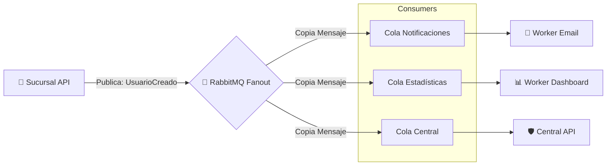

# ⚡ **EcoMarket - Taller 4: Implementación de Sistemas Distribuidos**


### 📡 *Comunicación Asíncrona y Patrones de Mensajería*

📅 **Fecha:** 24 de Octubre de 2025 (Reconstrucción Histórica)  
👤 **Autores:** Christofer Roberto Esparza Chavero, Brian Garcia y Juan Cordova  
📂 **Proyecto:** EcoMarket - Versión 4.0 (Colas y Eventos)

---

## 🚀 **Descripción del Proyecto**

En este taller, dimos el salto de la comunicación síncrona (HTTP directo) a la **Comunicación Asíncrona** utilizando patrones de mensajería robustos.

El objetivo fue desacoplar la Sucursal de la Central para que las ventas no se detengan si la Central está caída (**Offline-First real**) y para permitir que múltiples servicios reaccionen a un mismo evento sin conocerse entre sí (**Pub/Sub**).

Se implementaron 3 estrategias nuevas en el código:
1.  **Redis Queue (Modo 4):** Cola simple en memoria para buffering de ventas.
2.  **RabbitMQ Direct (Modo 5):** Mensajería confiable punto a punto.
3.  **RabbitMQ Fanout (Modo 6):** Para eventos de dominio masivos como "Usuario Creado".

---

## 🧭 **Diagrama de Arquitectura (Patrón Pub/Sub)**

Este diagrama muestra cómo un solo evento dispara múltiples acciones sin acoplamiento.



---

## 🛠️ Implementación Técnica

### 1. Estrategia de "Switch" Dinámico
La Sucursal fue modificada para cambiar su estrategia de comunicación en tiempo real mediante la variable **NOTIF_MODE**:

| Modo | Tecnología | Descripción | Ventaja |
|------|------------|-------------|---------|
| 4    | Redis      | Cola FIFO (RPUSH/LPOP) | Extrema velocidad y persistencia en memoria. |
| 5    | RabbitMQ Direct | Routing Key específico | Garantía de entrega y persistencia en disco. |
| 6    | RabbitMQ Fanout | Broadcast (A todos) | Ideal para eventos de negocio (Domain Events). |

### 2. Eventos de Dominio (Usuarios)
Se agregó un flujo paralelo: **Registro de Usuarios**.  
Cuando se crea un usuario en la Sucursal, se publica un evento `UsuarioCreado`.  
- **Central API:** Lo recibe y aumenta el contador global de usuarios.  
- **Servicio Simulado:** Imprime logs de envío de emails de bienvenida.

---

## 🧪 Pasos de Validación y Evidencia

Para verificar el desacoplamiento:

### Asegurar Infraestructura
```bash
docker-compose up -d rabbitmq redis
```

### Configurar Sucursal en Modo 6 (Fanout)
Desde el Dashboard de la Sucursal, seleccionar "6. RabbitMQ Fanout".

### Generar Evento (Registro de Usuario)
```bash
curl -X POST http://localhost:8002/users/register      -F "nombre=Juan" -F "email=juan@example.com"
```

### ✅ Evidencia de Desacoplamiento
Observar los logs de la Central. Se deben ver múltiples acciones ocurriendo simultáneamente por diferentes Workers:
- 📥 `[USUARIOS - Estadisticas] Nuevo usuario...`
- 📧 `[USUARIOS - Notificaciones] Enviando email a...`

---

## 🎬 Video de Demostración
Explicación detallada del patrón Pub/Sub y demostración del flujo de mensajes en RabbitMQ Management UI.  
👉 Ver Video de Explicación Pub/Sub (1 min)

- [VIDEO AQUÍ](https://drive.google.com/file/d/1RGvXK39IKS6eGHSssG9YYNzUEwWLT2yl/view?usp=sharing)
---

## 📂 Archivos Clave
El código fuente implementado para este taller se encuentra integrado en la raíz:

- [`SucursalAPIdemo.py`](https://github.com/Chriis1404/DECISIONS.md/blob/main/SucursalAPIdemo.py) - Lógica de `publish_user_created` y selectores de modo.  
- [`CentralAPI.py`](https://github.com/Chriis1404/DECISIONS.md/blob/main/CentralAPI.py) - Consumers de RabbitMQ (callback) para procesar eventos.  
- [`docker-compose.yml`](https://github.com/Chriis1404/DECISIONS.md/blob/main/docker-compose.yml) - Configuración de servicios rabbitmq y redis.
- [`publisher.py`](https://github.com/Chriis1404/DECISIONS.md/blob/main/Taller4_Implementaci%C3%B3n_Sistema_de_Eventos/publisher.py) - Codigo que emite el evento "Usuario Creado".  
- [`comsumer_notificaciones.py`](https://github.com/Chriis1404/DECISIONS.md/blob/main/Taller4_Implementaci%C3%B3n_Sistema_de_Eventos/consumer_notificaciones.py) - Codigo de microservicio en envía correos de bienvenida.
- [`consumer_estadisticas.py`](https://github.com/Chriis1404/DECISIONS.md/blob/main/Taller4_Implementaci%C3%B3n_Sistema_de_Eventos/consumer_estadisticas.py) - Codigo que lleva el conteo de usuarios.

---

## 🎯 Estado del Taller: ✅ Completado
