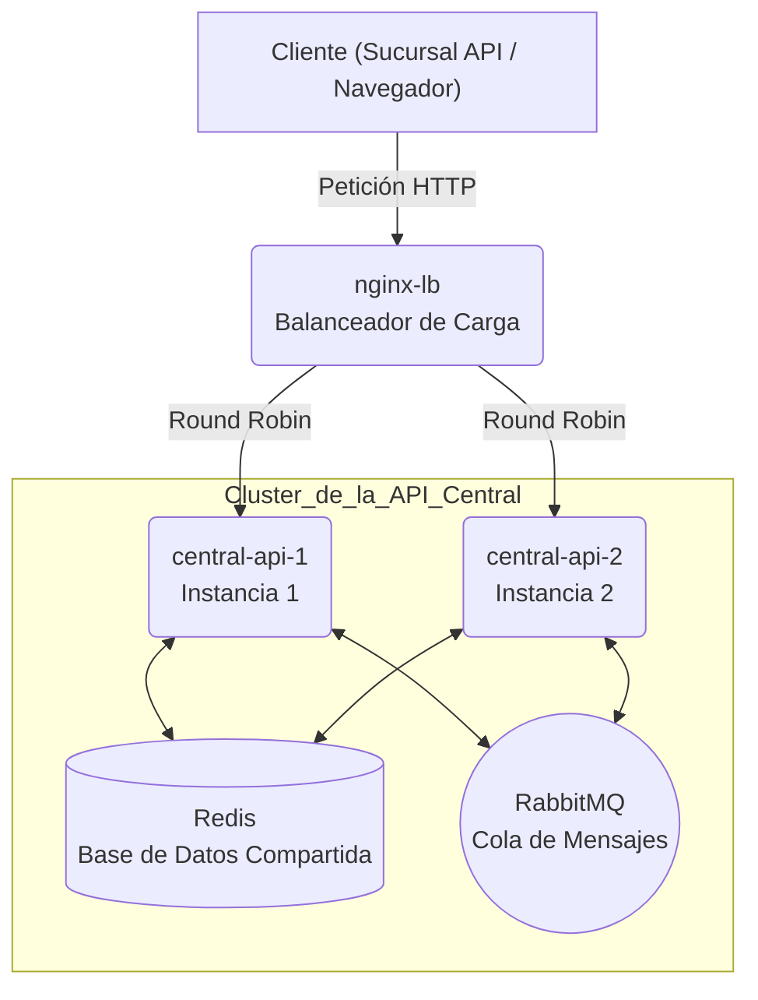

# 🌎 **EcoMarket - Hito 2**
### 🧩 *Alta Disponibilidad, Escalabilidad y Balanceo de Carga*

📅 **Fecha:** 5 de noviembre de 2025  
👤 **Autor:** [Christofer Roberto Esparza Chavero, Brian Garcia y Juan Cordova]  
📂 **Proyecto:** EcoMarket - API Central y Sucursal  

---

## 🚀 **Descripción del Proyecto**

Este proyecto implementa una **arquitectura de microservicios resiliente y escalable** para la **API Central de EcoMarket**, utilizando **Nginx** como balanceador de carga y **Docker Compose** para la orquestación.

El sistema está diseñado para:
- Manejar múltiples instancias simultáneamente.  
- Distribuir tráfico de forma equitativa (*Round Robin*).  
- Mantener alta disponibilidad ante fallos de contenedores.  
- Compartir estado entre servicios mediante **Redis** y **RabbitMQ**.

---

## 🧭 **Diagrama de Arquitectura y Flujo de Tráfico**



---

## 🛠️ **Comandos de Ejecución**

A continuación, los comandos más importantes para ejecutar, monitorear y administrar los contenedores del proyecto:

```bash
# 1️⃣ Moverse a la carpeta del proyecto
cd C:\Users\user\Documents\Eligardo

# 2️⃣ Construir imágenes (si hiciste cambios en el código)
docker-compose build --no-cache

# 3️⃣ Levantar los contenedores en segundo plano
docker-compose up -d

# 4️⃣ Verificar que todo esté corriendo
docker ps

# 5️⃣ Ver logs en vivo de cada servicio
docker logs -f central-api-1
docker logs -f central-api-2
docker logs -f sucursal-demo

# 6️⃣ Simular fallo (detener una instancia)
docker-compose stop central1

# 7️⃣ Simular recuperación (reanudar instancia)
docker-compose start central1

# 8️⃣ Reiniciar la base de datos Redis
docker-compose exec redis redis-cli FLUSHDB

# 9️⃣ Detener y eliminar todos los contenedores
docker-compose down
```

💡 **Consejo:**  
Usa `docker-compose stop/start central1` para simular fallos sin eliminar el contenedor.

---

## 🌐 **Servicios Disponibles**

| Servicio | URL | Descripción |
|-----------|-----|-------------|
| 🧩 **API Central (Dashboard)** | [http://localhost/dashboard](http://localhost/dashboard) | Interfaz principal (a través de Nginx) |
| 🏪 **API Sucursal (Dashboard)** | [http://localhost:8002/dashboard](http://localhost:8002/dashboard) | Interfaz de sucursal para simulación |
| 🐇 **RabbitMQ (Consola Admin)** | [http://localhost:15672](http://localhost:15672) | Usuario: `ecomarket_user` / Contraseña: `ecomarket_password` |

---

## 🎬 **Video de Demostración (E2E)**

🎥 Un video corto (1-2 minutos) muestra:

- ⚖️ Balanceo de carga en acción (Round Robin).  
- 💪 Tolerancia a fallos al detener una instancia.  
- 🔁 Recuperación automática al reiniciarla.  

➡️ **[Ver Video de Demostración Aquí](https://drive.google.com/file/d/1K_R1VLqmOyyltJJGILgpGwDb_l1TsNeA/view?usp=sharing)**  
(Guarda el archivo como `video_demo.mp4` en el repositorio para que este enlace funcione.)

---

## 📂 **Repositorio del Proyecto**

El código fuente completo se encuentra disponible en el siguiente enlace:

➡️ **[Ver Repositorio del Proyecto en GitHub "CENTRAL.API"](https://github.com/Chriis1404/DECISIONS.md/blob/main/CentralAPI.py)** 

➡️ **[Ver Repositorio del Proyecto en GitHub "SUCURSAL.API"](https://github.com/Chriis1404/DECISIONS.md/blob/main/SucursalAPIdemo.py)**

➡️ **[Ver Repositorio del Proyecto en GitHub "DOCKER-COMPOSE.YML"](https://github.com/Chriis1404/DECISIONS.md/blob/main/docker-compose.yml)**

➡️ **[Ver Repositorio del Proyecto en GitHub "NGINX.CONF"](https://github.com/Chriis1404/DECISIONS.md/blob/main/nginx.conf)**

➡️ **[Ver Repositorio del Proyecto en GitHub "DOCKERFILE"](https://github.com/Chriis1404/DECISIONS.md/blob/main/Dockerfile)**

---

## 📄 **Informe Técnico: Hito 2 - Escalabilidad y Resiliencia en EcoMarket**

### 1️⃣ Justificación de Escalabilidad (Horizontal vs. Vertical)

Para la evolución de la API Central de EcoMarket, se optó por una estrategia de **escalabilidad horizontal (“escalar hacia afuera”)** en lugar de **vertical (“escalar hacia arriba”)**.

#### 🧱 Escalabilidad Vertical
Implica aumentar los recursos de una sola máquina (más CPU, más RAM).  
Aunque es simple de implementar inicialmente, tiene un límite físico, es costoso y presenta un **punto único de fallo (SPOF)**.  
Si esa máquina falla, todo el servicio central se detiene.

#### ⚡ Escalabilidad Horizontal
Implica añadir más instancias del servicio (contenedores) y distribuir la carga entre ellas mediante un balanceador (Nginx).

---

### ✅ Ventajas de la Escalabilidad Horizontal

- **Alta Disponibilidad (Resiliencia):**  
  Al tener dos instancias (central-api-1 y central-api-2), si una falla o entra en mantenimiento, Nginx redirige automáticamente el tráfico a la instancia activa.  
  ➡️ El servicio nunca se interrumpe.

- **Mayor Rendimiento (Throughput):**  
  Dos instancias pueden manejar el doble de peticiones simultáneas.  
  Esto permite mantener tiempos de respuesta bajos incluso bajo carga.

- **Costo-Efectividad y Flexibilidad:**  
  Es más rentable desplegar varias instancias pequeñas que una máquina de gran capacidad.  
  Durante picos de tráfico (por ejemplo, *Black Friday*), se pueden levantar 5 instancias, y reducir a 2 en horas de baja demanda.

---

### ⚙️ Retos Abordados

El principal reto en una arquitectura horizontal es la **gestión del estado**.  
Si cada API mantuviera su propia base de datos, el sistema sería inconsistente.

#### 🔧 Soluciones Aplicadas

- **🧠 Estado de Base de Datos (Inventario, Ventas, Usuarios):**  
  Se centralizó el almacenamiento en Redis, permitiendo que ambas instancias compartan los mismos datos en memoria.

- **📨 Estado de Tareas (Notificaciones):**  
  Se desacopló mediante RabbitMQ.  
  Para evitar duplicaciones de mensajes, se implementó **idempotencia con locks en Redis** (`sale_lock:` y `user_event_lock:`), asegurando que solo la primera instancia procese cada evento.

---

### 2️⃣ Distribución Lograda (Resultados)

Se configuró Nginx como proxy reverso para balancear el tráfico entre las dos instancias de la API Central.  
El algoritmo usado es **Round Robin**, que distribuye las peticiones de manera equitativa.

#### 📜 Evidencia (Logs)
```
central-api-1 | INFO: 172.18.0.7:55930 - "GET /dashboard HTTP/1.0" 200 OK
central-api-2 | INFO: 172.18.0.7:49522 - "GET /dashboard HTTP/1.0" 200 OK
central-api-1 | INFO: 172.18.0.7:55946 - "GET /dashboard HTTP/1.0" 200 OK
central-api-2 | INFO: 172.18.0.7:49536 - "GET /dashboard HTTP/1.0" 200 OK
```

📈 Cada solicitud alterna entre `central-api-1` y `central-api-2`, mostrando una **distribución equilibrada del tráfico**.

#### 🧩 Prueba de Fallo
```bash
docker stop central-api-1
```

El dashboard siguió operativo gracias a que **Nginx redirigió el 100% de las peticiones a `central-api-2`**, demostrando la **tolerancia a fallos y resiliencia del sistema**.

---

### 3️⃣ Mejoras Futuras

| Mejora | Descripción |
|---------|-------------|
| 🔁 **Auto-Scaling** | Implementar Kubernetes o Docker Swarm para escalar instancias dinámicamente según carga. |
| 📊 **Monitoreo en Tiempo Real** | Integrar Prometheus y Grafana para observar métricas y latencia. |
| ⚖️ **Algoritmo de Balanceo Inteligente** | Cambiar a *least_conn* para distribuir peticiones al servidor con menos conexiones activas. |

---

🎯 **Fin del Documento - EcoMarket Hito 2**
