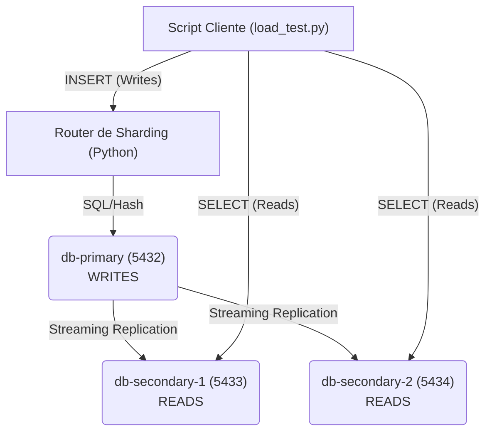

# 🌎 **EcoMarket - Taller 6**


### 🧩 *Distribución de Datos: Replicación y Sharding*

📅 **Fecha:** 19 de noviembre de 2025  
👤 **Autores:** Christofer Roberto Esparza Chavero, Brian Garcia y Juan Cordova  
📂 **Proyecto:** EcoMarket - Cluster PostgreSQL Distribuido

---

## 🚀 **Descripción del Proyecto**

Este documento presenta la implementación del **Taller 6**, cuyo enfoque es resolver los cuellos de botella de la base de datos monolítica (50k reads/h) mediante la distribución de datos.

Se implementó una arquitectura de **Base de Datos Distribuida** utilizando:
1. **PostgreSQL Streaming Replication:** Para escalar la capacidad de **lectura (Reads)**.
2. **Router de Sharding (Python):** Para distribuir la carga de **escritura (Writes)** de usuarios.

El sistema está diseñado para:
- Separar las responsabilidades: **Writes** al Primario, **Reads** a los Secundarios.
- Aplicar el principio de **Consistencia Eventual** (AP en CAP) donde es tolerable.

---

## 🧭 **Diagrama de Arquitectura y Flujo de Datos**



---

## 🛠️ **Comandos de Ejecución y Validación E2E**

```bash
# 1️⃣ Limpiar volúmenes y levantar la infraestructura distribuida
docker-compose down -v
docker-compose up -d

# 2️⃣ Ejecutar el Script de Validación E2E (Escribe, espera, lee y prueba sharding)
python load_test.py

# 3️⃣ Monitorear el Lag de Replicación (en el Primary)
docker exec ecomarket-db-primary psql -U postgres -d ecomarket -c "SELECT client_addr, state, pg_wal_lsn_diff(pg_current_wal_lsn(), replay_lsn) AS lag_bytes FROM pg_stat_replication;"

# 4️⃣ Detener el clúster
docker-compose down

# 5️⃣ Validación de lectura
docker exec ecomarket-db-secondary-1 psql -U postgres -d ecomarket -c "SELECT count(*) FROM orders;"
```

---

## 🌐 **Servicios Disponibles**

| Servicio            | Puerto | Descripción              | Rol             |
|--------------------|--------|--------------------------|-----------------|
| 🗄️ DB Primary       | 5432   | Base de datos Maestra   | Escritura       |
| 📑 DB Secondary 1   | 5433   | Réplica de lectura 1     | Lectura         |
| 📑 DB Secondary 2   | 5434   | Réplica de lectura 2     | Lectura         |
| 🐇 RabbitMQ         | 15672  | Cola de Mensajes         | Mensajería      |

---

## 🎬 **Video de Demostración (E2E)**

Un video corto (1 minuto) muestra la prueba E2E:  
- 📝 Escritura en Primary (ejecutando load_test.py).  
- ⚡ Verificación de Lectura inmediata en un Secondary (lag mínimo).  

[VIDEO AQUI](https://drive.google.com/file/d/15xSLVeBsXNBoUfimfqmJsd55mjisBk7q/view?usp=sharing)
---

## 📂 **Repositorio del Proyecto**

El código fuente completo se encuentra en la carpeta **Taller6_Distribucion/**:

- [Docker Compose (Infraestructura)](https://github.com/Chriis1404/DECISIONS.md/blob/main/Taller6_Distribucion/docker-compose.yml)
- [Script de Inicialización (init-primary.sh)](https://github.com/Chriis1404/DECISIONS.md/blob/main/Taller6_Distribucion/init-primary.sh)
- [Router de Sharding (shard_router.py)](https://github.com/Chriis1404/DECISIONS.md/blob/main/Taller6_Distribucion/shard_router.py)
- [Test de Validación (load_test.py)](https://github.com/Chriis1404/DECISIONS.md/blob/main/Taller6_Distribucion/load_test.py)
- [Ver Repositorio del Proyecto en GitHub "CENTRAL.API"](https://github.com/Chriis1404/DECISIONS.md/blob/main/CentralAPI.py)
- [Ver Repositorio del Proyecto en GitHub "SUCURSAL.API"](https://github.com/Chriis1404/DECISIONS.md/blob/main/SucursalAPIdemo.py)

---

## 📄 **Informe Técnico: Taller 6 - Análisis de Distribución**

### 1️⃣ Justificación y Rendimiento
El problema principal era el **15% de fallos en lecturas** por *locks* y un costo de **$37,500/hora** en picos.  
La replicación desvía el **90% del tráfico de lecturas** a los Secundarios, liberando al Primario.

---

### 2️⃣ Análisis CAP (Trade-offs)

| Entidad     | Decisión | Justificación |
|-------------|----------|---------------|
| Inventario  | **CP**   | No arriesgar venta sin stock. |
| Carrito/Órdenes | **AP** | Se permite Consistencia Eventual para asegurar disponibilidad. |

---

### 3️⃣ Retos y Monitoreo

| Reto / Mejora              | Descripción |
|---------------------------|-------------|
| Cuello de Botella de Writes | El Primario sigue siendo punto único de fallo. |
| Monitoreo de Lag            | Uso de `pg_stat_replication`. |
| Análisis de Queries         | Uso de `pgBadger` para optimizaciones. |
| Complejidad                | Sharding complica joins y rebalanceos. |

---

🎯 **Fin del Documento - EcoMarket Taller 6**
