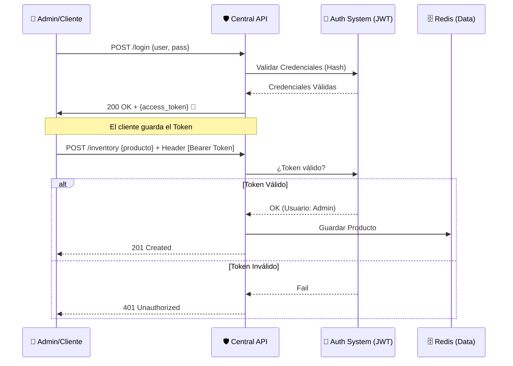

# 🛡️ **EcoMarket - Taller 7**


### 🔐 *Seguridad en Sistemas Distribuidos: Autenticación con JWT*

📅 **Fecha:** 25 de noviembre de 2025  
👤 **Autores:** Christofer Roberto Esparza Chavero, Brian Garcia y Juan Cordova  
📂 **Proyecto:** EcoMarket - API Central Segura

---

## 🚀 **Descripción del Proyecto**

Este documento presenta la implementación del **Taller 7**, cuyo objetivo es asegurar los endpoints críticos de la arquitectura distribuida de EcoMarket mediante **Autenticación Stateless**.

Se transformó la API Central para dejar de aceptar peticiones anónimas en operaciones sensibles, implementando:
1. **JSON Web Tokens (JWT):** Para autenticación sin estado.
2. **Middleware de Seguridad ("El Cadenero"):** Valida firma y expiración del token.
3. **Hashing de Contraseñas (bcrypt):** Para evitar almacenar contraseñas en texto plano.

El sistema garantiza que:
- **Lecturas (GET):** Públicas.
- **Escrituras (POST/PUT/DELETE):** Requieren token válido con rol `admin`.

---

## 🧭 **Diagrama de Flujo de Autenticación**



---

## 🛠️ **Comandos de Ejecución y Pruebas**

```bash
# 1️⃣ Levantar servicios
docker-compose up -d

# 2️⃣ Ejecutar API Central con JWT
python CentralAPI.py

# 3️⃣ Ejecutar Sucursal (para pruebas)
python SucursalAPIdemo.py
```

---

## 🧪 **Prueba de Seguridad Manual (E2E)**

1. **Intento de Hackeo:** Agregar producto sin login → *Debe dar 401*.  
2. **Login:** En `/dashboard`, usuario: `admin`, pass: `admin123`.  
3. **Operación Segura:** Agregar/eliminar producto con sesión iniciada → *200/201*.  
4. **Logout:** Confirmar que ya no puedes editar.

---

## 🌐 **Servicios Protegidos**

| Servicio | Puerto | Seguridad | Descripción |
|---------|--------|-----------|-------------|
| 🛡️ Central API | 8000 | JWT (HS256) | Inventario + Login |
| 🏪 Sucursal API | 8002 | Pública | Cliente |
| 🔑 /login | Public | Genera Token | Autenticación |
| 🔒 /inventory | Protegido | Requiere Bearer Token | CRUD Inventario |

---

## 🎬 **Video de Demostración (E2E)**

Video mostrando:
- Bloqueo de usuarios anónimos  
- Generación del token  
- Uso de token para gestionar inventario  

👉 *[INSERTAR VIDEO AQUÍ]*

---

## 📂 **Repositorio del Proyecto**

- [**Central API (JWT)**](https://github.com/Chriis1404/DECISIONS.md/blob/main/CentralAPI.py)
- [**Sucursal API (Cliente)**](https://github.com/Chriis1404/DECISIONS.md/blob/main/SucursalAPIdemo.py)
- [**requirements.txt**](https://github.com/Chriis1404/DECISIONS.md/blob/main/Taller7_Seguridad_JWT/requirements.txt)
- [**docker-compose.yml**](https://github.com/Chriis1404/DECISIONS.md/blob/main/docker-compose.yml)
- [**Nuevas Librerias Agregadas**](https://github.com/Chriis1404/DECISIONS.md/blob/main/Taller7_Seguridad_JWT/01_jwt_config_setup.py)
- [**Codigo del Modelo de Datos para el Login, Estructura del Token y Base de Datos Simulada**](https://github.com/Chriis1404/DECISIONS.md/blob/main/Taller7_Seguridad_JWT/02_auth_schemas.py)
- [**Codigo de Creación del Token y el "Cadenero"**](https://github.com/Chriis1404/DECISIONS.md/blob/main/Taller7_Seguridad_JWT/03_jwt_middleware_logic.py)
- [**Codigo de Protección de las Rutas de Inventario y Ruta Pública de Login**](https://github.com/Chriis1404/DECISIONS.md/blob/main/Taller7_Seguridad_JWT/04_protected_endpoints.py)
- [**JS que Gestiona el Token en el Navegador**](https://github.com/Chriis1404/DECISIONS.md/blob/main/Taller7_Seguridad_JWT/05_frontend_auth_client.js)
- [**Codigo de la Correción en la Sucursal para Evitar el Bucle Infinito y el Crash al Recibir Ventas**](https://github.com/Chriis1404/DECISIONS.md/blob/main/Taller7_Seguridad_JWT/06_sucursal_sync_fix.py)

---

## 📄 **Informe Técnico: Taller 7 - Seguridad JWT**

### 1️⃣ Justificación de JWT

JWT fue elegido sobre sesiones tradicionales porque EcoMarket es un sistema distribuido:

- **Stateless:** No se guardan sesiones en el servidor.  
- **Escalable:** Cualquier réplica puede validar tokens solo con la SECRET_KEY.

---

### 2️⃣ **Estructura del Token (Claims)**

| Claim | Ejemplo | Uso |
|-------|---------|-----|
| `sub` | admin | Identifica usuario |
| `role` | admin | Permisos |
| `exp` | 1732551234 | Expiración |

---

### 3️⃣ **Riesgos y Mitigaciones**

| Riesgo | Mitigación |
|--------|------------|
| Robo de identidad | Tokens cortos (60 min) |
| Acceso no autorizado | Middleware `get_current_user` |
| Fuga de credenciales | Hash bcrypt |
| Hardcoding | Variables de entorno |

---

🎯 **Fin del Documento - EcoMarket Taller 7**
