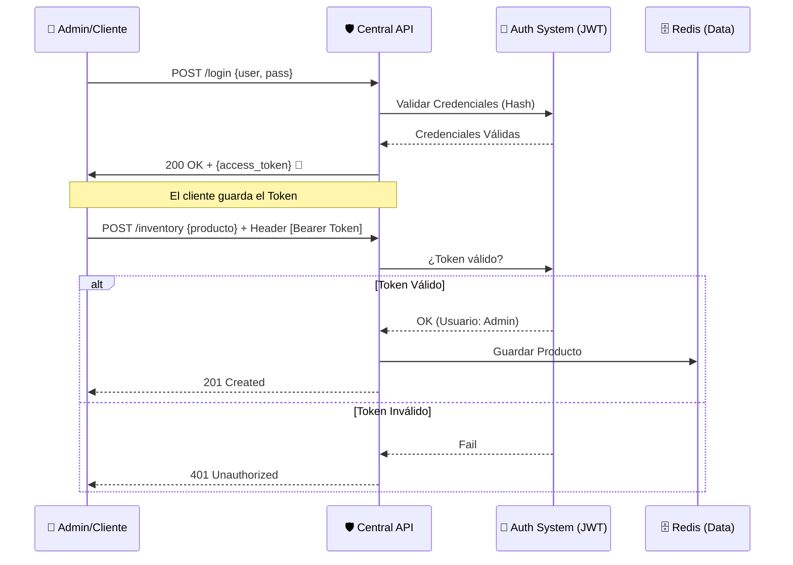

# 🛡️ **EcoMarket - Taller 7**


### 🔐 *Seguridad en Sistemas Distribuidos: Autenticación con JWT*

📅 **Fecha:** 25 de noviembre de 2025  
👤 **Autores:** Christofer Roberto Esparza Chavero, Brian Garcia y Juan Cordova  
📂 **Proyecto:** EcoMarket - API Central Segura

---

## 🚀 **Descripción del Proyecto**

Este documento presenta la implementación del **Taller 7**, cuyo objetivo es asegurar los endpoints críticos de la arquitectura distribuida de EcoMarket mediante **Autenticación Stateless**.

Se transformó la API Central para dejar de aceptar peticiones anónimas en operaciones sensibles, implementando:
1. **JSON Web Tokens (JWT):** Para autenticación sin estado.
2. **Middleware de Seguridad ("El Cadenero"):** Valida firma y expiración del token.
3. **Hashing de Contraseñas (bcrypt):** Para evitar almacenar contraseñas en texto plano.

El sistema garantiza que:
- **Lecturas (GET):** Públicas.
- **Escrituras (POST/PUT/DELETE):** Requieren token válido con rol `admin`.

---

## 🧭 **Diagrama de Flujo de Autenticación**



---

## 🛠️ **Comandos de Ejecución y Pruebas**

```bash
# 1️⃣ Levantar servicios
docker-compose up -d

# 2️⃣ Ejecutar API Central con JWT
python CentralAPI.py

# 3️⃣ Ejecutar Sucursal (para pruebas)
python SucursalAPIdemo.py
```

---

## 🧪 **Prueba de Seguridad Manual (E2E)**

1. **Intento de Hackeo:** Agregar producto sin login → *Debe dar 401*.  
2. **Login:** En `/dashboard`, usuario: `admin`, pass: `admin123`.  
3. **Operación Segura:** Agregar/eliminar producto con sesión iniciada → *200/201*.  
4. **Logout:** Confirmar que ya no puedes editar.

---

## 🌐 **Servicios Protegidos**

| Servicio | Puerto | Seguridad | Descripción |
|---------|--------|-----------|-------------|
| 🛡️ Central API | 8000 | JWT (HS256) | Inventario + Login |
| 🏪 Sucursal API | 8002 | Pública | Cliente |
| 🔑 /login | Public | Genera Token | Autenticación |
| 🔒 /inventory | Protegido | Requiere Bearer Token | CRUD Inventario |

---

## 🎬 **Video de Demostración (E2E)**

Video mostrando:
- Bloqueo de usuarios anónimos  
- Generación del token  
- Uso de token para gestionar inventario  

👉 *[VIDEO AQUÍ](https://drive.google.com/file/d/1rglDS-73Wplc_HEskL_0w5EZZr596S-P/view?usp=sharing)*

---

## 📂 **Repositorio del Proyecto**

- [**Central API (JWT)**](https://github.com/Chriis1404/DECISIONS.md/blob/main/CentralAPI.py)
- [**Sucursal API (Cliente)**](https://github.com/Chriis1404/DECISIONS.md/blob/main/SucursalAPIdemo.py)
- [**requirements.txt**](https://github.com/Chriis1404/DECISIONS.md/blob/main/Taller7_Seguridad_JWT/requirements.txt)
- [**docker-compose.yml**](https://github.com/Chriis1404/DECISIONS.md/blob/main/docker-compose.yml)
- [**Nuevas Librerias Agregadas**](https://github.com/Chriis1404/DECISIONS.md/blob/main/Taller7_Seguridad_JWT/01_jwt_config_setup.py)
- [**Codigo del Modelo de Datos para el Login, Estructura del Token y Base de Datos Simulada**](https://github.com/Chriis1404/DECISIONS.md/blob/main/Taller7_Seguridad_JWT/02_auth_schemas.py)
- [**Codigo de Creación del Token y el "Cadenero"**](https://github.com/Chriis1404/DECISIONS.md/blob/main/Taller7_Seguridad_JWT/03_jwt_middleware_logic.py)
- [**Codigo de Protección de las Rutas de Inventario y Ruta Pública de Login**](https://github.com/Chriis1404/DECISIONS.md/blob/main/Taller7_Seguridad_JWT/04_protected_endpoints.py)
- [**JS que Gestiona el Token en el Navegador**](https://github.com/Chriis1404/DECISIONS.md/blob/main/Taller7_Seguridad_JWT/05_frontend_auth_client.js)
- [**Codigo de la Correción en la Sucursal para Evitar el Bucle Infinito y el Crash al Recibir Ventas**](https://github.com/Chriis1404/DECISIONS.md/blob/main/Taller7_Seguridad_JWT/06_sucursal_sync_fix.py)

---

## 📄 **Informe Técnico: Taller 7 - Seguridad JWT**

### 1. Introducción y Contexto del Problema
En las fases anteriores del proyecto EcoMarket, los esfuerzos se concentraron en garantizar la alta disponibilidad y la escalabilidad horizontal. Sin embargo, esta arquitectura distribuida presentaba una vulnerabilidad crítica: la **API Central operaba sin una capa de autenticación**. Cualquier agente podía realizar operaciones destructivas en el inventario.

El desafío principal radicaba en la naturaleza distribuida del sistema. Al tener múltiples réplicas de la API Central bajo un balanceador de carga, el uso de **sesiones tradicionales (stateful)** en memoria era inviable: si la petición llega a la réplica A, pero la sesión se creó en la réplica B, el usuario pierde su acceso.

### 2. Solución Implementada: Arquitectura Stateless con JWT
Para resolver esto sin comprometer la escalabilidad, implementamos un modelo de autenticación **Stateless** (Sin Estado) utilizando **JSON Web Tokens (JWT)**.

A diferencia de las sesiones tradicionales, JWT permite que el estado de la autenticación viaje con el cliente. Cuando un administrador inicia sesión, la API Central genera un token firmado criptográficamente.

> **Ventaja clave:** Cualquier contenedor Docker de nuestra API puede validar el token por su cuenta verificando la firma con la `SECRET_KEY`, sin necesidad de consultar una base de datos centralizada de sesiones en cada petición (Rendimiento O(1)).

### 3. Detalles de la Implementación
La seguridad se integró en el núcleo de `CentralAPI.py` siguiendo tres pilares fundamentales:

#### A. Gestión de Credenciales (Hashing)
Utilizamos la librería **Passlib** con el algoritmo **bcrypt**. Nunca almacenamos contraseñas en texto plano. Al hacer login, el sistema compara el hash de la contraseña ingresada con el hash almacenado, protegiendo las credenciales ante posibles fugas de datos (Data Breaches).

#### B. El "Cadenero" (Middleware)
Implementamos la función `get_current_user` en FastAPI. Esta actúa como un guardián que intercepta las peticiones antes de llegar a la lógica de negocio:
1.  Busca el encabezado `Authorization: Bearer <token>`.
2.  Verifica la **Firma** (integridad) para asegurar que no fue modificado.
3.  Verifica la **Expiración** (validez temporal).
4.  Si falla, lanza un error `401 Unauthorized` inmediatamente.

#### C. Estructura del Token (Claims)
Diseñamos el payload del token para ser ligero y eficiente:

| Claim | Valor | Función |
| :--- | :--- | :--- |
| **`sub`** | `admin` | **Identidad:** Identifica al usuario sin consultar la BD. |
| **`role`** | `admin` | **Autorización:** Define permisos para rutas críticas. |
| **`exp`** | `+60 min` | **Seguridad:** Ventana de validez limitada para mitigar robos. |

### 4. Conclusión y Trabajo Futuro
La implementación del Taller 7 ha transformado a EcoMarket de un prototipo funcional a un sistema seguro. Hemos demostrado que es posible proteger una arquitectura distribuida compleja utilizando estándares modernos sin sacrificar escalabilidad.

**Mejoras Futuras Identificadas:**
* **Almacenamiento:** Migrar de `LocalStorage` a **Cookies HttpOnly** para prevenir ataques XSS.
* **Encriptación en Tránsito:** Implementar **HTTPS/TLS** para evitar la interceptación del token en la red (Man-in-the-Middle).
* **Revocación:** Implementar una lista negra en Redis para invalidar tokens antes de su expiración natural (Logout forzado).

---

### Anexo: Protocolo de Pruebas (Guion E2E)
Para validar la implementación, se ejecutó el siguiente flujo (documentado en el video adjunto):

- [x] **Verificación de Bloqueo:** Se confirmó que intentar acceder a `/inventory` (método POST) sin token resulta en un bloqueo inmediato (`401`).
- [x] **Autenticación:** El flujo de Login genera correctamente el token firmado y el cliente lo almacena.
- [x] **Operación Autorizada:** Con el token en el encabezado, la API permite la modificación del inventario (`200 OK`).
- [x] **Revocación (Logout):** Al eliminar el token del cliente, el acceso se pierde instantáneamente, confirmando el modelo Stateless.

---

🎯 **Fin del Documento - EcoMarket Taller 7**
