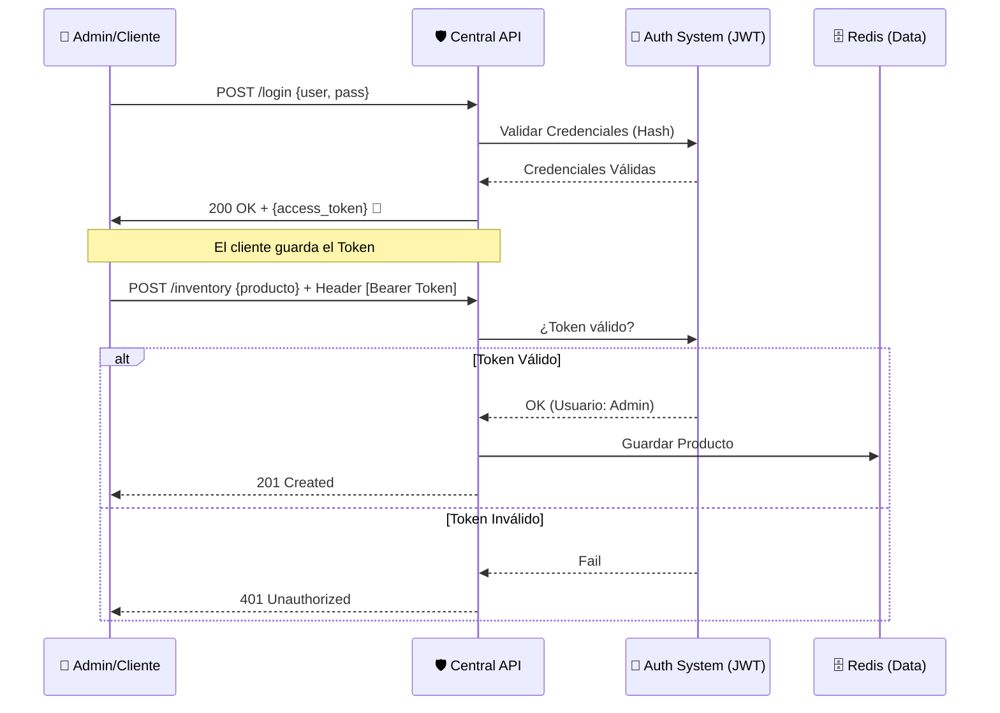

# 🛡️ **EcoMarket - Taller 7**


### 🔐 *Seguridad en Sistemas Distribuidos: Autenticación con JWT*

📅 **Fecha:** 25 de noviembre de 2025  
👤 **Autores:** Christofer Roberto Esparza Chavero, Brian Garcia y Juan Cordova  
📂 **Proyecto:** EcoMarket - API Central Segura

---

## 🚀 **Descripción del Proyecto**

Este documento presenta la implementación del **Taller 7**, cuyo objetivo es asegurar los endpoints críticos de la arquitectura distribuida de EcoMarket mediante **Autenticación Stateless**.

Se transformó la API Central para dejar de aceptar peticiones anónimas en operaciones sensibles, implementando:
1. **JSON Web Tokens (JWT):** Para autenticación sin estado.
2. **Middleware de Seguridad ("El Cadenero"):** Valida firma y expiración del token.
3. **Hashing de Contraseñas (bcrypt):** Para evitar almacenar contraseñas en texto plano.

El sistema garantiza que:
- **Lecturas (GET):** Públicas.
- **Escrituras (POST/PUT/DELETE):** Requieren token válido con rol `admin`.

---

## 🧭 **Diagrama de Flujo de Autenticación**



---

## 🛠️ **Comandos de Ejecución y Pruebas**

```bash
# 1️⃣ Levantar servicios
docker-compose up -d

# 2️⃣ Ejecutar API Central con JWT
python CentralAPI.py

# 3️⃣ Ejecutar Sucursal (para pruebas)
python SucursalAPIdemo.py
```

---

## 🧪 **Prueba de Seguridad Manual (E2E)**

1. **Intento de Hackeo:** Agregar producto sin login → *Debe dar 401*.  
2. **Login:** En `/dashboard`, usuario: `admin`, pass: `admin123`.  
3. **Operación Segura:** Agregar/eliminar producto con sesión iniciada → *200/201*.  
4. **Logout:** Confirmar que ya no puedes editar.

---

## 🌐 **Servicios Protegidos**

| Servicio | Puerto | Seguridad | Descripción |
|---------|--------|-----------|-------------|
| 🛡️ Central API | 8000 | JWT (HS256) | Inventario + Login |
| 🏪 Sucursal API | 8002 | Pública | Cliente |
| 🔑 /login | Public | Genera Token | Autenticación |
| 🔒 /inventory | Protegido | Requiere Bearer Token | CRUD Inventario |

---

## 🎬 **Video de Demostración (E2E)**

Video mostrando:
- Bloqueo de usuarios anónimos  
- Generación del token  
- Uso de token para gestionar inventario  

👉 *[INSERTAR VIDEO AQUÍ]*

---

## 📂 **Repositorio del Proyecto**

- [**Central API (JWT)**](https://github.com/Chriis1404/DECISIONS.md/blob/main/CentralAPI.py)
- [**Sucursal API (Cliente)**](https://github.com/Chriis1404/DECISIONS.md/blob/main/SucursalAPIdemo.py)
- [**requirements.txt**](https://github.com/Chriis1404/DECISIONS.md/blob/main/Taller7_Seguridad_JWT/requirements.txt)
- [**docker-compose.yml**](https://github.com/Chriis1404/DECISIONS.md/blob/main/docker-compose.yml)
- [**Nuevas Librerias Agregadas**](https://github.com/Chriis1404/DECISIONS.md/blob/main/Taller7_Seguridad_JWT/01_jwt_config_setup.py)
- [**Codigo del Modelo de Datos para el Login, Estructura del Token y Base de Datos Simulada**](https://github.com/Chriis1404/DECISIONS.md/blob/main/Taller7_Seguridad_JWT/02_auth_schemas.py)
- [**Codigo de Creación del Token y el "Cadenero"**](https://github.com/Chriis1404/DECISIONS.md/blob/main/Taller7_Seguridad_JWT/03_jwt_middleware_logic.py)
- [**Codigo de Protección de las Rutas de Inventario y Ruta Pública de Login**](https://github.com/Chriis1404/DECISIONS.md/blob/main/Taller7_Seguridad_JWT/04_protected_endpoints.py)
- [**JS que Gestiona el Token en el Navegador**](https://github.com/Chriis1404/DECISIONS.md/blob/main/Taller7_Seguridad_JWT/05_frontend_auth_client.js)
- [**Codigo de la Correción en la Sucursal para Evitar el Bucle Infinito y el Crash al Recibir Ventas**](https://github.com/Chriis1404/DECISIONS.md/blob/main/Taller7_Seguridad_JWT/06_sucursal_sync_fix.py)

---

## 📄 **Informe Técnico: Taller 7 - Seguridad JWT**

### 1️⃣ Justificación de JWT

JWT fue elegido sobre sesiones tradicionales porque EcoMarket es un sistema distribuido:

- **Stateless:** No se guardan sesiones en el servidor.  
- **Escalable:** Cualquier réplica puede validar tokens solo con la SECRET_KEY.

1. ¿Por qué hicimos esto? (Justificación)
En los talleres anteriores nos enfocamos en que el sistema escalara y no se cayera, pero teníamos un problema grave: la API Central estaba de puertas abiertas. Cualquiera con Postman podía borrar nuestro inventario o meter datos falsos.

Para solucionar esto en nuestra arquitectura distribuida (donde tenemos varias réplicas de la API y balanceadores de carga), las sesiones tradicionales ("cookies de sesión") no eran viables porque obligan al servidor a recordar al usuario. Si esa instancia del servidor se reinicia, adiós sesión.

Por eso elegimos JWT (JSON Web Tokens).

Es "Stateless" (Sin Estado): El servidor no guarda nada. Toda la información de la sesión viaja dentro del token que tiene el cliente.

Es Rápido: Validar el token es solo una operación matemática (revisar la firma), no hay que ir a preguntar a la base de datos cada vez.

Funciona con Docker: Cualquier contenedor de nuestra API puede validar el token por su cuenta.

2. ¿Cómo funciona nuestro Token?
Diseñamos el token para que sea ligero y seguro. Dentro del token (en el payload) guardamos tres datos clave:

sub (Sujeto): Quién es el usuario (ej. admin).

role (Rol): Qué permisos tiene. Esto nos sirve para que en el futuro, si entra un usuario "cliente", no pueda borrar productos.

exp (Expiración): Le pusimos 60 minutos de vida. Si alguien roba el token, solo le sirve por un rato.

3. ¿Qué implementamos en el Código?
Hicimos tres cambios principales en CentralAPI.py para blindar el sistema:

El "Cadenero" (Middleware): Creamos una función llamada get_current_user que actúa como un filtro. Se pone antes de las funciones críticas (como add_product). Si la petición no trae token o el token es falso, el cadenero la bloquea con un error 401 antes de que toque la base de datos.

Cifrado de Contraseñas: Ya no guardamos admin123 en texto plano. Usamos una librería llamada Passlib con bcrypt para transformar la contraseña en un hash ilegible. Así, incluso si hackean la base de datos, no sabrán las claves reales.

Gestión de Secretos: La clave para firmar los tokens (SECRET_KEY) no está escrita en el código (hardcoded). La leemos desde las variables de entorno de Docker.

4. Riesgos que detectamos y Futuras Mejoras
Aunque el sistema es mucho más seguro, somos conscientes de algunos puntos que se pueden mejorar en versiones futuras:

Almacenamiento del Token: Por ahora, el frontend guarda el token en LocalStorage. Esto es fácil de hacer, pero vulnerable a ataques XSS (si alguien inyecta scripts en la web). La mejora sería usar Cookies HttpOnly.

HTTPS: Actualmente el token viaja "desnudo" por la red interna. En un entorno real, es obligatorio usar HTTPS (TLS) para que nadie intercepte el token en el camino.

Revocación: Como el sistema es stateless, es difícil "patear" a un usuario antes de que su token expire. Para la próxima, podríamos usar una "lista negra" en Redis para bloquear tokens robados al instante.

🏁 Conclusión
Con este taller, EcoMarket dejó de ser un sistema ingenuo. Ahora tenemos Autenticación Real. Logramos proteger el inventario maestro asegurando que solo quien tenga las credenciales correctas pueda alterarlo, todo esto sin sacrificar la velocidad ni la escalabilidad de nuestros microservicios.

---

### 2️⃣ **Estructura del Token (Claims)**

| Claim | Ejemplo | Uso |
|-------|---------|-----|
| `sub` | admin | Identifica usuario |
| `role` | admin | Permisos |
| `exp` | 1732551234 | Expiración |

---

### 3️⃣ **Riesgos y Mitigaciones**

| Riesgo | Mitigación |
|--------|------------|
| Robo de identidad | Tokens cortos (60 min) |
| Acceso no autorizado | Middleware `get_current_user` |
| Fuga de credenciales | Hash bcrypt |
| Hardcoding | Variables de entorno |

---

🎯 **Fin del Documento - EcoMarket Taller 7**
